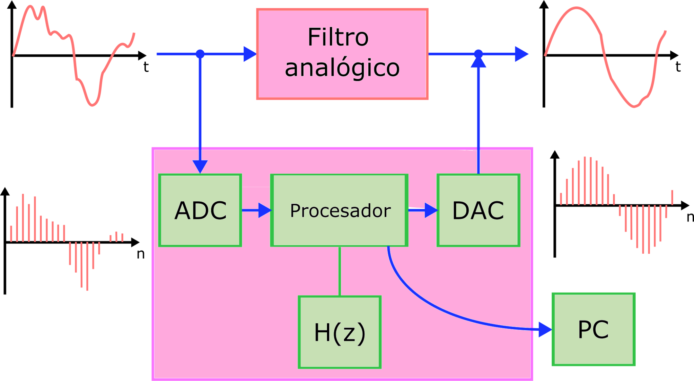
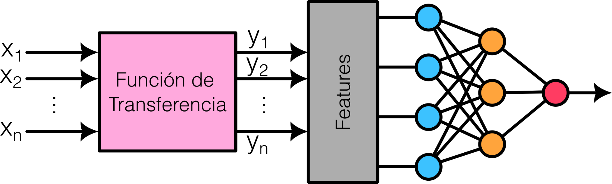
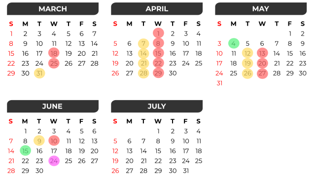

<!-- slide -->
## Diapositiva 1
### Presentación, Objetivos y Metodología
#### Análisis y procesamiento de Señales
##### Bioingeniería - Facultad de Ingeniería - UNSTA
##### 2026
**Dr. Ing. Facundo Adrián Lucianna**
**Ing. Facundo Roldán**

---

<!-- slide -->
## Diapositiva 2
### ¿En qué consiste esta asignatura?
Esta asignatura es la continuación natural de **Señales y Sistemas**. Nuestro objetivo principal es aprender a extraer información valiosa de señales biológicas. Para ello, abordaremos:
- El diseño e implementación de {amarillo}(**Filtros Digitales**).
- Métodos avanzados de procesamiento basados en {verde}(**Deep Learning**).

---

<!-- slide -->
## Diapositiva 3
### ¿Por qué a un bioingeniero le importa esto?
Como estudiaron en **Señales y Sistemas**, el cuerpo humano se comunica mediante una enorme diversidad de señales simultáneas. 
Además, estas bioseñales son sumamente complejas: son {rojo}(**ruidosas**) y {rojo}(**no estacionarias**), lo que dificulta enormemente su análisis con las técnicas clásicas de procesamiento.

---

<!-- slide -->
## Diapositiva 4
### ¿Qué vamos a hacer con las señales?
- En la primera etapa, nos enfocaremos en {verde}(**filtros digitales**).
- En la segunda etapa, exploraremos el procesamiento utilizando {verde}(**Deep Learning**).
- A lo largo de toda la cursada, trabajaremos con señales {amarillo}(**digitales**).

---

<!-- slide -->
## Diapositiva 5
### Filtrado de señales

Un paso preliminar e indispensable para poder extraer información útil de cualquier medición biológica, es diseñar un filtro que permita {amarillo}(**eliminar el ruido o las interferencias**) de la señal.

---

<!-- slide -->
## Diapositiva 6
### Extracción de características y Deep Learning

Mediante el análisis temporal y frecuencial de una señal, logramos extraer atributos clave (**features**). De esta forma, pasamos a delegar en un modelo de {rosa}(**Deep Learning**) la tarea más compleja: descubrir automáticamente los patrones ocultos y procesar la información obtenida.

---

<!-- slide -->
## Diapositiva 7

### Metodología

---

<!-- slide -->
## Diapositiva 8
### Metodología de la cursada

- {amarillo}(**Trabajos Prácticos (TPs):**) Tendremos de forma periódica TPs que abarcarán las distintas unidades temáticas. No son de entrega obligatoria y fomentamos que se resuelvan grupal o individualmente.
- {verde}(**Parciales:**) La regularidad se obtiene aprobando **dos parciales individuales**. Para la evaluación, a cada alumno se le asignará un ejercicio al azar elegido de los TPs vistos hasta la fecha. Cada alumno tendrá **una semana** para resolver su versión del examen y entregarla.

{rosa}(**Condiciones de regularidad**):
- Se deben aprobar ambos parciales con nota {verde}(**mayor o igual a 4**).
- Si se desaprueba **o** no se entrega un parcial, habrá una instancia de {morado}(**recuperatorio**) a final de la materia, entregando un nuevo ejercicio que también deberá aprobarse con 4.
- Desaprobar los dos parciales, o desaprobar el recuperatorio, implica quedar en condición de {rojo}(**libre**).

---

<!-- slide -->
## Diapositiva 9
### Evaluación Final

Para aprobar la materia en la mesa final, la modalidad será a {amarillo}(**libro abierto**) y constará de:
1. {verde}(**Presentación oral (15 minutos):**) El alumno elegirá y expondrá una aplicación práctica relacionada a cualquier tema dictado en la cursada.
2. {verde}(**Ronda de preguntas (5 minutos):**) Consultas generales del tribunal respecto a los temas vistos en el año.

{rosa}(*La calificación resultará de la calidad conceptual de la presentación y la solidez en las respuestas de la ronda de preguntas. Adicionalmente, el desempeño y compromiso mostrado durante el cursado será evaluado de forma positiva para mejorar la nota final.*)

---

<!-- slide -->
## Diapositiva 10
### Horarios de Cursado

- {rojo}(**Clases teóricas:**) Miércoles de 18:30 a 21:30 hs.
- {amarillo}(**Clases prácticas:**) Martes de 15:00 a 17:25 hs.

---

<!-- slide -->
## Diapositiva 11
### Cronograma

- {rojo}(**Teoría**)
- {amarillo}(**Práctica**)
- {verde}(**Parcial**)
- {morado}(**Recuperatorio**)

---

