<!-- slide -->
## Diapositiva 1
### Filtros digitales
#### Análisis y procesamiento de Señales
##### Bioingeniería - Facultad de Ingeniería - UNSTA
##### 2026
**Dr. Ing. Facundo Adrián Lucianna**
**Ing. Facundo Roldán**

---

<!-- slide -->
## Diapositiva 2
### Filtros digitales

---

<!-- slide -->
## Diapositiva 3
### Filtros digitales
- Un {amarillo}(**filtro digital**) es un sistema que {amarillo}(**discrimina**) frecuencias o gamas de frecuencias de una señal, {amarillo}(**modificando su amplitud y fase**).
- Los filtros que veremos son {amarillo}(**sistemas lineales e invariantes en el tiempo (LTI)**).
- Se caracterizan mediante su {verde}(**función de transferencia**), ya sea en el dominio del tiempo o mediante la {verde}(**transformada Z**).

---

<!-- slide -->
## Diapositiva 4
### Filtros digitales
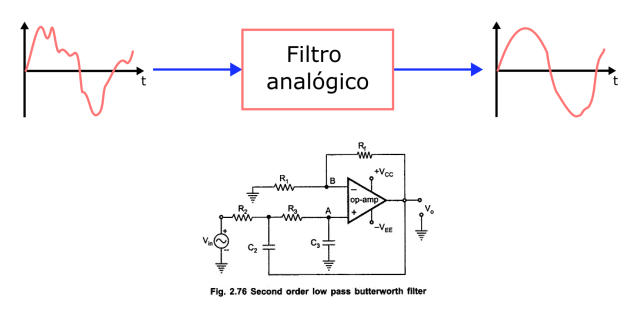

---

<!-- slide -->
## Diapositiva 5
### Filtros digitales
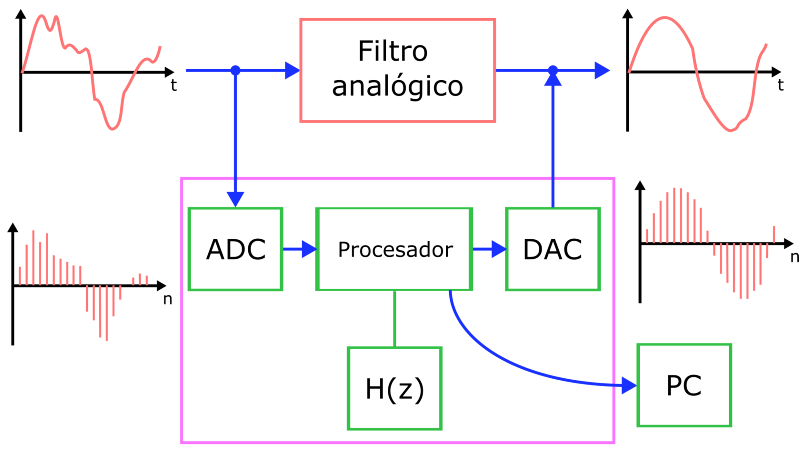

---

<!-- slide -->
## Diapositiva 6
### Filtros digitales
- El efecto es similar al de los filtros analógicos, pero su {amarillo}(**implementación es diferente**) (dominio discreto).
{verde}(**Filtros analógicos:*) Se implementan con circuitos electrónicos pasivos o activos.
{rojo}(**Filtros digitales:**) Se implementan mediante {rojo}(**circuitos lógicos digitales**) (DSP, FPGA) o {rojo}(**software**) (programas de computación).
- {rojo}(**Programable:**) Su operación depende de un programa almacenado en memoria. Sus características pueden {rojo}(**cambiarse fácilmente**).
- {rojo}(**Alta estabilidad:**) Son extremadamente estables frente al tiempo y la temperatura.
- {verde}(*Filtros analógicos (activos):*) Suelen presentar {verde}(**derivas (drift)**) y {verde}(**dependencia térmica**).

---

<!-- slide -->
## Diapositiva 7
### Clasificación de filtros digitales

---

<!-- slide -->
## Diapositiva 8
### Clasificación de filtros digitales
- {verde}(**No recursivos:**) La salida depende {verde}(**únicamente de las entradas**) (presentes y pasadas).

$$H(z) = \sum_{k=0}^{K} b[k] z^{-k} \quad \text{<--->} \quad y[n] = \sum_{k=0}^{K} b[k] x[n-k] $$

$$y[n] = \sum_{k=-K_1}^{K_2 - 1} b[k+K_1] x[n-k]$$

- {verde}(**Estabilidad garantizada:**) Tienen todos sus **polos en el origen**.

---

<!-- slide -->
## Diapositiva 9
### Clasificación de filtros digitales
- {amarillo}(**Sistemas FIR** (*Finite Impulse Response*):) Su respuesta al impulso es {amarillo}(**finita**).
- En estos filtros, {verde}(**los coeficientes son directamente la respuesta al impulso**).

$$y[n] = x[n] + 0.8 x[n-1] - 0.5 x[n-2] + 0.33 x[n-3] - 0.25 x[n-4] + 0.2 x[n-5] - 0.14 x[n-6] - 0.125 x[n-7] $$
$$H(z) = \frac{z^7 + 0.8 z^6 - 0.5 z^5 + 0.33 z^4 - 0.25 z^3 + 0.2 z^2 - 0.14 z - 0.125}{z^7} $$

---

<!-- slide -->
## Diapositiva 10
### Clasificación de filtros digitales
- {amarillo}(**Recursivos:**) La salida depende de las entradas y de {amarillo}(**salidas pasadas**).

$$H(z) = \frac{\sum_{k=0}^{K-1} b[k] z^{-k}}{\sum_{l=1}^{L-1} a[l] z^{-l}}  \quad \text{<--->} \quad y[n] = \sum_{k=0}^{K-1} b[k] x[n-k] - \sum_{l=1}^{L-1} a[l] y[n-l] $$
$$y[n] = \sum_{k=-K_1}^{K_2-1} b[k+K_1] x[n-k] - \sum_{l=1}^{L-1} a[l] y[n-l] $$

- {verde}(**Retroalimentación:**) Pueden presentar {rosa}(**problemas de estabilidad**) (dependiendo de la ubicación de los polos).

---

<!-- slide -->
## Diapositiva 11
### Clasificación de filtros digitales
- {amarillo}(**Sistemas IIR** (*Infinite Impulse Response*):) Su respuesta al impulso es {amarillo}(**infinita**).
- La respuesta {verde}(**tiende a cero**), pero teóricamente nunca llega a él.

$$y[n] = 0.86 x[n] - 0.86 x[n-1] + 0.86 x[n-2] + 0.86 y[n-1] - 0.73 y[n-2] $$
$$H(z) = \frac{0.86 z^2 - 0.86 z + 0.86}{z^2 - 0.86 z + 0.73} $$

---

<!-- slide -->
## Diapositiva 12
### Clasificación de filtros digitales
- {amarillo}(**Clasificación según la causalidad:**) ¿Utiliza muestras "del futuro"?
- {amarillo}(**Causal:**) Solo utiliza entradas y salidas {verde}(**presentes y pasadas**). Poseen {morado}(**transformada Z**).

$$y[n] = 0.86 x[n] - 0.86 x[n-1] + 0.86 x[n-2] + 0.86 y[n-1] - 0.73 y[n-2] $$
$$H(z) = \frac{0.86 z^2 - 0.86 z + 0.86}{z^2 - 0.86 z + 0.73} $$

---

<!-- slide -->
## Diapositiva 13
### Clasificación de filtros digitales
- {amarillo}(**No Causal:**) Utiliza {rosa}(**muestras del futuro**).
- *Ejemplo típico:* Cálculo de derivada por {verde}(**diferencia central**).

$$y[n] = \frac{f_s}{2} x[n+1] - \frac{f_s}{2} x[n-1] $$

- Nos centraremos principalmente en **sistemas causales**.

---

<!-- slide -->
## Diapositiva 14
### Clasificación de filtros digitales
- {amarillo}(**Orden del filtro:**) Número de **muestras pasadas** (retrasos) necesarias para calcular la salida.
- *Ejemplos:*
  - Orden cero: $y[n] = b[0] x[n]$
  - 1er Orden: $y[n] = b[0] x[n] + b[1] x[n-1]$
  - 2do Orden: $y[n] = b[0] x[n] + b[1] x[n-1] + b[2] x[n-2]$
  - 3er Orden: $y[n] = b[0] x[n] + b[1] x[n-1] + b[2] x[n-2] + b[3] x[n-3]$

---

<!-- slide -->
## Diapositiva 15
### Tipos de filtros

---

<!-- slide -->
## Diapositiva 16
### Tipos de filtros
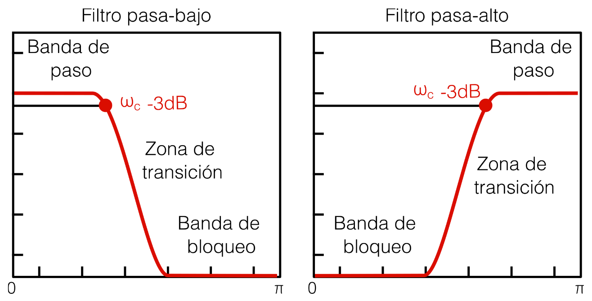

---

<!-- slide -->
## Diapositiva 17
### Tipos de filtros
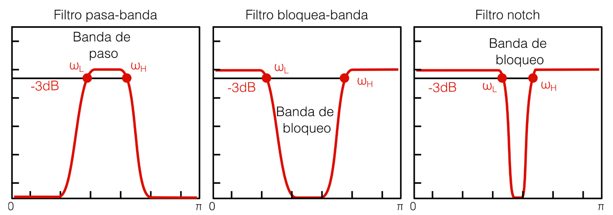

---

<!-- slide -->
## Diapositiva 18
### Tipos de filtros

---

<!-- slide -->
## Diapositiva 19
### Ejemplos de filtros

---

<!-- slide -->
## Diapositiva 20
### Ejemplos de filtros
- Sistema de ganancia simple (amplificador): Este sistema aplica un factor de ganancia a cada valor de entrada.

$$ y[n] = b[0] x[n] $$

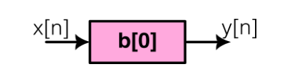

- $ 0 < b[0] < 1 $: Atenúa la señal.
- $ b[0] = 1 $: No modifica la señal.
- $ b[0] > 1 $: Amplifica la señal.
- $ b[0] < 0 $: Invierte la señal.

---

<!-- slide -->
## Diapositiva 21
### Ejemplos de filtros
- Sistema de retardo puro: Este sistema aplica un retardo de k muestras.

$$ y[n] = x[n-k] $$

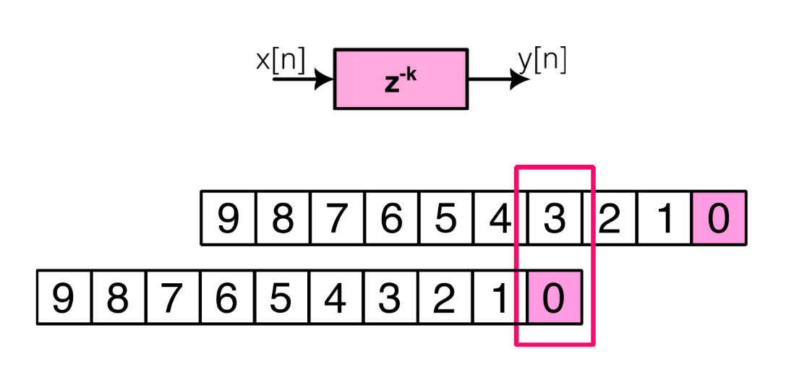

---

<!-- slide -->
## Diapositiva 22
### Ejemplos de filtros
{amarillo}(**Filtro de promedios móviles:**)
- Filtro **FIR causal**.
- Coeficientes con el **mismo valor ($1/M$)**.
- Orden del filtro: **$M-1$**.

$$y[n] = \frac{1}{M} \sum_{k=0}^{M-1} x[n-k]$$

$$b[k] = \frac{1}{M} \quad \text{para } k = 0, 1, \dots, M-1$$

$$H(z) = \frac{1}{M} \sum_{k=0}^{M-1} z^{-k}$$

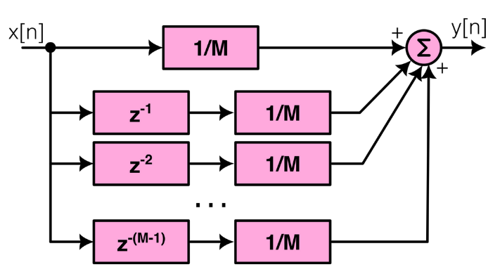

---

<!-- slide -->
## Diapositiva 23
### Ejemplos de filtros
{amarillo}(**Filtro de promedios móviles:**) Es un filtro pasabajo y su respuesta en frecuencia depende del orden del mismo.

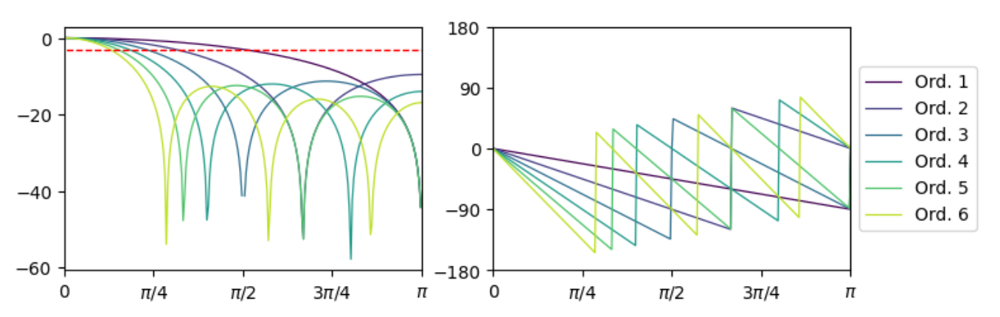

---

<!-- slide -->
## Diapositiva 24
### Ejemplos de filtros
{amarillo}(**Filtro de promedios móviles:**) Es un filtro pasabajo y su respuesta en frecuencia depende del orden del mismo.

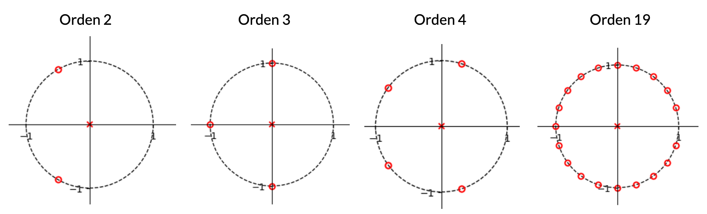

---

<!-- slide -->
## Diapositiva 25
### Ejemplos de filtros
{amarillo}(**Filtro de promedios móviles:**) Es un filtro pasabajo y su respuesta en frecuencia depende del orden del mismo.

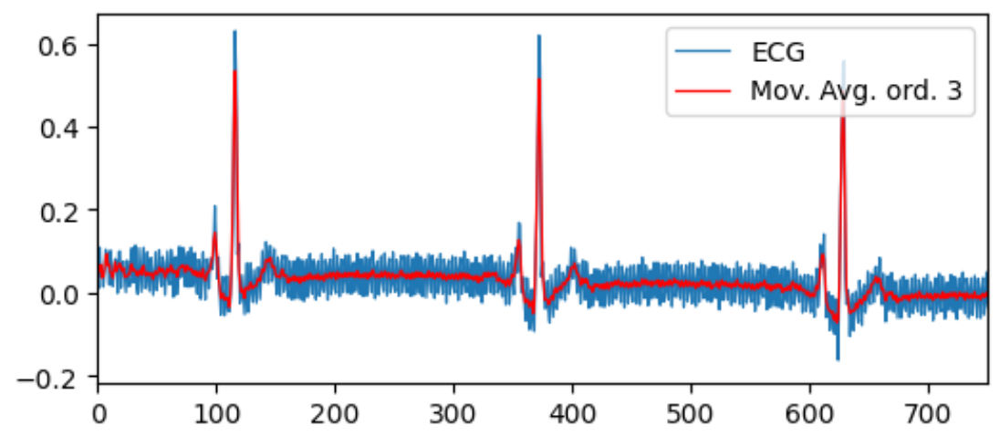

---

<!-- slide -->
## Diapositiva 26
### Filtrados "diferentes"

---

<!-- slide -->
## Diapositiva 27
### Filtrados "diferentes"
{verde}(**Filtrados alternativos**) (más allá de la función de transferencia):

{verde}(**Quitar la tendencia (Detrend):**)
- Remueve el valor de continua o una **tendencia lineal**.
- Implementado como `scipy.signal.detrend()`.

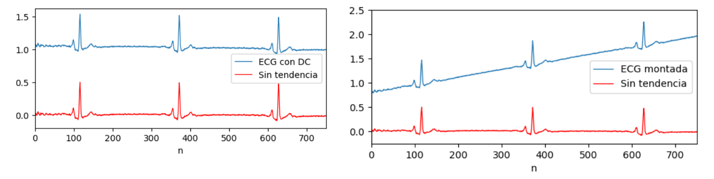

---

<!-- slide -->
## Diapositiva 28
### Filtrados "diferentes"

{verde}(**Remoción de bajas frecuencias** (Filtro pasa-alto):)
- Ideal para remover **derivas lentas (drifts)** de la señal.
- **Técnica:** Dividir la señal en **segmentos/ventanas**, quitar la tendencia a cada uno y unir los resultados.

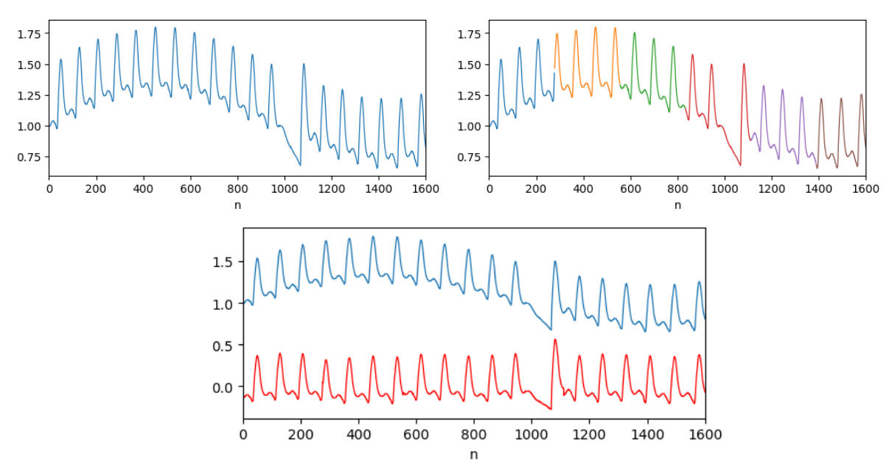

---

<!-- slide -->
## Diapositiva 29
### Filtrados "diferentes"
{amarillo}(**Filtrado en el dominio de la frecuencia:**)
- En lugar de la convolución temporal, se usa la **FFT** para pasar a la frecuencia.
- Se **multiplica** por la respuesta del filtro.
- Se retorna al tiempo con la **IFFT**.
- Muy utilizado en **procesamiento de video** y grandes volúmenes de datos.

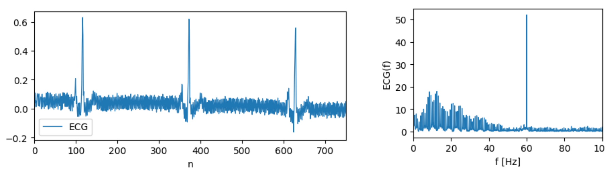

---

<!-- slide -->
## Diapositiva 30
### Filtrados "diferentes"
{amarillo}(**Filtrado en el dominio de la frecuencia:**)
- En lugar de la convolución temporal, se usa la **FFT** para pasar a la frecuencia.
- Se **multiplica** por la respuesta del filtro.
- Se retorna al tiempo con la **IFFT**.
- Muy utilizado en **procesamiento de video** y grandes volúmenes de datos.

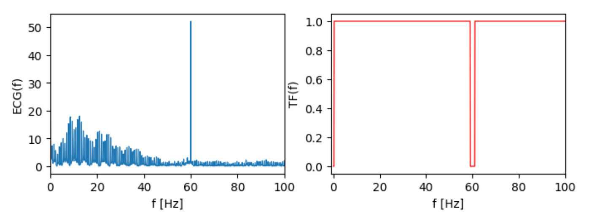

---

<!-- slide -->
## Diapositiva 32
### Filtrados "diferentes"
{amarillo}(**Filtrado en el dominio de la frecuencia:**)
- En lugar de la convolución temporal, se usa la **FFT** para pasar a la frecuencia.
- Se **multiplica** por la respuesta del filtro.
- Se retorna al tiempo con la **IFFT**.
- Muy utilizado en **procesamiento de video** y grandes volúmenes de datos.

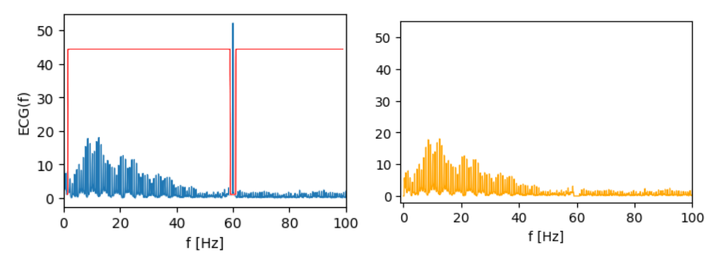

---

<!-- slide -->
## Diapositiva 33
### Filtrados "diferentes"
{amarillo}(**Filtrado en el dominio de la frecuencia:**)
- En lugar de la convolución temporal, se usa la **FFT** para pasar a la frecuencia.
- Se **multiplica** por la respuesta del filtro.
- Se retorna al tiempo con la **IFFT**.
- Muy utilizado en **procesamiento de video** y grandes volúmenes de datos.

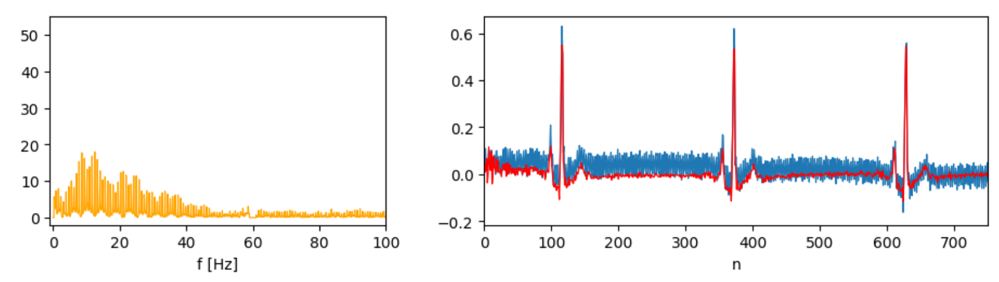

---