<!-- slide -->
## Diapositiva 1
### Filtros digitales
#### Análisis y procesamiento de Señales
##### Bioingeniería - Facultad de Ingeniería - UNSTA
##### 2026
**Dr. Ing. Facundo Adrián Lucianna**
**Ing. Facundo Roldán**

---

<!-- slide -->
## Diapositiva 3
### Filtros digitales

---

<!-- slide -->
## Diapositiva 4
### Filtros digitales
- Un **filtro digital** es un sistema que **discrimina** frecuencias o gamas de frecuencias de una señal, **modificando su amplitud y fase**.
- Los filtros que veremos son **sistemas lineales e invariantes en el tiempo (LTI)**.
- Se caracterizan mediante su **función de transferencia**, ya sea en el dominio del tiempo o mediante la **transformada Z**.

---

<!-- slide -->
## Diapositiva 5
### Filtros digitales
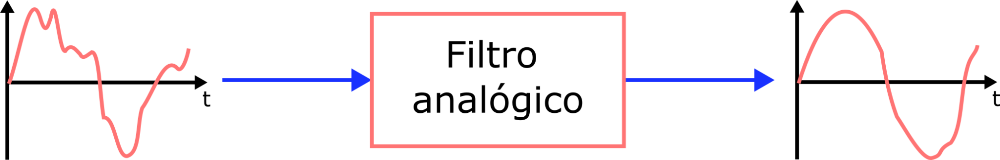
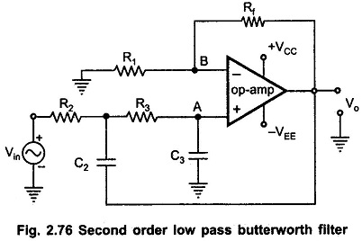

---

<!-- slide -->
## Diapositiva 6
### Filtros digitales
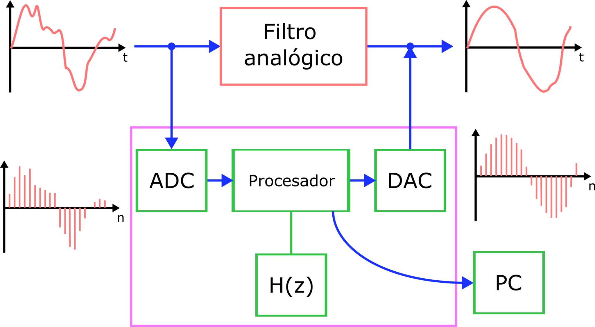

---

<!-- slide -->
## Diapositiva 7
### Filtros digitales
- El efecto es similar al de los filtros analógicos, pero su **implementación es diferente** (dominio discreto).
- **Filtros analógicos:** Se implementan con circuitos electrónicos pasivos o activos.
- **Filtros digitales:** Se implementan mediante **circuitos lógicos digitales** (DSP, FPGA) o **software** (programas de computación).

---

<!-- slide -->
## Diapositiva 8
### Filtros digitales
- **Programable:** Su operación depende de un programa almacenado en memoria. Sus características pueden **cambiarse fácilmente**.
- **Alta estabilidad:** Son extremadamente estables frente al tiempo y la temperatura.
- *Filtros analógicos (activos):* Suelen presentar **derivas (drift)** y dependencia térmica.

---

<!-- slide -->
## Diapositiva 9
### Clasificación de filtros digitales

---

<!-- slide -->
## Diapositiva 10
### Clasificación de filtros digitales
- **No recursivos:** La salida depende **únicamente de las entradas** (presentes y pasadas).
- **Estabilidad garantizada:** Tienen todos sus **polos en el origen**.

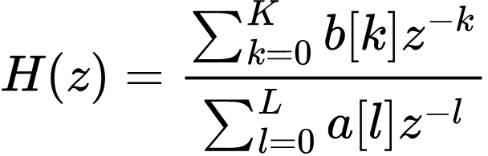
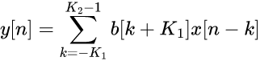

---

<!-- slide -->
## Diapositiva 11
### Clasificación de filtros digitales
- **Sistemas FIR** (*Finite Impulse Response*): Su respuesta al impulso es **finita**.
- En estos filtros, **los coeficientes son directamente la respuesta al impulso**.

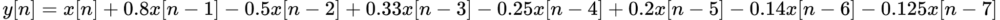
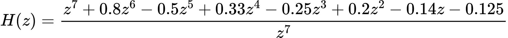

---

<!-- slide -->
## Diapositiva 12
### Clasificación de filtros digitales
- **Recursivos:** La salida depende de las entradas y de **salidas pasadas**.
- **Retroalimentación:** Pueden presentar **problemas de estabilidad** (dependiendo de la ubicación de los polos).

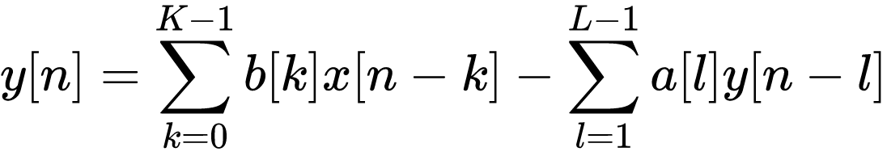
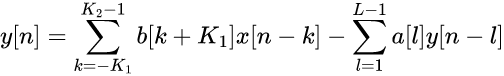

---

<!-- slide -->
## Diapositiva 13
### Clasificación de filtros digitales
- **Sistemas IIR** (*Infinite Impulse Response*): Su respuesta al impulso es **infinita**.
- La respuesta **tiende a cero**, pero teóricamente nunca llega a él.

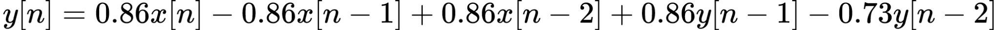
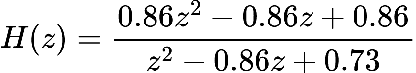

---

<!-- slide -->
## Diapositiva 14
### Clasificación de filtros digitales
- **Clasificación según la causalidad:** ¿Utiliza muestras "del futuro"?
- **Causal:** Solo utiliza entradas y salidas **presentes y pasadas**. Poseen **transformada Z**.

---

<!-- slide -->
## Diapositiva 15
### Clasificación de filtros digitales
- **No Causal:** Utiliza **muestras del futuro**.
- *Ejemplo típico:* Cálculo de derivada por **diferencia central**.
- Nos centraremos principalmente en **sistemas causales**.
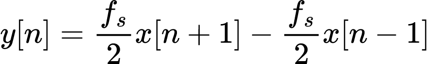

---

<!-- slide -->
## Diapositiva 16
### Clasificación de filtros digitales
- **Orden del filtro:** Número de **muestras pasadas** (retrasos) necesarias para calcular la salida.
- **Ejemplos visuales:**
  - Orden cero
  - 1er Orden
  - 2do Orden
  - 3er Orden

---

<!-- slide -->
## Diapositiva 17
### Tipos de filtros

---

<!-- slide -->
## Diapositiva 18
### Tipos de filtros
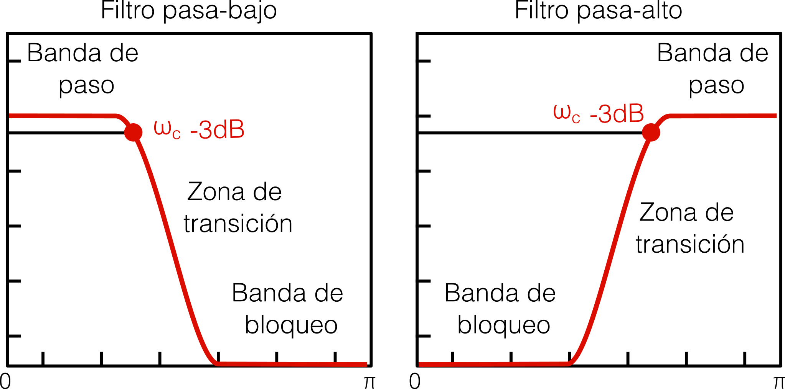

---

<!-- slide -->
## Diapositiva 19
### Tipos de filtros
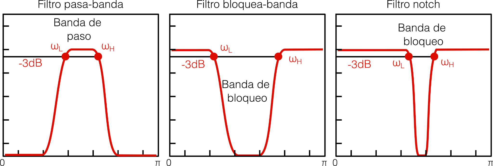

---

<!-- slide -->
## Diapositiva 20
### Tipos de filtros
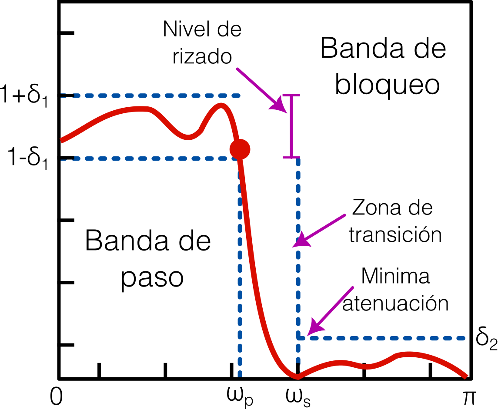

---

<!-- slide -->
## Diapositiva 21
### Ejemplos de filtros

---

<!-- slide -->
## Diapositiva 22
### Ejemplos de filtros
- Sistema de ganancia simple (amplificador): Este sistema aplica un factor de ganancia a cada valor de entrada.
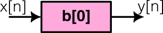
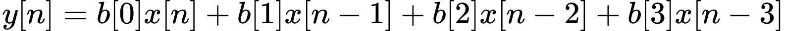

---

<!-- slide -->
## Diapositiva 23
### Ejemplos de filtros
- Sistema de retardo puro: Este sistema aplica un retardo de k muestras.
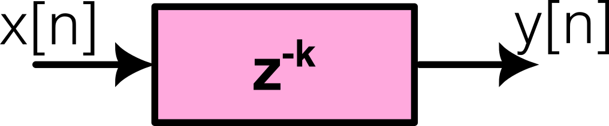
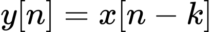
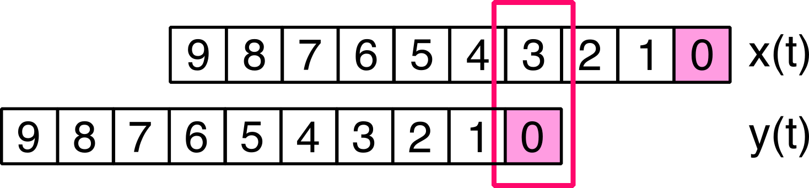

---

<!-- slide -->
## Diapositiva 24
### Ejemplos de filtros
- **Filtro de promedios móviles:**
  - Filtro **FIR causal**.
  - Coeficientes con el **mismo valor ($1/M$)**.
  - Orden del filtro: **$M-1$**.
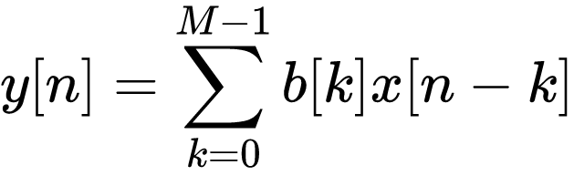
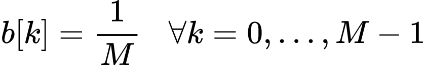
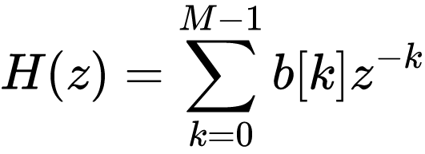

---

<!-- slide -->
## Diapositiva 25
### Ejemplos de filtros
- **Filtro de promedios móviles:**
  - Filtro **FIR causal**.
  - Coeficientes con el **mismo valor ($1/M$)**.
  - Orden del filtro: **$M-1$**.
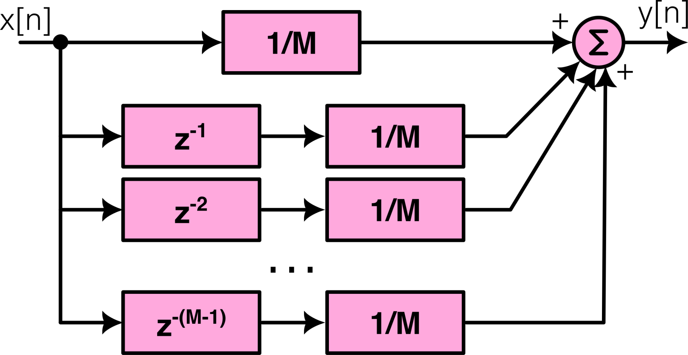

---

<!-- slide -->
## Diapositiva 26
### Ejemplos de filtros
- Filtro de promedio móviles: Es un filtro pasabajo y su respuesta en frecuencia depende del orden del mismo.
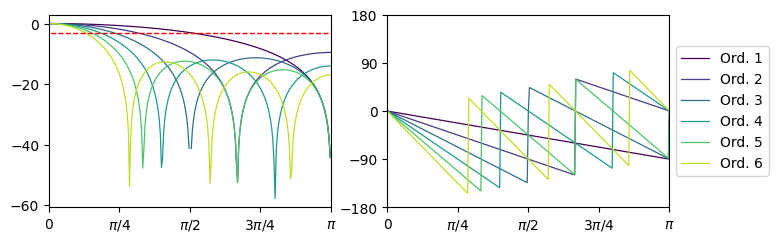

---

<!-- slide -->
## Diapositiva 27
### Ejemplos de filtros
- Filtro de promedio móviles: Es un filtro pasabajo y su respuesta en frecuencia depende del orden del mismo.
- Orden 2
- Orden 3
- Orden 4
- Orden 19
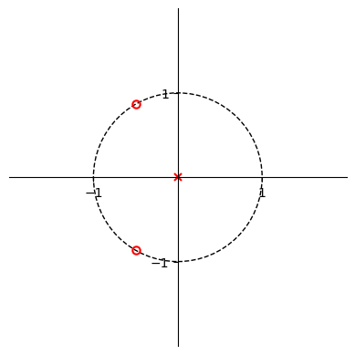
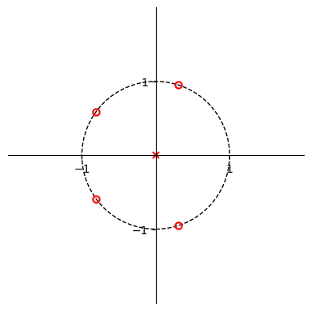
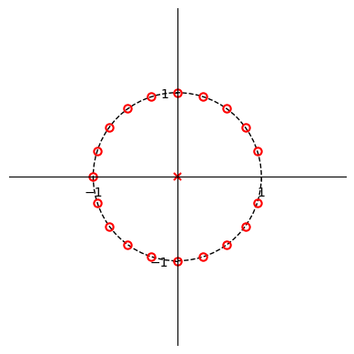
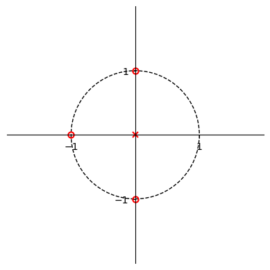

---

<!-- slide -->
## Diapositiva 28
### Ejemplos de filtros
- Filtro de promedio móviles: Es un filtro pasabajo y su respuesta en frecuencia depende del orden del mismo.
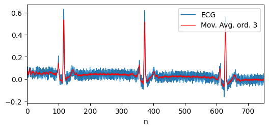

---

<!-- slide -->
## Diapositiva 29
### Filtrados "diferentes"

---

<!-- slide -->
## Diapositiva 30
### Filtrados "diferentes"
- **Filtrados alternativos** (más allá de la función de transferencia):
  1. **Quitar la tendencia (Detrend):**
     - Remueve el valor de continua o una **tendencia lineal**.
     - Implementado como `scipy.signal.detrend()`.

---

<!-- slide -->
## Diapositiva 31
### Filtrados "diferentes"
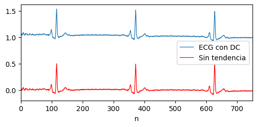

---

<!-- slide -->
## Diapositiva 32
### Filtrados "diferentes"
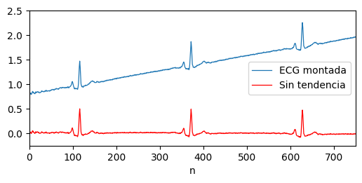

---

<!-- slide -->
## Diapositiva 33
### Filtrados "diferentes"
- **Remoción de bajas frecuencias** (Filtro pasa-alto):
  - Ideal para remover **derivas lentas (drifts)** de la señal.
  - **Técnica:** Dividir la señal en **segmentos/ventanas**, quitar la tendencia a cada uno y unir los resultados.

---

<!-- slide -->
## Diapositiva 34
### Filtrados "diferentes"
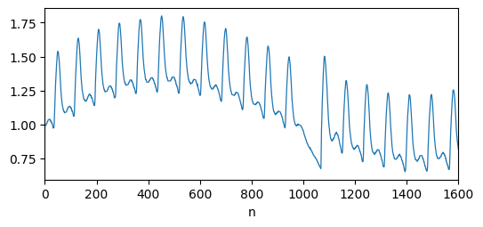

---

<!-- slide -->
## Diapositiva 35
### Filtrados "diferentes"
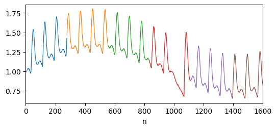

---

<!-- slide -->
## Diapositiva 36
### Filtrados "diferentes"
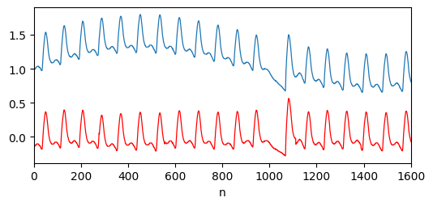

---

<!-- slide -->
## Diapositiva 37
### Filtrados "diferentes"
- **Filtrado en el dominio de la frecuencia:**
  - En lugar de la convolución temporal, se usa la **FFT** para pasar a la frecuencia.
  - Se **multiplica** por la respuesta del filtro.
  - Se retorna al tiempo con la **IFFT**.
  - Muy utilizado en **procesamiento de video** y grandes volúmenes de datos.

---

<!-- slide -->
## Diapositiva 38
### Filtrados "diferentes"

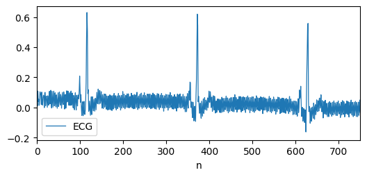

---

<!-- slide -->
## Diapositiva 39
### Filtrados "diferentes"
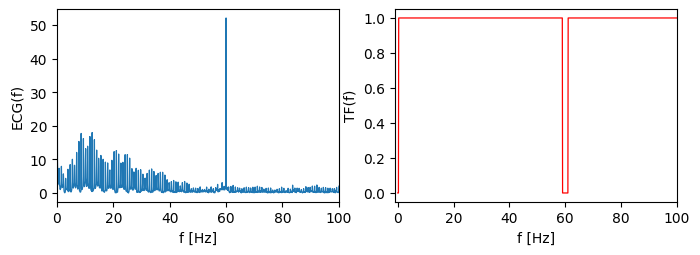

---

<!-- slide -->
## Diapositiva 40
### Filtrados "diferentes"

---

<!-- slide -->
## Diapositiva 41
### Filtrados "diferentes"
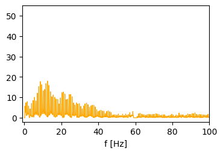
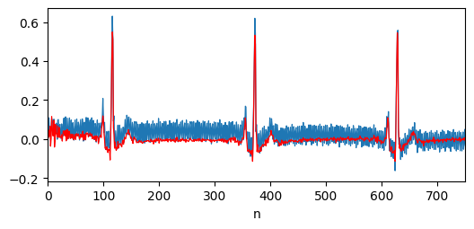

---

<!-- slide -->
## Diapositiva 42
### Filtrados "diferentes"

Formula $ x = x + 1 $ 

---

<!-- slide -->
## Diapositiva 43
### Filtrados "diferentes"

Formula 

$$ x = x + 1 $$ 

---