<!-- slide -->
## Diapositiva 1
### Diseño de filtros digitales usando diagrama polo y ceros
#### Análisis y procesamiento de Señales
##### Bioingeniería - Facultad de Ingeniería - UNSTA
##### 2026
**Dr. Ing. Facundo Adrián Lucianna**
**Ing. Facundo Roldán**

---

<!-- slide -->
## Diapositiva 2
### Diseño de filtros digitales usando diagrama polo y ceros

---

<!-- slide -->
## Diapositiva 3
### Diseño de filtros digitales
- Una primera forma que vamos a ver de diseñar filtros es {amarillo}(**trabajando con el diagrama de polos y ceros**), poniendo ceros y polos e ir viendo su respuesta en frecuencia.
- Es una {verde}(**técnica bastante artesanal**), permite armar filtros FIR e IIR, y en general, se pueden formar diseños sencillos.
- Un buen uso de esta técnica puede permitir obtener filtros con {verde}(**muchos menos coeficientes**) que las otras técnicas que veremos, pero requieren **mucha experiencia**.

---

<!-- slide -->
## Diapositiva 4
### Diseño de filtros digitales
- La idea es pensar a la {amarillo}(**respuesta en frecuencia como una banda elástica**), a la cual le vamos empujando para abajo usando {rojo}(**ceros**) o arriba usando {verde}(**polos**).

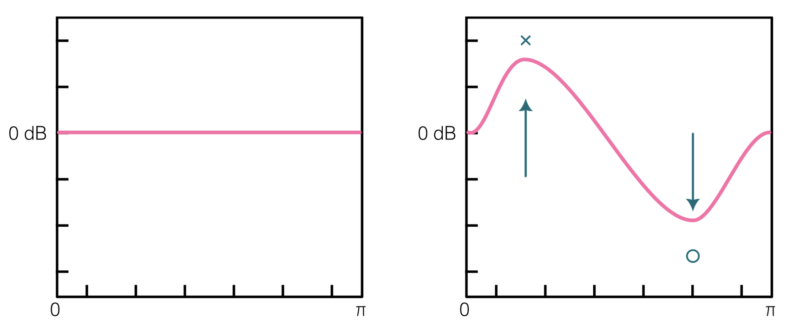

---

<!-- slide -->
## Diapositiva 5
### Diseño de filtros digitales
- {amarillo}(**Qué tanto empujamos**) va a depender de qué tan cerca del **círculo unitario** estemos.

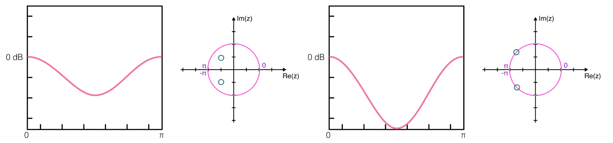

---

<!-- slide -->
## Diapositiva 6
### Diseño de filtros digitales
A la hora de poner ceros y polos, debemos tener en cuenta las siguientes {amarillo}(**reglas:**)
- {verde}(**Misma cantidad de polos que de ceros:**) Una vez que ubicamos los ceros y polos que queremos, debemos ver de cuál hay déficit y poner los restantes en el origen. Los dos polinomios de $H(z)$ deben ser del mismo orden.
- {verde}(**Los polos siempre dentro del círculo**) para mantener estabilidad.
- Recordemos que la {verde}(**mitad superior del círculo corresponde a las frecuencias positivas**) y la mitad inferior a las frecuencias negativas.

---

<!-- slide -->
## Diapositiva 7
### Diseño de filtros digitales
A la hora de poner ceros y polos, debemos tener en cuenta las siguientes {amarillo}(**reglas:**)
- Si ponemos un cero (o un polo) que {rojo}(**no sea real**), si o si debemos colocar su {rojo}(**complejo conjugado**).

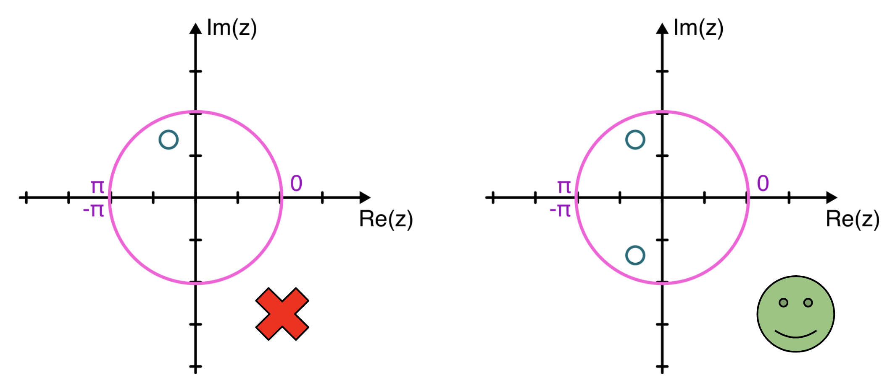

---

<!-- slide -->
## Diapositiva 8
### Diseño de filtros digitales
A la hora de poner ceros y polos, debemos tener en cuenta las siguientes {amarillo}(**reglas:**)
- Como estamos usando la transformada Z, estos filtros son {verde}(**causales**).
- Si ponemos {verde}(**todos los polos en el origen**), el filtro es **FIR**, es decir, la salida solo va a depender de las entradas presentes y pasadas.
- Si ponemos {amarillo}(**al menos un polo fuera del origen**), el filtro es **IIR**, es decir, la salida va a depender de las entradas presentes y pasadas y de salidas pasadas.

---

<!-- slide -->
## Diapositiva 9
### Diseño de filtros digitales
{amarillo}(**¿Cómo ponemos polos y ceros?**) Usamos la {verde}(**notación polar:**)

$$z = re^{j\omega} = |z|e^{j\omega}$$

Donde $r$ es la distancia al centro:
- Si es **uno**, está sobre el círculo unitario.
- Si está **entre 0 y 1**, está dentro del círculo.
- Si es **mayor a 1**, está por fuera del círculo.

$\omega$ es la frecuencia, recordemos que esta entre $0$ y $\pi$ ($0$ y $f_s/2$).

---

<!-- slide -->
## Diapositiva 10
### Diseño de filtros digitales
{amarillo}(**¿Cómo ponemos polos y ceros?**) Usamos la {verde}(**notación polar:**)

$$z = re^{j\omega} = |z|e^{j\omega}$$

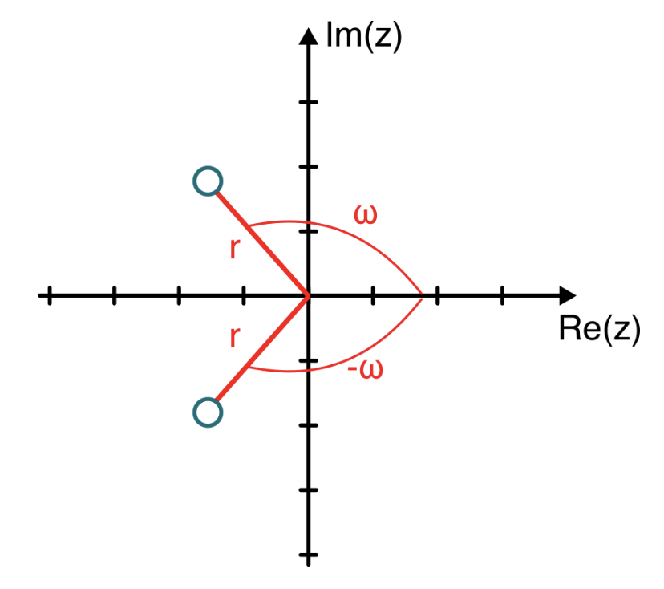

---

<!-- slide -->
## Diapositiva 11
### Diseño de filtros digitales
Una vez que tenemos ubicados los polos y ceros, {amarillo}(**pasamos a coordenadas cartesianas:**)

$$Re(z) = r\cos(\omega) \qquad Im(z) = r\,\text{sen}(\omega)$$

Luego se trabaja algebraicamente para obtener los polinomios:

$$H(z) = b_0 z^{-K+L} \frac{\prod_{k=1}^{K}(z - z_k)}{\prod_{l=1}^{L}(z - z_l)}$$

$$H(z) = \frac{\sum_{k=0}^{K} b[k] z^{-k}}{\sum_{l=0}^{L} a[l] z^{-l}}$$

$$y[n] = \sum_{k=0}^{K-1} b[k]\,x[n-k] - \sum_{l=1}^{L-1} a[l]\,y[n-l]$$

---

<!-- slide -->
## Diapositiva 12
### Diseño de filtros digitales
{amarillo}(**Ejemplo:**) Veamos la siguiente señal:
- Tiene {rojo}(**ruido de 60 Hz**), podemos aplicar un **filtro notch**.

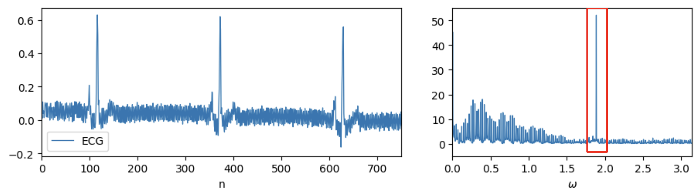

---

<!-- slide -->
## Diapositiva 13
### Diseño de filtros digitales
{amarillo}(**Ejemplo:**) Veamos la siguiente señal:
- La frecuencia de muestreo es **200 Hz**, entonces si normalizamos la frecuencia de 60 Hz es $\omega_{60} = 0.6\pi$. Ponemos un **cero** en esa frecuencia.

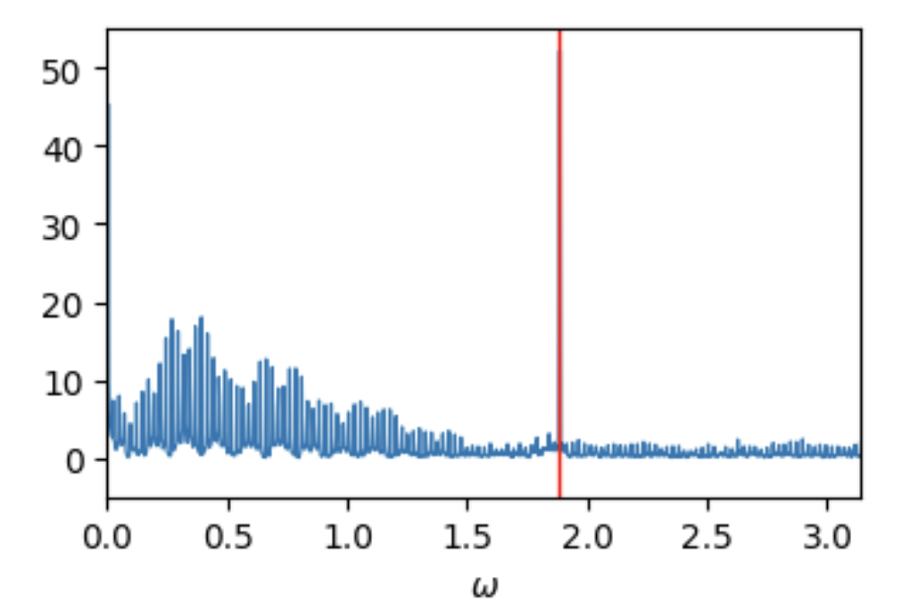

---

<!-- slide -->
## Diapositiva 14
### Diseño de filtros digitales
{amarillo}(**Ejemplo:**) Colocamos un cero en $\omega_{60} = 0.6\pi$ y su conjugado en $-0.6\pi$:

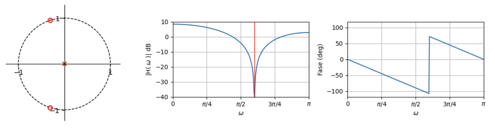

---

<!-- slide -->
## Diapositiva 15
### Diseño de filtros digitales
- Está bastante bien, el problema es que se {rojo}(**amplifica un poco en la zona de paso**). Previo a ajustar eso, vamos a ver si podemos **estrechar el notch** agregando polos en $0.57\pi$ y $0.63\pi$ (57 Hz y 63 Hz).

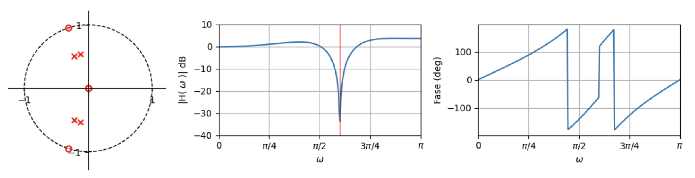

---

<!-- slide -->
## Diapositiva 16
### Diseño de filtros digitales
- Ahí se {verde}(**achicó el ancho de la zona de bloqueo**). Vamos a poner un **cero más en 0 Hz** para levantar la primera parte.

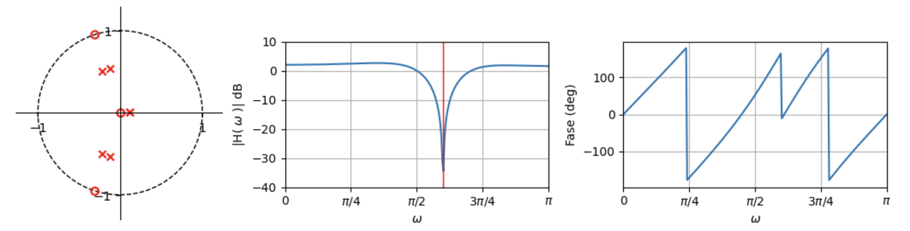
---

<!-- slide -->
## Diapositiva 17
### Diseño de filtros digitales
- Vemos que la {verde}(**fase se mantiene bastante lineal**) en la zona de paso. Por lo que estamos conformes con este filtro.
- Vamos a {amarillo}(**mover la respuesta a 0 dB**) para que no se amplifique. Para ello dividimos por el valor de $H(0)$ a toda la respuesta (podría usarse un valor medio de la banda de paso).

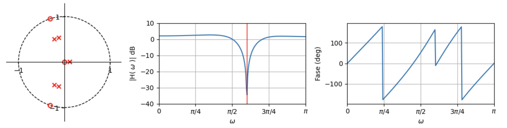

---

<!-- slide -->
## Diapositiva 18
### Diseño de filtros digitales
- Este filtro tiene un {verde}(**ancho de banda de 16 Hz**), va desde 52 Hz a 68 Hz.
- En la zona de la banda de paso la distorsión va desde **0.8 dB a -0.15 dB** por lo que tiene muy poca distorsión.
- Igual la fase, tiene una respuesta bastante cercana a la **lineal**.

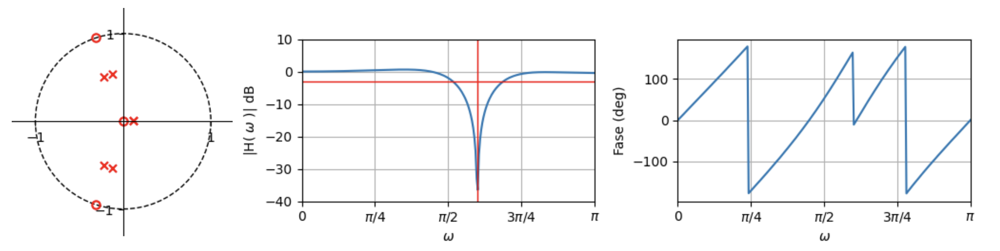

---

<!-- slide -->
## Diapositiva 19
### Diseño de filtros digitales
Conforme con el filtro, obtengamos la {amarillo}(**función de transferencia:**)

$$H(z) = 0.82\,z^3 \frac{1 + 0.6z + z^2}{-0.018 + 0.05z + 0.06z^2 + 0.57z^3 + 0.47z^4 + z^5}$$

$$H(z) = \frac{0.82z^{-2} + 0.51z^{-1} + 0.82}{-0.02z^{-5} + 0.05z^{-4} + 0.06z^{-3} + 0.57z^{-2} + 0.48z^{-1} + 1}$$

Los coeficientes son:

```
b = [0.82, 0.51, 0.82]
a = [1, 0.48, 0.57, 0.06, 0.05, -0.20]
```

---

<!-- slide -->
## Diapositiva 20
### Diseño de filtros digitales
Con los coeficientes, podemos {verde}(**aplicar el filtro**):

```python
b = [0.82, 0.51, 0.82]
a = [1, 0.48, 0.57, 0.06, 0.05, -0.20]
```

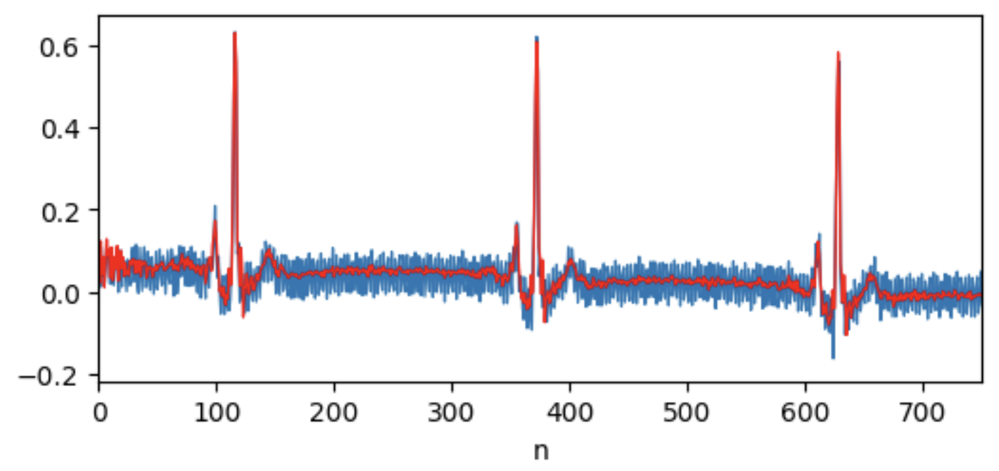

---

<!-- slide -->
## Diapositiva 21
### Diseño de filtros digitales
Con los coeficientes, podemos {verde}(**aplicar el filtro**):

```python
b = [0.82, 0.51, 0.82]
a = [1, 0.48, 0.57, 0.06, 0.05, -0.20]
```

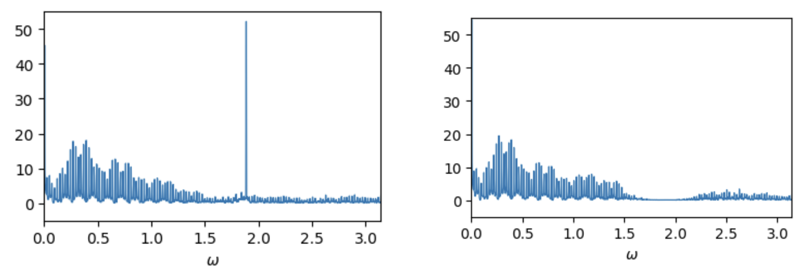

---

<!-- slide -->
## Diapositiva 22
### Diseño de filtros digitales
- Este es un {amarillo}(**filtro IIR**), es {verde}(**estable**) porque todos sus polos están dentro del círculo y su {rojo}(**respuesta al impulso es infinita:**)

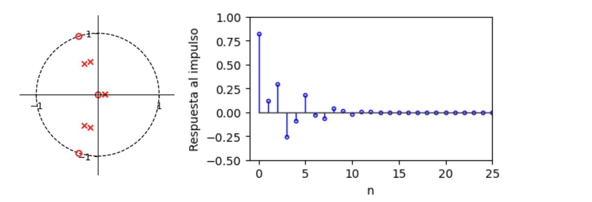

---

<!-- slide -->
## Diapositiva 23
### Diseño de filtros digitales
- Si recordamos, los filtros FIR tienen como coeficientes la respuesta al impulso, por lo que podemos {amarillo}(**convertir un filtro IIR en un filtro FIR**) tomando la respuesta al impulso y **truncando** una cantidad finita de valores.
- Si por ejemplo tomamos los **20 primeros coeficientes:**

$$H(z) = \sum_{k=0}^{19} b[k]\,x[n-k]$$

---

<!-- slide -->
## Diapositiva 24
### Diseño de filtros digitales
Nos queda:

```
b = [0.82,  0.12,  0.29,  -0.25,  -0.09,  0.18,  -0.03,  -0.07,
     0.04,  0.01, -0.02, -0.002,  0.005, -0.003, -0.0007,  0.001,
    -0.0001, -0.0003, 0.0003, 0.0001, 0.00001]
```

- De esta forma transformamos un filtro IIR en uno que usa **sólo entradas**. Hay casos en que es más fácil aplicar solo entradas.
- Al {rojo}(**truncar la respuesta al impulso**), el filtro pierde precisión. Cuantos más coeficientes usamos mejor será el filtro, pero el **retardo aumenta**.

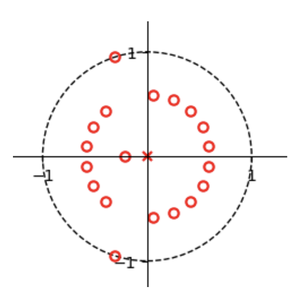

---

<!-- slide -->
## Diapositiva 25
### Diseño de filtros digitales
En este caso, la {amarillo}(**respuesta en frecuencia del filtro FIR**) queda:

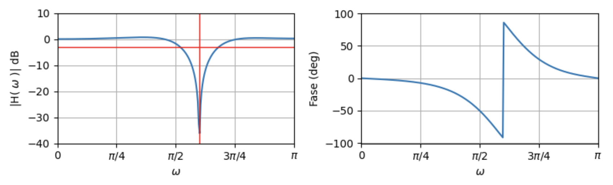

---

<!-- slide -->
## Diapositiva 26
### Diseño de filtros digitales
Aplicando el {verde}(**filtro FIR**) a la señal ECG:

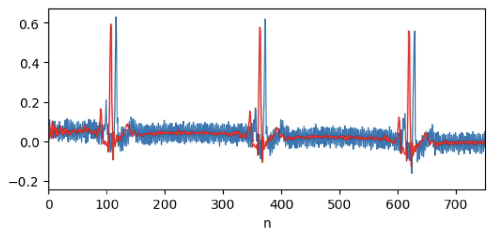

---
