<!-- slide -->
## Diapositiva 1
### Diseño de filtros digitales FIR
#### Análisis y procesamiento de Señales
##### Bioingeniería - Facultad de Ingeniería - UNSTA
##### 2026
**Dr. Ing. Facundo Adrián Lucianna**
**Ing. Facundo Roldán**

---

<!-- slide -->
## Diapositiva 2
### Diseño de filtros digitales FIR

---

<!-- slide -->
## Diapositiva 3
### Diseño de filtros digitales FIR
- La salida del filtro {verde}(**depende únicamente de las entradas**). Este tipo de sistemas se llaman {amarillo}(**FIR (Finite Impulse Response)**).
- En este tipo de filtro, {verde}(**la respuesta al impulso son los coeficientes**) $b[k]$:

$$y[n] = \sum_{k=0}^{K} b[k]\,x[n-k] \qquad \Leftarrow \Rightarrow \qquad H(z) = \sum_{k=0}^{K} b[k]\,z^{-k}$$

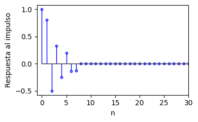

---

<!-- slide -->
## Diapositiva 4
### Diseño de filtros digitales FIR
El {amarillo}(**diseño de un filtro FIR**) consiste en:
- {verde}(**Encontrar los coeficientes de la respuesta al impulso**) $b[k]$
- {verde}(**Encontrar la respuesta en frecuencia**) $H(\omega)$

Especificar un FIR implica determinar los {amarillo}(**coeficientes de una serie de Fourier**). Usamos la conversión de transformada Z a la transformada de Fourier:

$$y[n] = \sum_{k=0}^{K} b[k]\,x[n-k] \qquad \Leftarrow \Rightarrow \qquad H(z) = \sum_{k=0}^{K} b[k]\,z^{-k}$$

$$ H(z) = \sum_{k=0}^{K} b[k]\,z^{-k} \qquad \Rightarrow \qquad H(\omega) = \sum_{k=0}^{K} b[k]\,e^{-j\omega k}$$

$$b[k] = \frac{1}{2\pi} \int_{-\pi}^{\pi} H(\omega)\,e^{j\omega k}\,d\omega$$

---

<!-- slide -->
## Diapositiva 5
### Diseño de filtros digitales FIR
La idea es usar una {amarillo}(**respuesta ideal de un filtro**) para encontrarle los coeficientes de Fourier.

Para un {verde}(**filtro pasa-bajo ideal**) con frecuencia de corte $\omega_c$:

$$H(\omega) = \begin{cases} 1 & -\omega_c \leq \omega \leq \omega_c \\ 0 & \text{en otro caso} \end{cases}$$

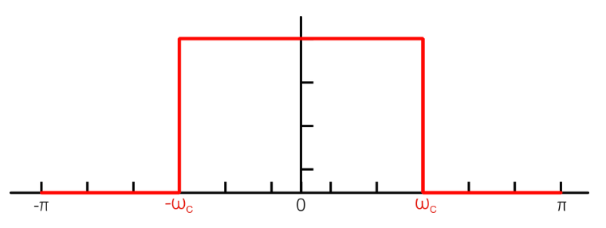

---

<!-- slide -->
## Diapositiva 6
### Diseño de filtros digitales FIR
Para poder aplicarle la serie, lo {amarillo}(**hacemos periódica**) con período $2\pi$.
- Son señales de pulsos, y conocemos su {verde}(**serie de Fourier**).

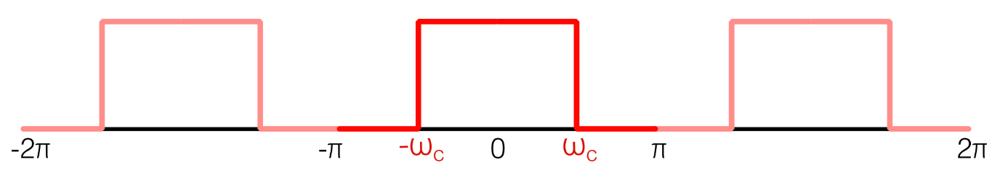

---

<!-- slide -->
## Diapositiva 7
### Diseño de filtros digitales FIR
Calculando, empezamos para {amarillo}(**$b[0]$**):

$$b[0] = \frac{1}{2\pi} \int_{-\omega_c}^{\omega_c} e^{-j\omega \cdot 0}\,d\omega = \frac{1}{2\pi}\,(\omega_c - (-\omega_c)) = \frac{\omega_c}{\pi}$$

---

<!-- slide -->
## Diapositiva 8
### Diseño de filtros digitales FIR
Calculando, seguimos para {amarillo}(**otros valores de $k$**):

$$b[k] = \frac{1}{2\pi} \int_{-\omega_c}^{\omega_c} e^{-j\omega k}\,d\omega = \frac{1}{2\pi}\,\frac{1}{(-jk)}\,e^{-j\omega k}\Big|_{-\omega_c}^{\omega_c}$$

$$= \frac{1}{(-2\pi jk)}\left(e^{-j\omega_c k} - e^{j\omega_c k}\right) = \frac{\text{sen}(k\omega_c)}{k\pi}$$

---

<!-- slide -->
## Diapositiva 9
### Diseño de filtros digitales FIR
Los coeficientes para el {amarillo}(**filtro pasa-bajo**) son:

$$b[k] = \begin{cases} \dfrac{\omega_c}{\pi} & k = 0 \\[8pt] \dfrac{\text{sen}(k\omega_c)}{k\pi} & k \neq 0 \end{cases}$$

---

<!-- slide -->
## Diapositiva 10
### Diseño de filtros digitales FIR
De similar forma se encuentran los {amarillo}(**diferentes tipos de filtros:**)
- {verde}(**Filtro pasa-bajo:**) $b[0] = \omega_c/\pi$; $\quad b[k] = \text{sen}(k\omega_c)/(k\pi)$
- {verde}(**Filtro pasa-alto:**) $b[0] = 1 - \omega_c/\pi$; $\quad b[k] = -\text{sen}(k\omega_c)/(k\pi)$
- {verde}(**Filtro pasa-banda:**) $b[0] = (\omega_{c2}-\omega_{c1})/\pi$; $\quad b[k] = [\text{sen}(k\omega_{c2})-\text{sen}(k\omega_{c1})]/(k\pi)$
- {verde}(**Filtro bloquea-banda:**) $b[0] = 1 - (\omega_{c2}-\omega_{c1})/\pi$; $\quad b[k] = [\text{sen}(k\omega_{c1})-\text{sen}(k\omega_{c2})]/(k\pi)$

---

<!-- slide -->
## Diapositiva 11
### Diseño de filtros digitales FIR
Los coeficientes son {rojo}(**infinitos:**) la serie de Fourier de un pulso genera coeficientes $b[k]$ para todo $k \in (-\infty, \infty)$.

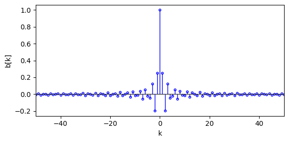

---

<!-- slide -->
## Diapositiva 12
### Diseño de filtros digitales FIR
Los coeficientes son infinitos: {amarillo}(**debemos truncar con una ventana**). Se puede usar una ventana {verde}(**rectangular, Blackman, Hamming**), etc.

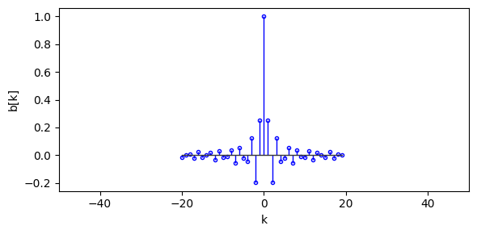

---

<!-- slide -->
## Diapositiva 13
### Diseño de filtros digitales FIR
Si entendemos a los $k$ negativos como coeficientes de {rojo}(**entradas futuras**), este filtro es **no causal**, por lo que se {amarillo}(**traslada**) para que los coeficientes sean positivos y el filtro sea causal.

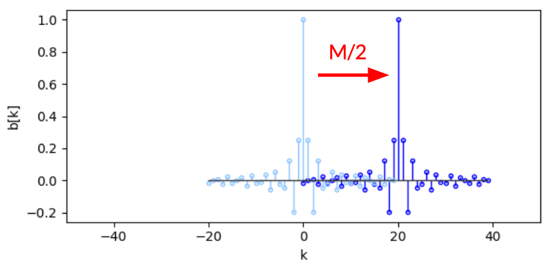

---

<!-- slide -->
## Diapositiva 14
### Diseño de filtros digitales FIR
Entonces el proceso de diseño de un {amarillo}(**filtro FIR por aproximación**) consiste en:

**Paso 1:** Definimos el tipo de filtro, las frecuencias de corte y las {verde}(**tolerancias**) en las diferentes bandas:

$$1 - \delta_1 \leq |H(e^{j\omega})| \leq 1 + \delta_1 \quad \text{(banda de paso)}$$

$$|H(e^{j\omega})| \leq \delta_2 \quad \text{(banda de bloqueo)}$$

---

<!-- slide -->
## Diapositiva 15
### Diseño de filtros digitales FIR
**Paso 2:** Una vez seleccionado el tipo de filtro, seleccionamos los {verde}(**coeficientes ideales**), por ejemplo para un filtro pasa-bajo:

$$b[k] = \begin{cases} \dfrac{\omega_c}{\pi} & k = 0 \\[8pt] \dfrac{\text{sen}(k\omega_c)}{k\pi} & k \neq 0 \end{cases}$$

---

<!-- slide -->
## Diapositiva 16
### Diseño de filtros digitales FIR
**Paso 3:** Seleccionamos cuántos coeficientes vamos a usar, {amarillo}(**$M$**), y recortamos usando una {verde}(**ventana**) que vaya de $-M/2$ a $M/2$. Por ejemplo, una ventana rectangular:

$$w_{rec}[k] = \begin{cases} 1 & -M/2 \leq k \leq M/2 \\ 0 & \text{en otro caso} \end{cases} \qquad \Rightarrow \qquad b[k] = b[k] \cdot w[k]$$

---

<!-- slide -->
## Diapositiva 17
### Diseño de filtros digitales FIR
**Paso 4:** {amarillo}(**Desplazamos**) los coeficientes de $-M/2 \dots M/2$ a $0 \dots M$, para que el filtro sea causal.

---

<!-- slide -->
## Diapositiva 18
### Diseño de filtros digitales FIR
**Paso 5:** Con los coeficientes, podemos {verde}(**filtrar mediante convolución**):

$$y[n] = \sum_{k=0}^{M} b[k]\,x[n-k]$$

---

<!-- slide -->
## Diapositiva 19
### Diseño de filtros digitales FIR
La cantidad de coeficientes {amarillo}(**$M$**) va a determinar las tolerancias del filtro. Cuanto más coeficientes, más cercano a la {verde}(**respuesta ideal**) y tolerancias más ajustadas.

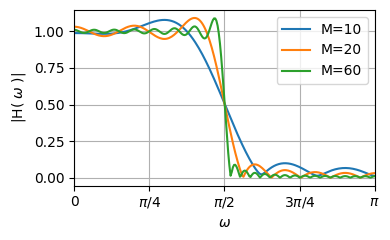

---

<!-- slide -->
## Diapositiva 20
### Diseño de filtros digitales FIR
La cantidad de coeficientes $M$ y las tolerancias obtenidas con ventana rectangular ($\omega_c = \pi/2$):

| $M$ | $\delta_1$ | $\delta_2$ | $\omega_p$ | $\omega_s$ | $\omega_c$ |
|-----|-----------|-----------|-----------|-----------|-----------|
| 10 | 0.08 | 0.1 | 1.27 | 1.93 | 1.44 |
| 20 | 0.09 | 0.09 | 1.42 | 1.75 | 1.50 |
| 60 | 0.08 | 0.09 | 1.51 | 1.64 | 1.57 |

---

<!-- slide -->
## Diapositiva 21
### Diseño de filtros digitales FIR
Esta es la serie de Fourier de un pulso, por lo que tenemos el {rojo}(**fenómeno de la oreja de Gibbs**). Con las {verde}(**ventanas de suavizado**) (Hamming, Blackman) ajustamos la banda de paso a expensas de aumentar la zona de transición.

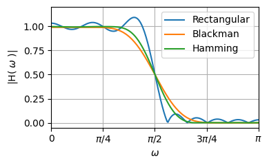

---

<!-- slide -->
## Diapositiva 22
### Diseño de filtros digitales FIR
Comparación de ventanas para $M = 20$ y $\omega_c = \pi/2$:

| Ventana | $\delta_1$ | $\delta_2$ | $\omega_p$ | $\omega_s$ |
|---------|-----------|-----------|-----------|-----------|
| Rectangular | 0.09 | 0.09 | 1.42 | 1.75 |
| Blackman | 0.004 | 0.003 | 0.87 | 2.37 |
| Hamming | 0.004 | 0.003 | 1.07 | 2.17 |

- {verde}(**Rectangular:**) menor zona de transición, mayor rizado.
- {verde}(**Blackman/Hamming:**) menor rizado, mayor zona de transición.

---

<!-- slide -->
## Diapositiva 23
### Diseño de filtros digitales FIR
El diagrama de polos y ceros toma la siguiente forma. Para {amarillo}(**$M$ creciente**), los ceros se acumulan sobre el círculo unitario en la zona de bloqueo:

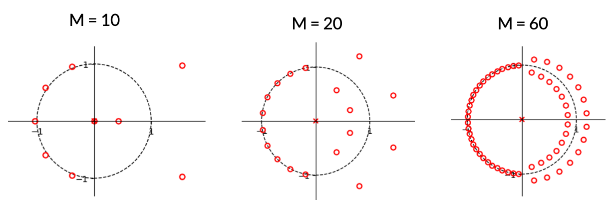

---

<!-- slide -->
## Diapositiva 24
### Diseño de filtros digitales FIR
Comparación del diagrama de polos y ceros para distintas {amarillo}(**ventanas**) con $M = 20$:

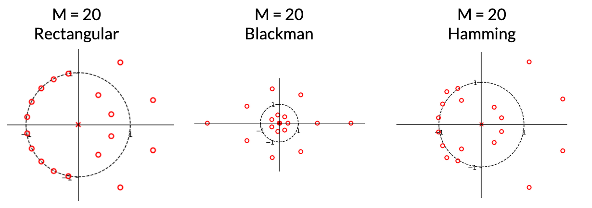

---

<!-- slide -->
## Diapositiva 25
### Diseño de filtros digitales FIR
Cuando aplicamos la convolución, la señal se filtra con un {rojo}(**retardo**) de exactamente $M/2$ muestras:

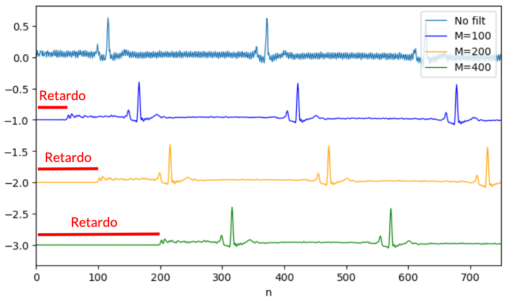

---

<!-- slide -->
## Diapositiva 26
### Diseño de filtros digitales FIR
Si usamos la función `np.convolve` con el argumento {verde}(**`mode="same"`**), automáticamente acomoda este retardo:

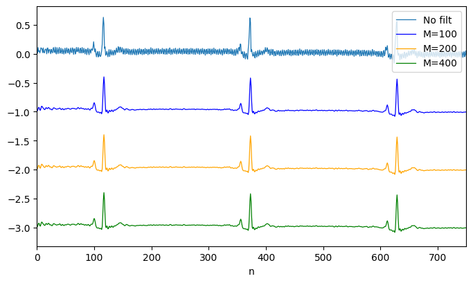

---
