<!-- slide -->
## Diapositiva 1
### Diseño de filtros digitales IIR
#### Análisis y procesamiento de Señales
##### Bioingeniería - Facultad de Ingeniería - UNSTA
##### 2026
**Dr. Ing. Facundo Adrián Lucianna**
**Ing. Facundo Roldán**

---

<!-- slide -->
## Diapositiva 2
### Diseño de filtros digitales IIR

---

<!-- slide -->
## Diapositiva 3
### Diseño de filtros digitales IIR
- La salida del filtro {verde}(**depende de las entradas y salidas**). Este tipo de sistemas se llaman {amarillo}(**IIR (Infinite Impulse Response)**) porque la respuesta al impulso es {rojo}(**infinita**).

$$y[n] = \sum_{k=0}^{K-1} b[k]\,x[n-k] - \sum_{l=1}^{L-1} a[l]\,y[n-l] \qquad \Leftarrow \Rightarrow \qquad H(z) = \frac{\sum_{k=0}^{K} b[k]\,z^{-k}}{\sum_{l=0}^{L} a[l]\,z^{-l}}$$

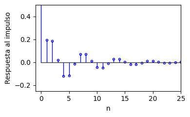

---

<!-- slide -->
## Diapositiva 4
### Diseño de filtros digitales IIR
Podemos mencionar dos tipos de filtros: {amarillo}(**AR y ARMA**).

{verde}(**Filtros AR (Autorregresivo):**) La salida depende solo de salidas pasadas y de la entrada actual:

$$y[n] = x[n] - \sum_{l=1}^{L-1} a[l]\,y[n-l] \qquad \Leftarrow \Rightarrow \qquad H(z) = \frac{1}{\sum_{l=0}^{L-1} a[l]\,z^{-l}}$$

- La función de transferencia contiene {verde}(**solo polos**), sus ceros están todos en el origen.
- El filtro es {verde}(**recursivo**) ya que la salida depende de sus propios valores pasados.

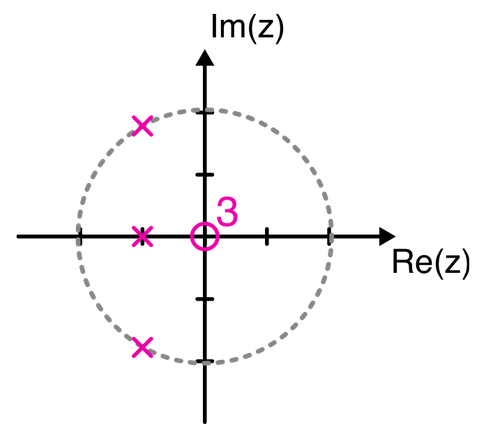

---

<!-- slide -->
## Diapositiva 5
### Diseño de filtros digitales IIR
{verde}(**Filtros ARMA (Autorregresivo y media móvil):**) Es el filtro más general y es una combinación de los filtros MA y AR:

$$y[n] = \sum_{k=0}^{K-1} b[k]\,x[n-k] - \sum_{l=1}^{L-1} a[l]\,y[n-l] \qquad \Leftarrow \Rightarrow \qquad H(z) = \frac{\sum_{k=0}^{K} b[k]\,z^{-k}}{\sum_{l=0}^{L} a[l]\,z^{-l}}$$

- Un filtro de este tipo se denota por {amarillo}(**ARMA(N, M)**), Autorregresivo de orden N y Media Móvil de orden M.
- Un filtro {verde}(**MA es otro nombre del filtro FIR**), que solo depende de entradas y tiene solamente ceros fuera del origen.

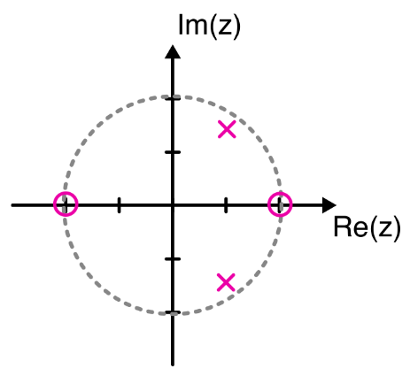

---

<!-- slide -->
## Diapositiva 6
### Diseño de filtros digitales IIR
{amarillo}(**¿Qué tipo de filtro usar: IIR o FIR?**)
- Los filtros {rojo}(**IIR**) producen en general {rojo}(**distorsión de fase**) (fase no lineal).
- Los filtros {verde}(**FIR**) son de {verde}(**fase lineal**).
- El orden de un filtro {verde}(**IIR es mucho menor**) que el de un filtro FIR para una misma aplicación.
- Los filtros {verde}(**FIR son siempre estables**).

---

<!-- slide -->
## Diapositiva 7
### Diseño de filtros digitales IIR
Podemos diseñar filtros IIR en al menos {amarillo}(**dos formas:**)
- {verde}(**Mediante métodos de diseño analógico**), seguido de una transformación del plano $s$ al plano $z$. Vamos a ver este tipo de diseño.
- Diseñar un prototipo de filtro pasa-bajo digital y hacer las oportunas transformaciones.

---

<!-- slide -->
## Diapositiva 8
### Diseño de filtros analógico

---

<!-- slide -->
## Diapositiva 9
### Diseño de filtros analógico
La idea es diseñar un {amarillo}(**filtro pasa-bajo analógico**), tal como vieron en Electrónica Analógica. Cuando se diseña el filtro, se determina a través de las {verde}(**especificaciones:**)

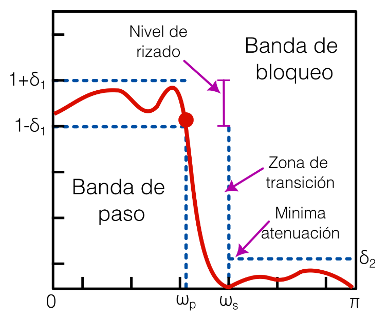

---

<!-- slide -->
## Diapositiva 10
### Diseño de filtros analógico
Se parte de un {amarillo}(**prototipo de filtro pasa-bajos normalizado**) ($\nu_c = 1$) en el que se usa una frecuencia $\nu$ normalizada. El módulo de la función de transferencia es:

$$|H(\nu)|^2 = \frac{1}{1 + (L_n(\nu))^2}$$

- $L_n(\nu)$ es un {verde}(**polinomio de grado $n$**).
- El objetivo del diseño es encontrar el polinomio $L_n(\nu)$ que mejor cumpla las especificaciones. Para ello se utilizan algunas {amarillo}(**aproximaciones (Butterworth, Chebyshev, etc.)**).

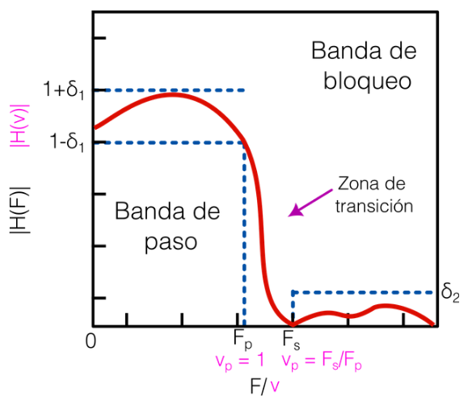

---

<!-- slide -->
## Diapositiva 11
### Diseño de filtros analógico
Entre las aproximaciones podemos mencionar:
- {verde}(**Butterworth:**) Respuesta de frecuencia lo más {verde}(**plana**) posible en la banda de paso, a expensas de una zona de transición más lenta.
- {verde}(**Chebyshev:**) Caída {verde}(**más pronunciada**) que Butterworth; tiene ondulación en la banda de paso (tipo I) o en la banda de bloqueo (tipo II).
- {verde}(**Elíptico:**) Ondulación en ambas bandas (paso y bloqueo). Dado el mismo orden, tiene la {verde}(**zona de transición más rápida**).

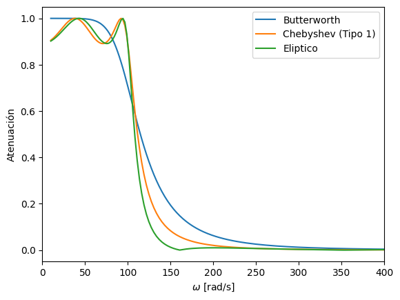

---

<!-- slide -->
## Diapositiva 12
### Diseño de filtros analógico
Una vez que tenemos el diseño del filtro pasa-bajo $H(\nu)$ normalizado, obtenemos $H_N(s)$. Dependiendo del tipo de filtro deseado, realizamos una {amarillo}(**transformación:**)
- {verde}(**Filtro pasa-bajo:**) Se desnormaliza para el rango de frecuencias deseado.
- {verde}(**Filtro pasa-alto:**) $H(s) = H_N\!\left(\dfrac{1}{s}\right)$ y luego se desnormaliza.
- {verde}(**Filtro pasa-banda:**) $H(s) = H_N\!\left(\dfrac{1}{\Delta\omega}\!\left(s + \dfrac{1}{s}\right)\right)$ con $\Delta\omega = \omega_2 - \, \omega_1$.
- {verde}(**Filtro bloquea-banda:**) $H(s) = H_N\!\left(\dfrac{\Delta\omega}{s + \frac{1}{s}}\right)$ con $\Delta\omega = \omega_2 - \omega_1$.

---

<!-- slide -->
## Diapositiva 13
### Diseño de filtros analógico

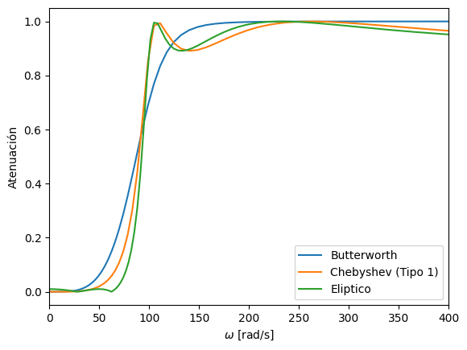

---

<!-- slide -->
## Diapositiva 13
### Diseño de filtros analógico
Para obtener las funciones de transferencia, ya que es un diseño analógico, recurrimos a las funciones de {amarillo}(**Scipy:**)

```python
# Filtro Butterworth
z, p, k = sp.signal.buttap(N_filt)        # prototipo LP normalizado
z, p, k = sp.signal.butter(N, Wn, btype='low', analog=True, output='zpk')

# Filtro Chebyshev Tipo 1 (ripple en banda de paso)
z, p, k = sp.signal.cheb1ap(N_filt, rp)

# Filtro Elíptico
z, p, k = sp.signal.ellip(N, rp, rs, Wn, btype='low', analog=True)
```

---

<!-- slide -->
## Diapositiva 14
### Conversión a filtro digital

---

<!-- slide -->
## Diapositiva 15
### Conversión a filtro digital
Una vez encontrada la función de transferencia del filtro analógico, {amarillo}(**transformamos del plano $s$ al plano $z$**).
- Hay varios métodos; nos interesan las transformaciones que hagan que la función en $z$ sea también {verde}(**racional**).
- Estas transformaciones son {rojo}(**aproximaciones**).

Una transformación $s \to z$ debe cumplir dos condiciones fundamentales:
- {verde}(**Estabilidad:**) Los polos después de la transformación deben quedar dentro del círculo unitario en el plano $z$.
- {verde}(**Sin aliasing:**) A cada frecuencia analógica en $(-\infty, \infty)$ le debe corresponder una única frecuencia digital en $(-f_s/2, f_s/2)$.

---

<!-- slide -->
## Diapositiva 16
### Transformada bilineal
La transformación $H(s) \to H(z)$ se produce haciendo el siguiente reemplazo en $H(s)$:

$$s = 2f_s\,\frac{1 - z^{-1}}{1 + z^{-1}} = 2f_s\,\frac{z - 1}{z + 1}$$

- Esta transformación mapea el {verde}(**semiplano izquierdo de $s$**) dentro del {verde}(**círculo unitario**), el derecho fuera, y el eje imaginario sobre el círculo unitario.
- Filtros analógicos estables producen {verde}(**filtros digitales estables**).

---

<!-- slide -->
## Diapositiva 17
### Transformada bilineal
El problema de esta transformación es que genera una {rojo}(**distorsión en frecuencia:**) las altas frecuencias quedan más agrupadas que en el filtro original.

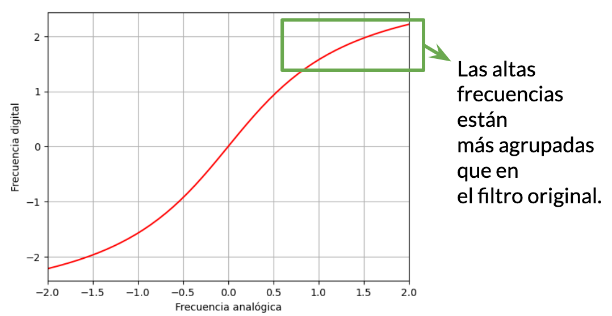

---

<!-- slide -->
## Diapositiva 18
### Transformada bilineal
Lo que se hace para evitar esto es aplicar una {amarillo}(**función inversa: pre-warping**). Antes de diseñar el filtro analógico, las frecuencias de corte se corrigen con:

$$\Omega_i = 2f_s \cdot \tan\!\left(\frac{\omega_i}{2f_s}\right)$$

De esta forma, cuando se aplique la transformada bilineal, se compensará el deformamiento.

```python
warped = 2 * fs * np.tan(wc / (2 * fs))
```

---

<!-- slide -->
## Diapositiva 19
### Ejemplos de implementación con Scipy

---

<!-- slide -->
## Diapositiva 20
### Ejemplos de implementación
Veamos el caso de un {amarillo}(**filtro pasa-bajo Butterworth**): trabajemos con la señal de ECG, usando $f_c = 50\,\text{Hz}$.

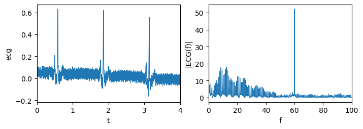

---

<!-- slide -->
## Diapositiva 21
### Ejemplos de implementación
{verde}(**Paso 1:**) Definimos la frecuencia de corte y el orden del filtro. {verde}(**Paso 2:**) Aplicamos el pre-warping.

```python
# 1) Definimos la frecuencia de corte y orden de filtro
fc = 50
wc = 2 * np.pi * fc
N_filt = 4

# 2) Aplicamos el pre-warping para evitar deformaciones
warped = 2 * fs * np.tan(wc / (2 * fs))
```

---

<!-- slide -->
## Diapositiva 22
### Ejemplos de implementación
{verde}(**Paso 3:**) Encontramos el filtro normalizado de Butterworth pasa-bajo con $\nu_c = 1$.

```python
# 3) Encontramos el filtro normalizado de Butter:
z, p, k = sp.signal.buttap(N_filt)
```

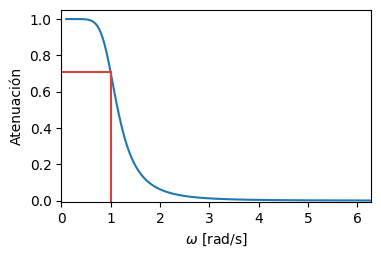

---

<!-- slide -->
## Diapositiva 23
### Ejemplos de implementación
{verde}(**Paso 4:**) Transformamos el filtro a la frecuencia deseada (desnormalización).

```python
# 4) Transformamos el filtro a la frecuencia deseada
z, p, k = sp.signal.lp2lp_zpk(z, p, k, wo=warped)
```

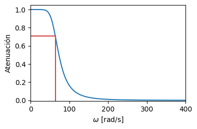

---

<!-- slide -->
## Diapositiva 24
### Ejemplos de implementación
Los pasos 3 y 4 se pueden resumir con la función `butter` usando `analog=True`:

```python
# Pasos 3 y 4 resumidos:
z, p, k = sp.signal.butter(4, warped, btype='low', analog=True, output='zpk')
```

{verde}(**Paso 5:**) Aplicamos la transformada bilineal. {verde}(**Paso 6:**) Obtenemos los coeficientes.

```python
# 5) Aplicamos la transformada bi-lineal
z, p, k = sp.signal.bilinear_zpk(z, p, k, fs)

# 6) Obtenemos los coeficientes
b, a = sp.signal.zpk2tf(z, p, k)
```

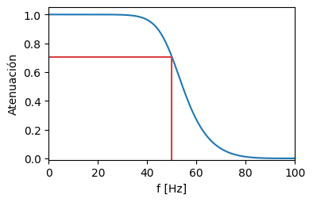

---

<!-- slide -->
## Diapositiva 25
### Ejemplos de implementación
Diagrama de polos y ceros del filtro digital pasa-bajo y su {amarillo}(**respuesta al impulso**) (infinita pero que decae):

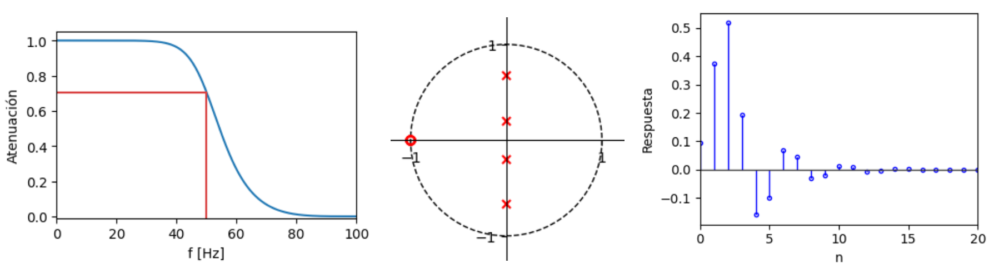

---

<!-- slide -->
## Diapositiva 26
### Ejemplos de implementación
{verde}(**Paso 7:**) Aplicamos el filtro a la señal de ECG.

```python
# 7) Aplicamos el filtro
ecg_filt = sp.signal.lfilter(b, a, ecg)
```

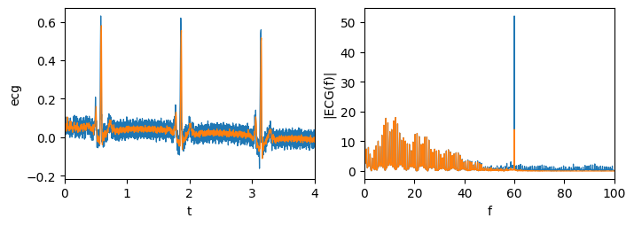

---

<!-- slide -->
## Diapositiva 27
### Ejemplos de implementación
Todo el proceso se puede resumir en {amarillo}(**una sola función**):

```python
# Todo se puede resumir en una sola funcion
b, a = sp.signal.butter(4, fc, fs=fs, btype='low', analog=False)
```

---

<!-- slide -->
## Diapositiva 28
### Ejemplos de implementación
Veamos el caso de un {amarillo}(**filtro bloquea-banda Chebyshev Tipo 1**): trabajemos con la señal de ECG que tiene interferencia de 60 Hz, usamos $f_{c1} = 50\,\text{Hz}$ y $f_{c2} = 70\,\text{Hz}$.


---

<!-- slide -->
## Diapositiva 29
### Ejemplos de implementación
Para el filtro Chebyshev debemos definir también el {amarillo}(**ripple en la banda de paso**) $r_p$.

```python
# 1) Definimos la frecuencia de corte y orden de filtro
fc1 = 50;  fc2 = 70
wc1 = 2 * np.pi * fc1;  wc2 = 2 * np.pi * fc2
N_filt = 6;  rp = 0.1

# 2) Aplicamos el pre-warping para evitar deformaciones
warped1 = 2 * fs * np.tan(wc1 / (2 * fs))
warped2 = 2 * fs * np.tan(wc2 / (2 * fs))
```

---

<!-- slide -->
## Diapositiva 30
### Ejemplos de implementación
{verde}(**Paso 3:**) Encontramos el filtro normalizado de Chebyshev.

```python
# 3) Encontramos el filtro normalizado de Chebyshev:
z, p, k = sp.signal.cheb1ap(N_filt, 0.1)
```

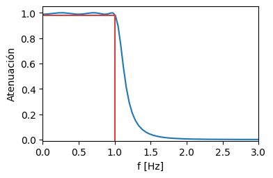

---

<!-- slide -->
## Diapositiva 31
### Ejemplos de implementación
{verde}(**Paso 4:**) Transformamos el filtro pasa-bajo a bloquea-banda con las frecuencias deseadas.

```python
# 4) Transformamos el filtro a la frecuencia deseada
wo  = (warped2 + warped1) / 2
bw  =  warped2 - warped1
z, p, k = sp.signal.lp2bs_zpk(z, p, k, wo=wo, bw=bw)
```

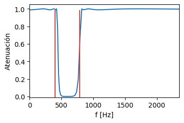

---

<!-- slide -->
## Diapositiva 32
### Ejemplos de implementación
{verde}(**Paso 5:**) Transformada bilineal. {verde}(**Paso 6:**) Obtenemos los coeficientes. La respuesta del filtro digital:

```python
# 5) Aplicamos la transformada bi-lineal
z, p, k = sp.signal.bilinear_zpk(z, p, k, fs)

# 6) Obtenemos los coeficientes
b, a = sp.signal.zpk2tf(z, p, k)
```

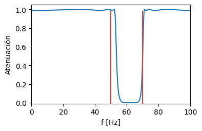

---

<!-- slide -->
## Diapositiva 33
### Ejemplos de implementación
Diagrama de polos y ceros del filtro bloquea-banda y su {amarillo}(**respuesta al impulso**):

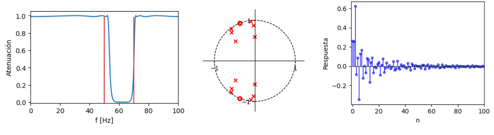

---

<!-- slide -->
## Diapositiva 34
### Ejemplos de implementación
{verde}(**Paso 7:**) Aplicamos el filtro Chebyshev bloquea-banda a la señal de ECG.

```python
# 7) Aplicamos el filtro
ecg_filt = sp.signal.lfilter(b, a, ecg)
```

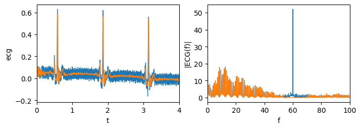

---

<!-- slide -->
## Diapositiva 35
### Ejemplos de implementación
Todo el proceso se puede resumir en {amarillo}(**una sola función**):

```python
# Todo se puede resumir en una sola funcion
b, a = sp.signal.cheby1(N_filt, rp, [fc1, fc2],
                        btype='bandstop', analog=False,
                        output='ba', fs=fs)
```


---

<!-- slide -->
## Diapositiva 36
### Ejemplos de implementación
Recordemos que si no podemos implementar un IIR, podemos {amarillo}(**transformar un filtro IIR en un FIR**) usando la respuesta al impulso como coeficientes y {verde}(**truncando**) a una cantidad finita.

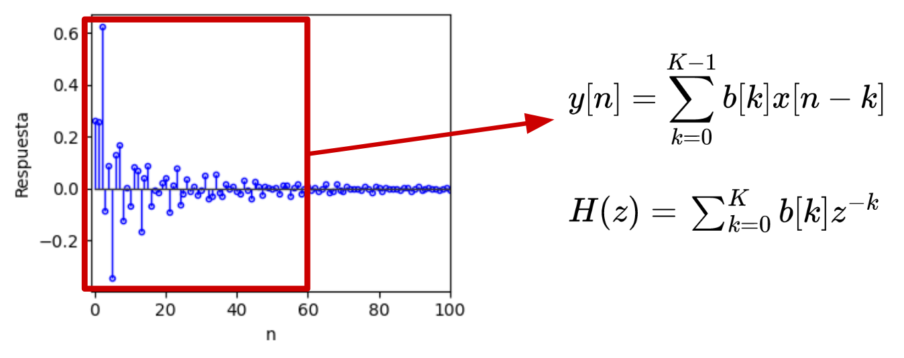

---

<!-- slide -->
## Diapositiva 37
### Ejemplos de implementación
Si tomamos la respuesta al impulso y la {amarillo}(**truncamos a $M$ muestras**), obtenemos un FIR equivalente. El diagrama de polos y ceros del FIR resultante:

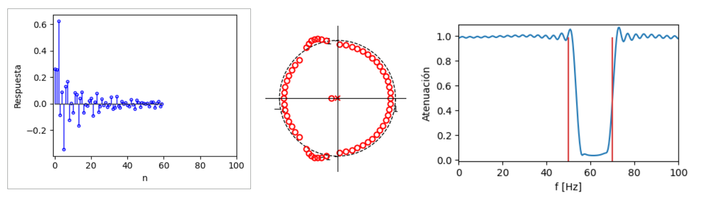

---

<!-- slide -->
## Diapositiva 38
### Ejemplos de implementación
La {verde}(**respuesta en frecuencia del FIR**) obtenido por truncamiento muestra el ripple propio del Chebyshev, y el resultado del filtrado es equivalente al IIR original:


---
