<!-- slide -->
## Diapositiva 1
### Introducción a Redes Neuronales
#### Análisis y procesamiento de Señales
##### Bioingeniería - Facultad de Ingeniería - UNSTA
##### 2026
**Dr. Ing. Facundo Adrián Lucianna**
**Ing. Facundo Roldán**

---

<!-- slide -->
## Diapositiva 2
### Redes Neuronales

- Las redes neuronales se plantean originalmente como {amarillo}(**algoritmos matemáticos**) que intentan imitar los cálculos del cerebro.
- Buscan replicar la enorme cantidad de {verde}(**unidades de procesamiento (neuronas)**) y su {verde}(**interconexión (sinapsis)**).
- De esta idea surgen dos grandes campos de aplicación: la {naranja}(**neurociencia computacional**) y el {naranja}(**Deep Learning**).

> El {amarillo}(**Deep Learning**) goza hoy de una enorme popularidad, con avances constantes y visibles para el público general.

---

<!-- slide -->
## Diapositiva 3
### Redes Neuronales

Un poco de historia…

- {verde}(**1943 — Neurona de McCulloch-Pitts:**) Primera formulación matemática del cálculo neuronal. La neurona actual de Deep Learning es muy similar a este modelo.
- {verde}(**1949 — Regla de Hebb:**) Donald Hebb propone una regla para modificar la intensidad de la conexión entre neuronas ({amarillo}(**aprendizaje**)). El concepto sigue vigente.
- {verde}(**1952 — Modelo de Hodgkin y Huxley:**) Modelo basado en conductancias mediante ecuaciones diferenciales. Explica la generación y propagación de {amarillo}(**potenciales de acción**). Premio Nobel en 1963.

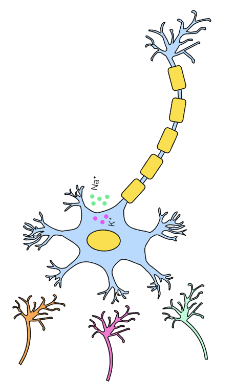

---

<!-- slide -->
## Diapositiva 4
### Redes Neuronales

- {verde}(**1947 — Alan Turing:**) dicta sus primeras lecciones sobre Inteligencia Artificial.
- Introduce conceptos clave: el {amarillo}(**test de Turing**), el {amarillo}(**aprendizaje automático**), los {amarillo}(**algoritmos genéticos**) y el {amarillo}(**aprendizaje por refuerzo**).

> Sugirió que era más eficiente crear IA a nivel humano {verde}(**desarrollando algoritmos de aprendizaje**) y enseñando a la máquina, en lugar de programar cada regla a mano.


---

<!-- slide -->
## Diapositiva 5
### Redes Neuronales

- En este estadio embrionario, las investigaciones estaban en su {naranja}(cúspide).
- {verde}(**1958 — Frank Rosenblatt:**) realiza la primera implementación del {amarillo}(**perceptrón**), basado en el modelo de McCulloch-Pitts.
- Rosenblatt es considerado el {verde}(**padre del Deep Learning**).
- Perfeccionó el perceptrón moderno y experimentó con redes de **dos o tres capas**.

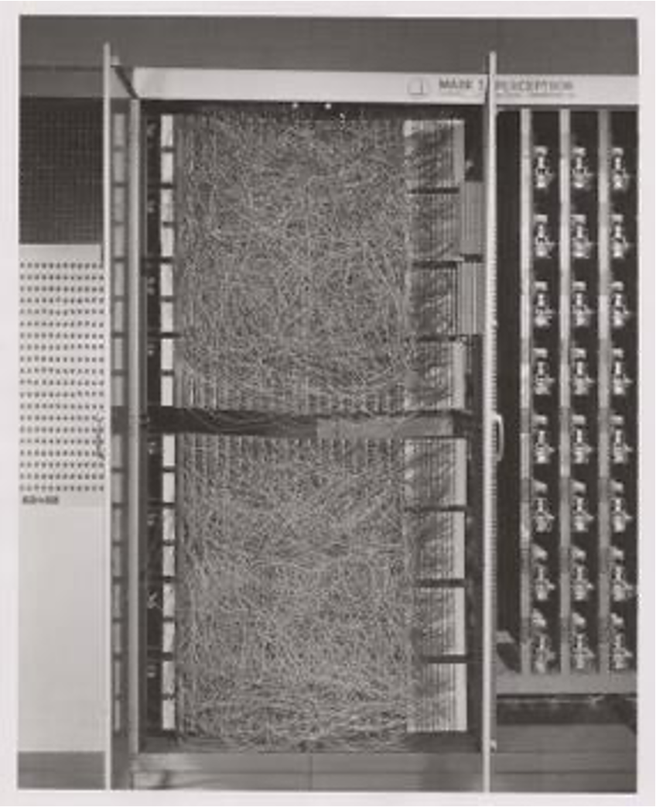

---

<!-- slide -->
## Diapositiva 6
### Redes Neuronales

- {rojo}(**1969 — El Primer Invierno:**) se publica el libro *Perceptrons* de Minsky y Papert, enfatizando los límites de lo que un perceptrón podía hacer.
- Su difusión {rojo}(**congeló casi toda la financiación**) en investigaciones hasta 1980.
- Crítica principal: el perceptrón no podía resolver la función lógica {amarillo}(**XOR**), algo que (se creía) una neurona biológica sí podía hacer.
- Más tarde se comprobó que una sola neurona biológica **tampoco** puede resolver XOR: hace falta una {verde}(**red de neuronas**).

> *Curiosidad:* En 2020 se descubrió que algunas neuronas humanas {verde}(¡sí pueden resolver XOR!).


---

<!-- slide -->
## Diapositiva 8
### Redes Neuronales

- {verde}(**1980-1990 — Fin del Invierno:**) trabajos de Rumelhart, Hopfield y otros vuelven a poner a las redes en el mapa.
- Se desarrollan hitos clave: el algoritmo de {amarillo}(**Backpropagation**), las {amarillo}(**redes de memoria**) y el concepto de {amarillo}(**propiedades emergentes**).
- {rojo}(**El Segundo Invierno:**) la llegada de algoritmos más sencillos de usar y con menos hiperparámetros — como {verde}(**SVM**) y {verde}(**Random Forests**) — opaca a las redes neuronales, ya que rendían mejor en esa época.

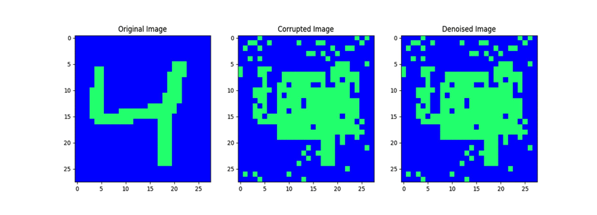

---

<!-- slide -->
## Diapositiva 10
### Redes Neuronales

- Con la llegada de la World Wide Web y las mejoras de hardware (Ley de Moore), surgen datasets enormes: el {amarillo}(**Big Data**).
- Aparece la necesidad de algoritmos capaces de aprovechar este volumen de información.
- El Big Data ayuda al {verde}(**Aprendizaje Automático (ML)**) y a la IA a recuperar su atractivo comercial.

> {naranja}(**2011:**) el sistema **IBM Watson** logra el nivel de un campeón humano en *Jeopardy!*

---

<!-- slide -->
## Diapositiva 11
### Redes Neuronales

- {naranja}(**2010 — El Renacimiento:**) la IA vuelve a la vida y adopta oficialmente el nombre de {amarillo}(**Deep Learning**).
- Aparecen nuevas arquitecturas y mecanismos.
- Los algoritmos comienzan a superar a los métodos clásicos en clasificación de imágenes, video, voz y texto.

> **Claves del éxito:** {verde}(**Big Data**), mejora exponencial en {verde}(**procesamiento de cálculo (GPUs)**) y la fuerte inversión de gigantes como Google, Meta y Microsoft.


---

<!-- slide -->
## Diapositiva 12
### Perceptrón y neuronas sigmoideas

---

<!-- slide -->
## Diapositiva 13
### Perceptrón

Repaso de fisiología:

- {verde}(**Cuerpo celular o soma:**) contiene el núcleo y las organelas.
- {verde}(**Dendritas:**) ramificaciones del soma donde se reciben las {amarillo}(**sinapsis**) de otras neuronas.
- {verde}(**Axón:**) prolongación encargada de transmitir el {amarillo}(**impulso nervioso**). Es el canal de comunicación.

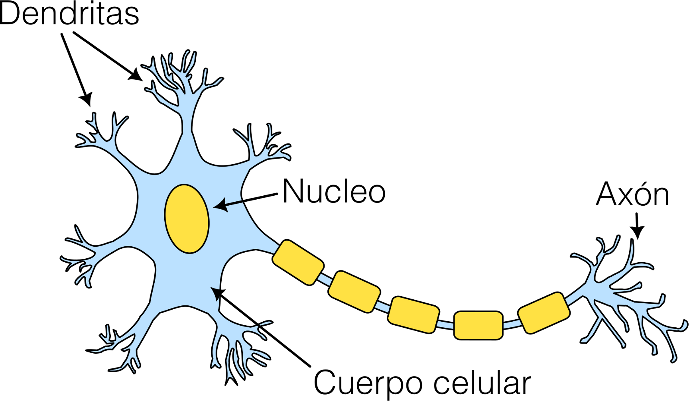

---

<!-- slide -->
## Diapositiva 14
### Perceptrón

En estado de reposo, el interior de la célula tiene un voltaje **negativo** comparado con el exterior.

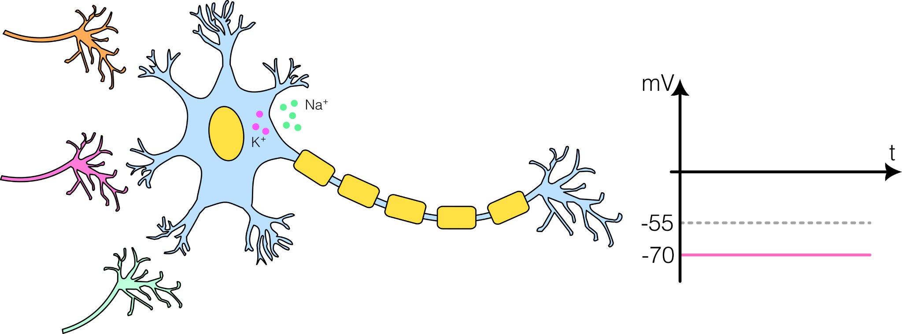

---

<!-- slide -->
## Diapositiva 15
### Perceptrón

Si otra neurona la excita {amarillo}(**levemente**), aumenta el voltaje, pero rápidamente vuelve a su estado de reposo.

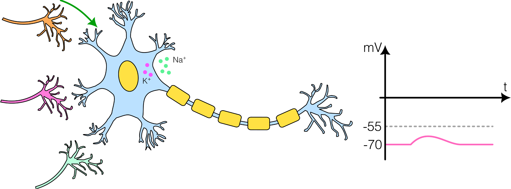

---

<!-- slide -->
## Diapositiva 16
### Perceptrón

De manera similar, una sinapsis puede ser {rojo}(**inhibitoria**), reduciendo aún más el voltaje.

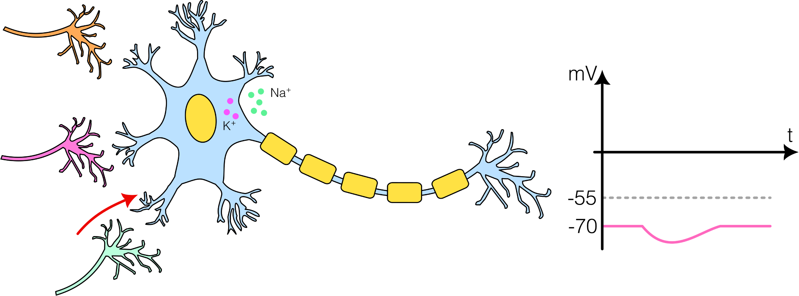

---

<!-- slide -->
## Diapositiva 17
### Perceptrón

Pero si la excitación supera un {amarillo}(**umbral**), se genera un impulso mediante un efecto de {verde}(**"todo o nada"**).

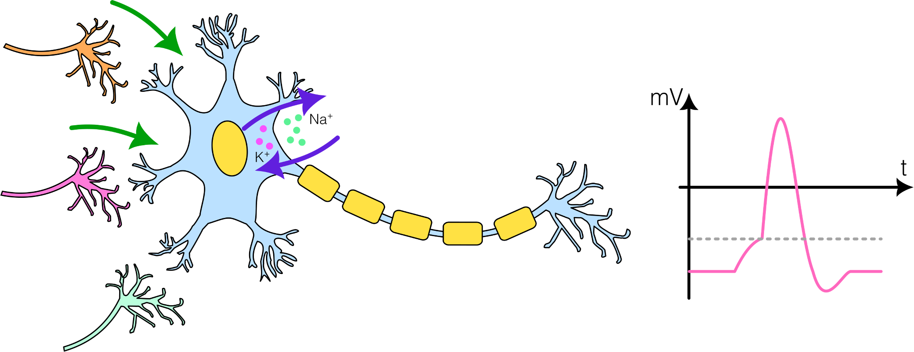

---

<!-- slide -->
## Diapositiva 18
### Perceptrón

Este impulso se propaga desde el cuerpo hasta el terminal axónico, y así la neurona envía su {amarillo}(**salida**).

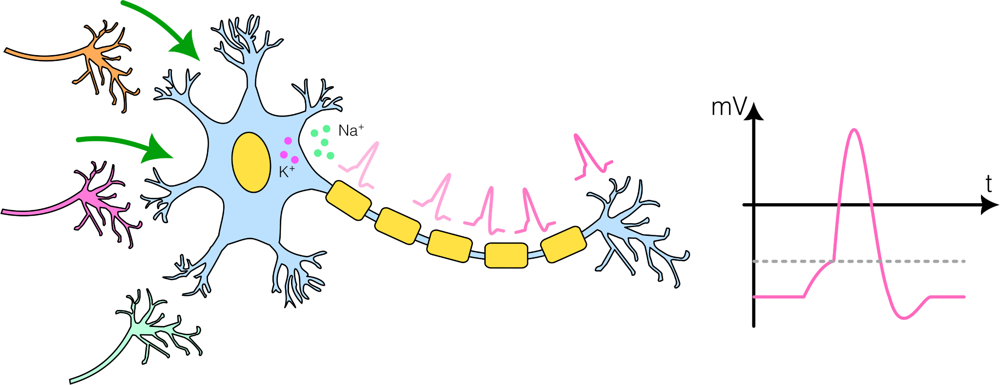

---

<!-- slide -->
## Diapositiva 19
### Perceptrón

Diferentes niveles de excitación producen diferentes {verde}(**tasas de disparo**) (frecuencia de impulsos).

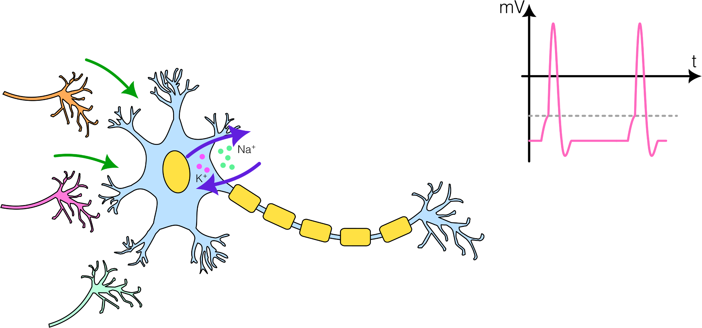

---

<!-- slide -->
## Diapositiva 20
### Perceptrón

Diferentes niveles de excitación producen diferentes {verde}(**tasas de disparo**).

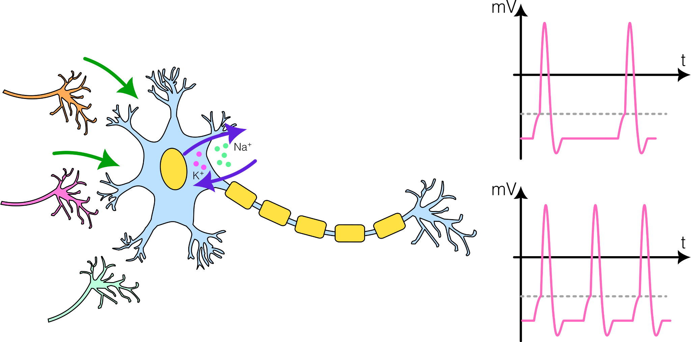

---

<!-- slide -->
## Diapositiva 21
### Perceptrón

Además, ante una misma excitación, existen {amarillo}(**sinapsis más sensibles**) que otras.

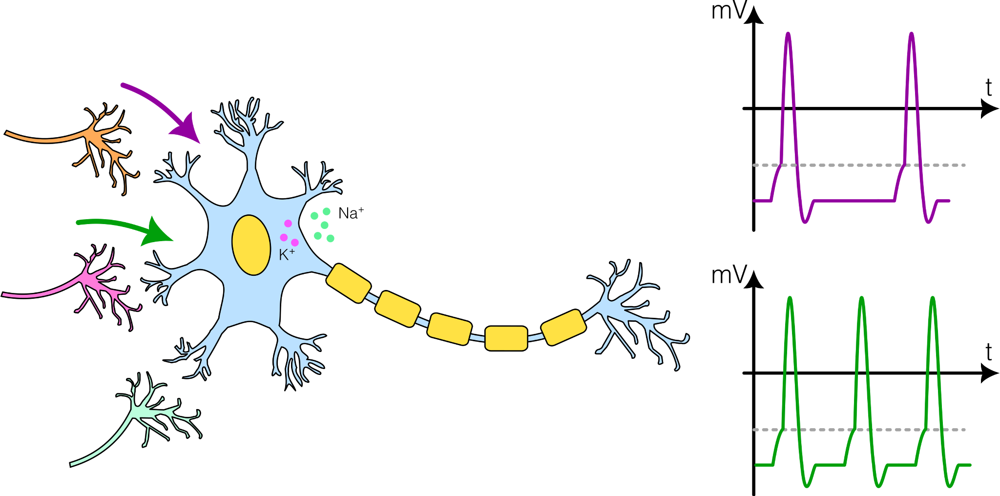

---

<!-- slide -->
## Diapositiva 22
### Perceptrón

Con esto en mente, armemos nuestro {verde}(**modelo matemático de neurona**).

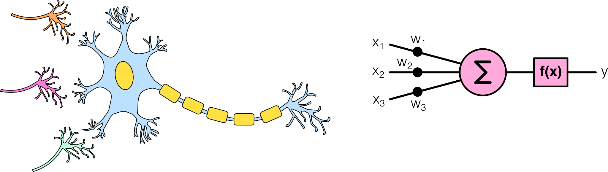

$$z = w_1 x_1 + w_2 x_2 + w_3 x_3 + b$$

$$z = \sum_{i=1}^{3} w_i x_i + b$$

$$y = f(z)$$

$$y = f\!\left(\sum_{i=1}^{3} w_i x_i + b \right)$$

---

<!-- slide -->
## Diapositiva 23
### Perceptrón

Podemos absorber el *bias* tratándolo como un peso más asociado a una entrada constante $x_4 = 1$:


$$z = w_1 x_1 + w_2 x_2 + w_3 x_3 + w_4 \cdot 1$$

$$z = \sum_{i=1}^{4} w_i x_i$$

$$y = f(z) = f\!\left(\sum_{i=1}^{4} w_i x_i \right)$$

> Esta forma compacta nos resulta {amarillo}(más cómoda) para escribir los cálculos en notación vectorial.

---

<!-- slide -->
## Diapositiva 24
### Perceptrón

- Si tenemos un vector (u observación) de $n$ atributos, la neurona tendrá $n$ entradas con $n+1$ {verde}(**pesos sinápticos**).
- La parte lineal del cálculo involucra los pesos sinápticos $w_i$ y el *bias* $b$.
- Cada peso representa si la conexión es {amarillo}(**excitatoria**) ($w_i > 0$), {rojo}(**inhibitoria**) ($w_i < 0$), o **inexistente** ($w_i = 0$).

$$\sum_{i=1}^{n} w_i x_i + b$$

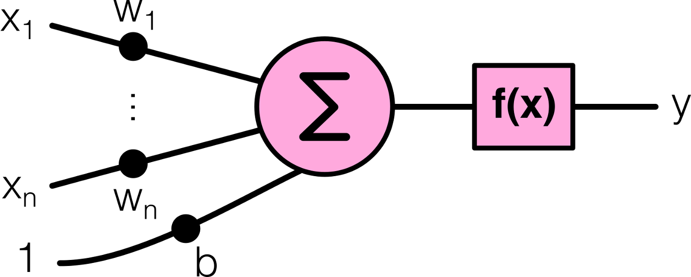

---

<!-- slide -->
## Diapositiva 25
### Perceptrón

Veamos la {verde}(**función de activación**): ¿qué estamos modelando con ella?

- En este modelo no nos interesa el impulso nervioso exacto, sino modelar la {amarillo}(**tasa de impulsos**).
- *Experimento:* si inyectamos voltaje y medimos la tasa de impulsos, vemos que antes de superar un {verde}(**umbral de disparo**) la neurona no dispara (tasa = 0 Hz).

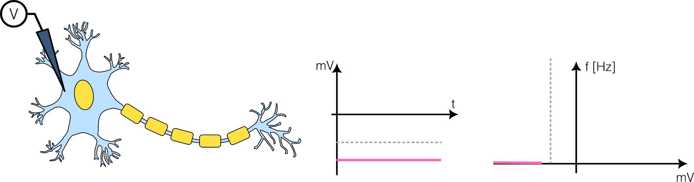

---

<!-- slide -->
## Diapositiva 26
### Perceptrón

Veamos la {verde}(**función de activación**): ¿qué estamos modelando con ella?

- *Experimento:* durante la etapa {verde}(**lineal**), si duplicamos el voltaje inyectado, la neurona dispara al {amarillo}(doble) de la frecuencia.

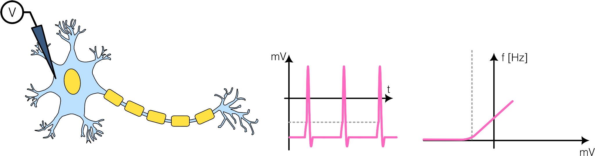

---

<!-- slide -->
## Diapositiva 27
### Perceptrón

Veamos la {verde}(**función de activación**): ¿qué estamos modelando con ella?

- *Experimento:* al llegar a un punto de saturación, no importa cuánto más voltaje inyectemos: la neurona dispara a su {rojo}(**máxima frecuencia posible**).

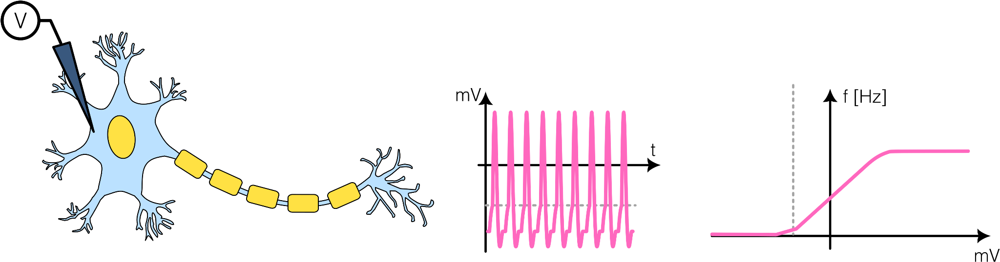

---

<!-- slide -->
## Diapositiva 28
### Perceptrón

- La {verde}(**función de activación**) es una función *no lineal* que modela la variación de la tasa de disparo.

> Esta es la expresión mínima de una neurona: una unidad de cálculo {amarillo}(**no lineal**).

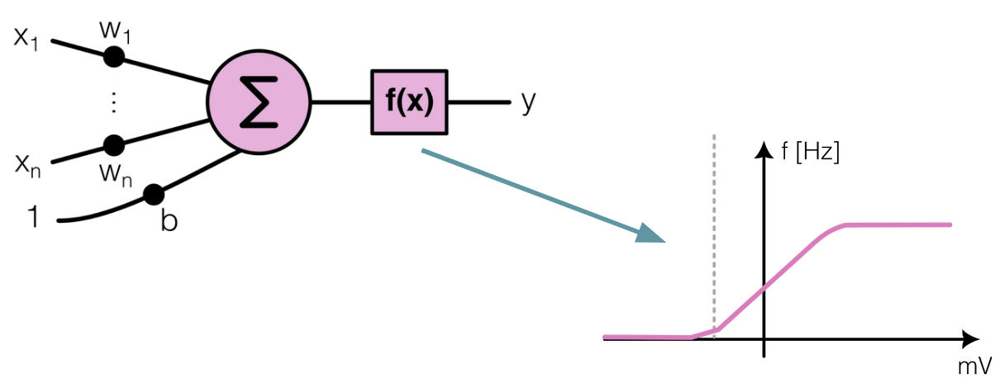

---

<!-- slide -->
## Diapositiva 29
### Perceptrón

La elección de la {verde}(**función de activación**) es una decisión de diseño para nuestra red:

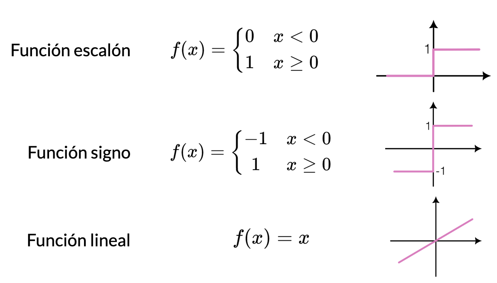

---

<!-- slide -->
## Diapositiva 30
### Perceptrón

Otras funciones de activación muy comunes:

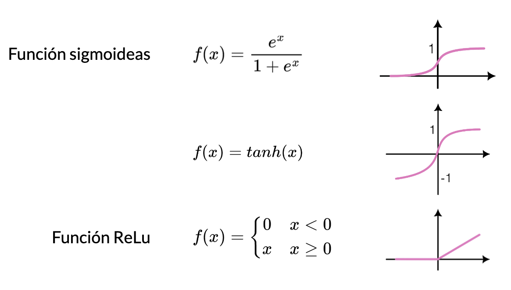

---

<!-- slide -->
## Diapositiva 31
### Perceptrón

Implementación de funciones lógicas usando un perceptrón:

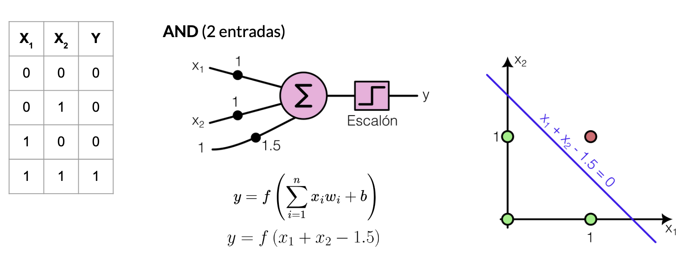

---

<!-- slide -->
## Diapositiva 32
### Perceptrón

Implementación de funciones lógicas usando un perceptrón:

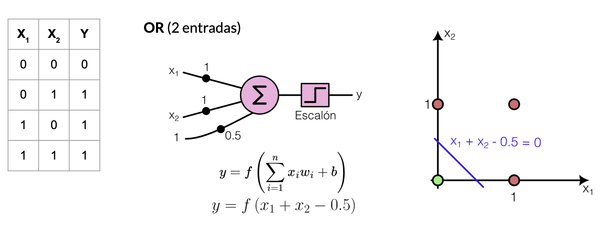

---

<!-- slide -->
## Diapositiva 33
### Perceptrón

Implementación de funciones lógicas usando un perceptrón:

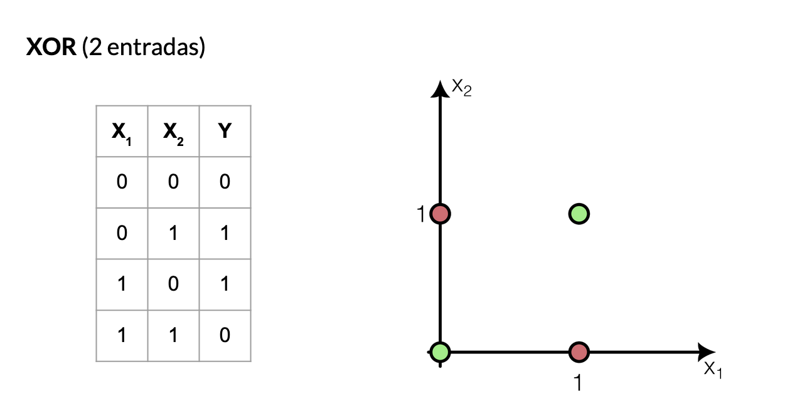

---

<!-- slide -->
## Diapositiva 34
### Entrenando un Perceptrón

---

<!-- slide -->
## Diapositiva 35
### Entrenando un perceptrón

- Los sistemas neuronales biológicos no nacen programados con todo el conocimiento.
- Existe un proceso de {verde}(**aprendizaje**) que modifica la red para incorporar nueva información.
- En nuestro modelo, aprender significa **encontrar el conjunto de** {amarillo}(**pesos sinápticos**) que permite al perceptrón realizar el cálculo deseado correctamente.

$$\vec{W} = \begin{pmatrix} w_1 \\ w_2 \\ w_3 \\ b \end{pmatrix}$$

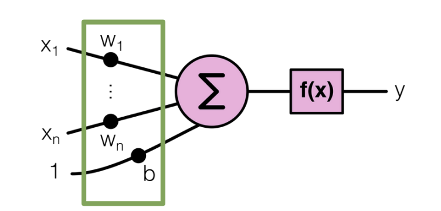

---

<!-- slide -->
## Diapositiva 36
### Entrenando un perceptrón

- Inicializamos los pesos al {verde}(**azar**), usualmente entre $-1$ y $1$ por problemas de escala.
- Entrenamos de forma {amarillo}(**iterativa**), mostrando muestras (aprendizaje supervisado) y ajustando los pesos según la respuesta del modelo.

$$w_i(t + 1) = w_i(t) + \Delta w_i(t)$$

- Se utiliza una {rojo}(**función de costo**) (o de evaluación) para medir cuánto se equivoca el modelo entre la salida estimada y la real. Por ejemplo, el **SSE** (*Sum of Squared Errors*):

$$E_{SSE}\!\left(\vec{W}\right) = \frac{1}{2} \sum_{j=1}^{p} \left(d_j - y_j\right)^{2}$$

---

<!-- slide -->
## Diapositiva 37
### Entrenando un perceptrón

{verde}(**Regla de Hebb:**)

- Una sinapsis aumenta su eficacia si las neuronas conectadas tienden a estar activas o inactivas {amarillo}(simultáneamente). Si no, se atenúa.
- Es similar al *condicionamiento clásico* (Experimento de Pavlov):

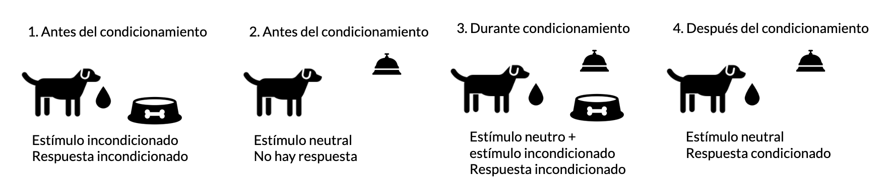

---

<!-- slide -->
## Diapositiva 38
### Entrenando un perceptrón

{verde}(**Regla de Hebb:**)

- Una sinapsis **aumenta** su eficacia (peso sináptico) si las dos neuronas conectadas tienden a estar activas o inactivas simultáneamente. En caso contrario, la fuerza de conexión se {rojo}(**atenúa**).
- Esto puede llevarse a una fórmula de actualización de pesos usando una {amarillo}(**constante de aprendizaje**) $\eta$:

$$\Delta w_{ij} = \eta \cdot x_i \cdot y$$

---

<!-- slide -->
## Diapositiva 39
### Entrenando un perceptrón

{verde}(**Regla del Perceptrón:**)

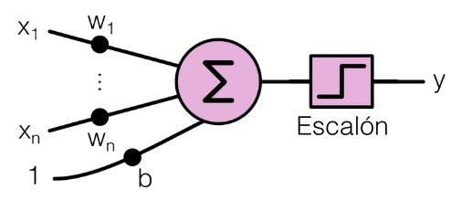

- Desarrollada por **Frank Rosenblatt**, mejora la Regla de Hebb.
- Las variaciones de los pesos son {amarillo}(**proporcionales al producto**) de las actividades de las neuronas emisoras y receptoras.
- Si la salida es {verde}(**correcta**), los pesos no cambian.
- Si es {rojo}(**incorrecta**), se ajusta cada $w_i$ proporcionalmente al error (válido si la salida es escalón):

$$\Delta w_{ij} = \eta \cdot (d_{j} - y_{j}) \cdot x_{ij}$$

---

<!-- slide -->
## Diapositiva 40
### Entrenando un perceptrón

{verde}(**Regla del Perceptrón:**)


*Algoritmo de entrenamiento:*

```python
while error > 0:
    x_train = shuffle(x_train)
    for x, d in x_train:
        y = perceptron.output(x)
        if d != y:
            weights = perceptron.obtain_weights()
            for i in range(len(weights)):
                weights[i] += eta * (d - y) * x[i]
            perceptron.update_weights(weights)
    error = misclassified(x_train, perceptron)
```

---

<!-- slide -->
## Diapositiva 41
### Entrenando un perceptrón

{verde}(**Regla del Perceptrón: Interpretación gráfica**)


- La parte lineal del perceptrón es equivalente a un {amarillo}(**producto escalar**), considerando al *bias* como un peso más asociado a una entrada constante de $1$:

$$\sum_{i=1}^{n} w_i x_i + b = \vec{W}^T \vec{X}$$

- Geométricamente, no es más que la ecuación de una {verde}(**recta**) (o un **hiperplano** en dimensiones mayores):

$$\vec{W}^T \vec{X} + b = 0$$

---

<!-- slide -->
## Diapositiva 42
### Entrenando un perceptrón

{verde}(**Regla del Perceptrón: Interpretación gráfica**)

- Si tenemos un caso de **dos entradas**, podemos visualizar gráficamente la {amarillo}(**frontera de decisión**).

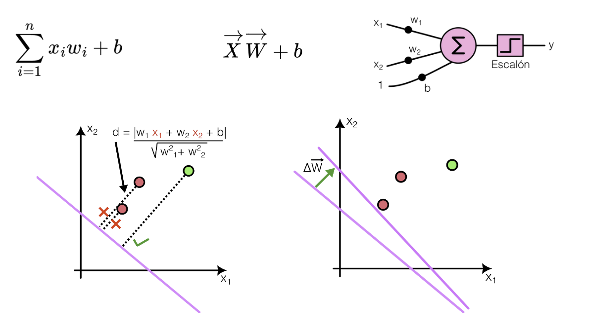

---

<!-- slide -->
## Diapositiva 43
### Entrenando un perceptrón

{verde}(**Regla del Perceptrón: Interpretación gráfica**)

- Si tenemos un caso de **dos entradas**, podemos visualizar gráficamente la {amarillo}(**frontera de decisión**).

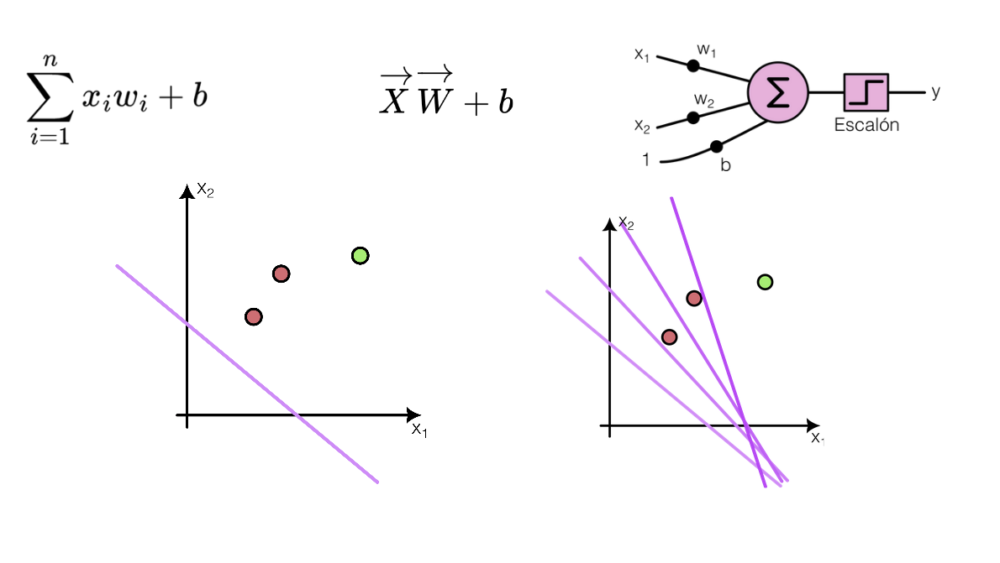

---

<!-- slide -->
## Diapositiva 44
### Entrenando un perceptrón

{verde}(**Regla del Perceptrón: Interpretación gráfica**)

- Como las salidas posibles son $1$ o $0$, el perceptrón **divide y** {amarillo}(**colorea su espacio de entrada**) en dos clases distintas.

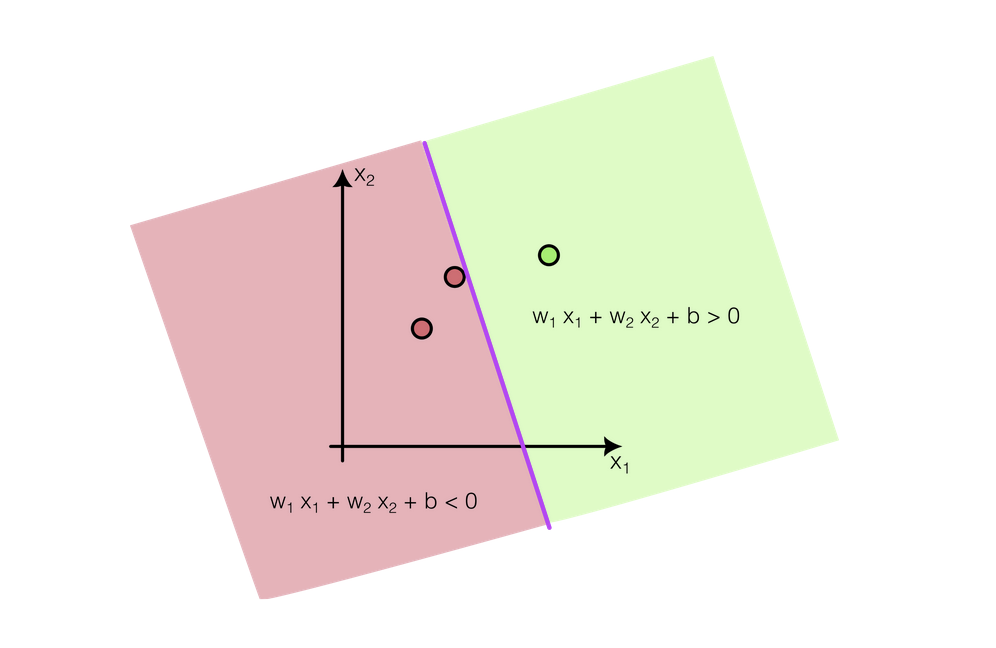

---

<!-- slide -->
## Diapositiva 45
### Entrenando un perceptrón

{rojo}(**Problema de la Regla del Perceptrón:**)

- Falla si los datos {rojo}(**no son linealmente separables**).
- Si no existe una recta que separe perfectamente las clases, el error nunca será cero.
- Como consecuencia, el bucle de entrenamiento {rojo}(**nunca termina**).

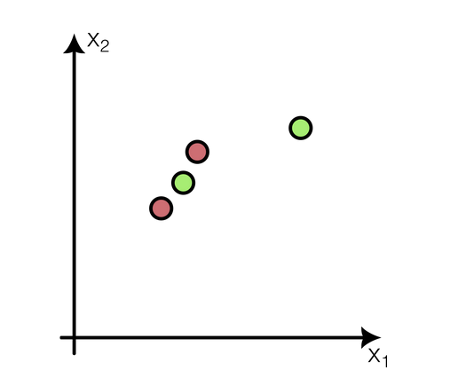

---

<!-- slide -->
## Diapositiva 46
### Entrenando un perceptrón

{verde}(**Aprendiendo por minimización del error**)

- Exigir un error de exactamente *cero* es un requisito demasiado estricto.
- Aún más problemático si usamos funciones de activación {verde}(**continuas**) (distintas al escalón).

> *Solución:* readaptar la regla para que {amarillo}(**minimice la función de costo**), haciendo pequeños cambios iterativos en los pesos hasta que el error sea "suficientemente" chico.

$$E_{SSE}\!\left(\vec{W}\right) = \frac{1}{2} \sum_{j=1}^{p} \left(d_j - y_j\right)^{2}$$

$$E_{SSE}\!\left(\vec{W}\right) = \frac{1}{2} \sum_{j=1}^{p} \left(d_j - f\!\left(\sum_{i=1}^{n} w_i x_i^{(j)} + b \right)\right)^{2}$$

---

<!-- slide -->
## Diapositiva 47
### Entrenando un perceptrón

{verde}(**Aprendiendo por minimización del error**)

- Con la Regla del Perceptrón original, buscábamos que la salida estuviera simplemente del lado correcto de la frontera.
- Ahora, buscamos que el vector de pesos se mueva para {amarillo}(**reducir continuamente la función de costo**).
- Esto requiere conocer cómo varía el costo a medida que cambian los pesos: el {amarillo}(**gradiente**).

> Si ajustamos los pesos en la dirección **opuesta** al gradiente ({verde}(*descenso por gradiente*)), nos acercamos a un mínimo.

---

<!-- slide -->
## Diapositiva 48
### Entrenando un perceptrón

{verde}(**Aprendiendo por minimización del error**)

- Si analizamos la función de error, vemos que **depende únicamente de los pesos** (las muestras de entrada son fijas).

$$E_{SSE}\!\left(\vec{W}\right) = \frac{1}{2} \sum_{j=1}^{p} \left(d_j - y_j\right)^{2}$$

$$E_{SSE}\!\left(\vec{W}\right) = \frac{1}{2} \sum_{j=1}^{p} \left(d_j - f\!\left(\sum_{i=1}^{n} w_i x_i^{(j)} + b \right)\right)^{2}$$

---

<!-- slide -->
## Diapositiva 49
### Entrenando un perceptrón

{verde}(**Aprendiendo por minimización del error**)

- Gráficamente, el descenso por gradiente busca el {amarillo}(**valle**) o punto más bajo en la superficie de error:


---

<!-- slide -->
## Diapositiva 50
### Entrenando un perceptrón

{verde}(**Aprendiendo por minimización del error**)

- En fórmula, para actualizar los pesos calculamos el gradiente y nos movemos en sentido **opuesto**:

$$\vec{W}(t + 1) = \vec{W}(t) - \eta \cdot \nabla E_{SSE}\!\left(\vec{W}(t)\right)$$

$$\nabla E_{SSE} = \left[\frac{\partial E_{SSE}}{\partial w_{1}},\, \frac{\partial E_{SSE}}{\partial w_{2}},\, \dots,\, \frac{\partial E_{SSE}}{\partial w_{n}} \right]^T$$

---

<!-- slide -->
## Diapositiva 51
### Entrenando un perceptrón

{verde}(**Aprendiendo por minimización del error**)

- Para calcular cómo afecta el peso $w_i$ al error total, aplicamos la {amarillo}(**Regla de la Cadena**):

$$\frac{\partial E_{SSE}}{\partial w_i} = \sum_{j=1}^{p} \underbrace{\frac{\partial E_j}{\partial y_j}}_{-(d_j - y_j)} \cdot \underbrace{\frac{\partial y_j}{\partial z_j}}_{f'(z_j)} \cdot \underbrace{\frac{\partial z_j}{\partial w_i}}_{x_i^{(j)}}$$

- **Salida del perceptrón:** $\dfrac{\partial E_j}{\partial y_j} = -(d_j - y_j)$
- **Derivada de la activación:** $\dfrac{\partial y_j}{\partial z_j} = f'(z_j)$
- **Entrada correspondiente:** $\dfrac{\partial z_j}{\partial w_i} = x_i^{(j)}$

- Reemplazando todo, obtenemos la derivada parcial final:

$$\frac{\partial E_{SSE}}{\partial w_{i}} = -\sum_{j=1}^{p} \left(d_j - y_j\right)\, f'\!\left(z_j\right)\, x_i^{(j)}$$

---

<!-- slide -->
## Diapositiva 52
### Entrenando un perceptrón

{verde}(**Aprendiendo por minimización del error**)

$$\frac{\partial E_{SSE}}{\partial w_{i}} = -\sum_{j=1}^{p} \left(d_j - y_j\right)\, f'\!\left(z_j\right)\, x_i^{(j)}$$

Observaciones al calcular el gradiente:

- Limita el uso a funciones de activación que sean {amarillo}(**derivables**).
- En la práctica se usan funciones con secciones derivables y se {rojo}(**corrigen errores numéricos**) puntuales (como en ReLU en $x=0$).
- El gradiente cambia según la {amarillo}(**función de costo**) elegida.
- Las librerías modernas resuelven esto con {verde}(**diferenciación automática**), abstrayendo este cálculo del usuario.

---

<!-- slide -->
## Diapositiva 53
### Entrenando un perceptrón

{verde}(**Aprendiendo por minimización del error**)

- Esta nueva regla de aprendizaje se conoce como la {amarillo}(**Regla Delta**):

```python
while error > threshold:
    x_train = shuffle(x_train)
    weights = perceptron.obtain_weights()
    for x, d in x_train:
        y = perceptron.output(x)
        for i in range(len(weights)):
            grad_error = gradiente(x, d, y, i)
            weights[i] = weights[i] - eta * grad_error
        perceptron.update_weights(weights)
    error = mse(x_train, perceptron)
```

---

<!-- slide -->
## Diapositiva 54
### Entrenando un perceptrón

{verde}(**Aprendiendo por minimización del error**)

El valor de la **constante de aprendizaje** ({amarillo}(*learning rate*)) es crucial:

- {rojo}(**Muy chico:**) demora demasiado en aprender.
- {rojo}(**Muy grande:**) puede divergir y nunca converger.

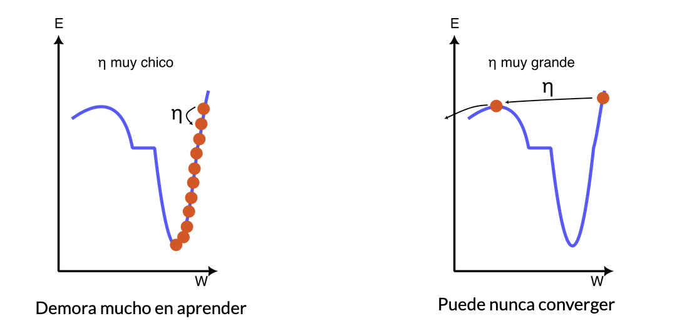

---

<!-- slide -->
## Diapositiva 55
### Entrenando un perceptrón

{verde}(**Aprendiendo por minimización del error**)

- Este método {rojo}(**no asegura**) encontrar el mínimo global: el descenso puede quedar atrapado en un {amarillo}(**mínimo local**).

> *Estrategia práctica:* entrenar varias veces inicializando los pesos al azar y quedarse con el mejor resultado.

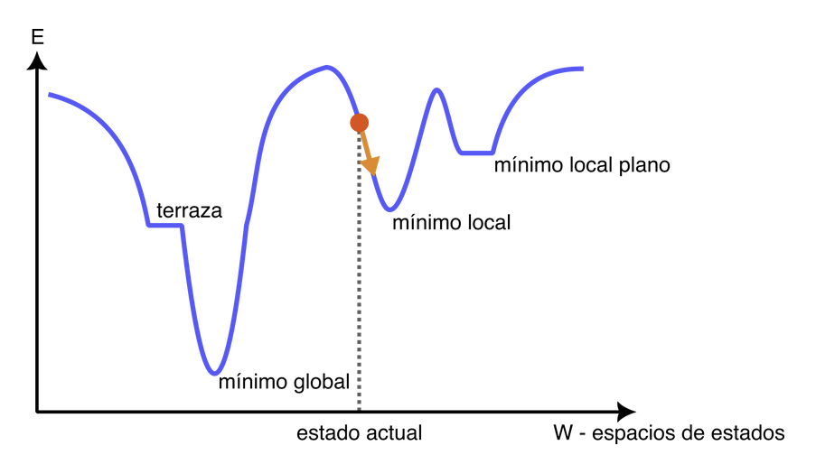

---

<!-- slide -->
## Diapositiva 56
### Entrenando un perceptrón

{verde}(**Aprendiendo por minimización del error**)

- Esta forma de aprendizaje nos permite ir **más allá** de la clasificación.
- Si usamos una función de activación lineal, la red realiza una {verde}(**regresión**).
- Llega al mismo resultado que **Mínimos Cuadrados**, pero mediante un {amarillo}(**proceso iterativo**), útil cuando hay muchas dimensiones u observaciones.


---

<!-- slide -->
## Diapositiva 57
### Entrenando un perceptrón

{rojo}(**Limitaciones de la Regla Delta pura:**)

- En cada iteración hay que calcular el error usando {rojo}(**todo el dataset**).
- Si el volumen de datos es inmenso (Big Data), cada paso puede demorar muchísimo.

```python
while error > threshold:
    x_train = shuffle(x_train)
    weights = perceptron.obtain_weights()
    for x, d in x_train:
        y = perceptron.output(x)
        for i in range(len(weights)):
            grad_error = gradiente(x, d, y, i)
            weights[i] = weights[i] - eta * grad_error
        perceptron.update_weights(weights)
    error = mse(x_train, perceptron)   # recorre TODO el dataset
```

---

<!-- slide -->
## Diapositiva 58
### Entrenando un perceptrón

{verde}(**Aprendiendo por minimización del error**)

- Una forma de agilizar el entrenamiento es usar {amarillo}(**mini-batches**) (lotes), actualizando los pesos a partir de un subconjunto de datos por iteración:

```python
while error > threshold:
    x_train = shuffle(x_train)

    for batch in split_in_batches(x_train, batch_size):
        weights = perceptron.obtain_weights()
        accum_delta = zeros(len(weights))

        for x, d in batch:
            y = perceptron.output(x)
            for i in range(len(weights)):
                accum_delta[i] += gradiente(x, d, y, i)

        for i in range(len(weights)):
            weights[i] = weights[i] - eta * accum_delta[i] / len(batch)

        perceptron.update_weights(weights)

    error = mse(x_train, perceptron)
```

---

<!-- slide -->
## Diapositiva 59
### La correcta forma de implementar clasificadores

---

<!-- slide -->
## Diapositiva 60
### Implementación de clasificadores

- Hasta ahora vimos {verde}(**clasificadores binarios**) (dos clases, salida $0$ o $1$).
- Para la activación final usábamos **Sigmoide** o **Escalón**.
- ¿Pero qué hacemos si tenemos {amarillo}(**más de dos clases**) (ej. Perro, Gato, Tero)?

> *Opción incorrecta:* asignar un número por clase ($0=$Perro, $1=$Gato, $2=$Tero). Esto asume un orden irreal (variable categórica como ordinal). ¿Qué significaría una salida de $1.35$?

- *Solución:* usar una función de costo más apropiada — la {amarillo}(**Entropía Cruzada Categórica**).

---

<!-- slide -->
## Diapositiva 61
### Implementación de clasificadores

{verde}(**One-Hot Encoding**)

- Para solucionar el problema usamos {amarillo}(**one-hot encoding**).
- Hacemos que la red tenga **tantas neuronas de salida como clases haya** (ej. $3$ neuronas para los animales).


- A esta codificación no le importa si cambiamos el orden de las neuronas.
- Los valores de salida (ej. $0.35,\, 0.5,\, 0.15$) se pueden interpretar directamente como {verde}(**probabilidades**) de pertenencia a cada clase.

---

<!-- slide -->
## Diapositiva 62
### Implementación de clasificadores

{verde}(**Función de activación Softmax**)

- Ninguna de las funciones de activación que vimos sirve para la última capa en este caso:
- Si la salida es **lineal**, puede tomar valores fuera del rango $[0, 1]$ (no es probabilidad).
- Si usamos **sigmoide**, aunque esté en el rango, {rojo}(**no asegura que la suma de todas las salidas sea $1$**).

> *Solución:* usar la función de activación {amarillo}(**Softmax**).

Dada la salida lineal de la red $\vec{O} = \vec{X}\vec{W} + b$, *Softmax* se define como:

$$\vec{Y} = \text{softmax}(\vec{O}), \qquad y_i = \frac{e^{o_i}}{\sum_{j} e^{o_{j}}}$$

---

<!-- slide -->
## Diapositiva 63
### Implementación de clasificadores

{verde}(**Función de activación Softmax**)

- Para definir la clase predicha, simplemente se elige la salida {verde}(**más grande**).

*Ejemplo:*

- Salida lineal: $\vec{O} = [1.25,\, 1.61,\, 0.40]$
- Exponencial: $\exp(\vec{O}) = [3.5,\, 5.0,\, 1.5]$
- Normalizamos: $\text{softmax}(\vec{O}) = [0.35,\, 0.5,\, 0.15]$
- Asignamos $1$ al mayor y $0$ al resto: $\vec{Y} = [0,\, 1,\, 0]$

---

<!-- slide -->
## Diapositiva 64
### Implementación de clasificadores

{verde}(**Optimización de cálculo con Softmax**)

- Como la función exponencial es {verde}(**estrictamente creciente**) — si $a < b$, entonces $e^{a} < e^{b}$ — no necesitamos calcularla si solo queremos predecir la clase.
- Comparando directamente $\vec{O} = [1.25,\, 1.61,\, 0.40]$ ya sabemos que el del medio es el mayor, dando $\vec{Y} = [0,\, 1,\, 0]$.

> Esto {amarillo}(**ahorra cálculo**) durante la inferencia. Por eso, en muchos frameworks, si indicamos que vamos a usar entropía cruzada, la capa final no requiere tener Softmax explícitamente para predecir.

---

<!-- slide -->
## Diapositiva 65
### Implementación de clasificadores

{verde}(**Entropía Cruzada Categórica**)

- ¿Cómo obtenemos la función de costo? La salida de Softmax se puede interpretar como la {amarillo}(**probabilidad condicional**) de cada clase.
- Buscamos los pesos que {verde}(**maximicen esta probabilidad**) para la clase correcta:

$$P(\vec{Y} \mid \vec{X}) = \prod_{i=1}^{n} P\!\left(Y^{[i]} \mid X^{[i]}\right)$$

> Queremos que, para todas las observaciones, la probabilidad asignada a la clase verdadera sea lo más cercana a $1$ posible.

---

<!-- slide -->
## Diapositiva 66
### Implementación de clasificadores

{verde}(**Entropía Cruzada Categórica**)

- Buscamos los pesos que hagan que el producto de estas probabilidades — la {verde}(**verosimilitud**) o *likelihood* — sea lo más grande posible:

$$P(\vec{Y} \mid \vec{X}) = \prod_{i=1}^{n} P\!\left(Y^{[i]} \mid X^{[i]}\right)$$

- Como maximizar productos es {rojo}(**numéricamente inestable**), tomamos el {amarillo}(**logaritmo de la verosimilitud**) (que convierte productos en sumas).
- Y le aplicamos un signo negativo para usar el algoritmo de {amarillo}(**descenso por gradiente**), que **minimiza**:

$$-\log P(\vec{Y} \mid \vec{X}) = -\log \prod_{i=1}^{n} P\!\left(Y^{[i]} \mid X^{[i]}\right) = \sum_{i=1}^{n} -\log P\!\left(Y^{[i]} \mid X^{[i]}\right)$$

$$\sum_{i=1}^{n} -\log P\!\left(Y^{[i]} \mid X^{[i]}\right) = \sum_{i=1}^{n} l\!\left(Y^{[i]}, D^{[i]}\right)$$

---

<!-- slide -->
## Diapositiva 67
### Implementación de clasificadores

{verde}(**Entropía Cruzada Categórica**)

- Así llegamos a nuestra función de costo ideal para problemas multi-clase: la {amarillo}(**Entropía Cruzada Categórica**), definida como:

$$l\!\left(Y^{[i]}, D^{[i]}\right) = -\sum_{j} d_j \log(y_j)$$

> Permite encontrar los pesos sinápticos {verde}(**minimizando**) este error.

---

<!-- slide -->
## Diapositiva 68
### Implementación de clasificadores

{verde}(**Entropía Cruzada Categórica**)

$$l\!\left(Y^{[i]}, D^{[i]}\right) = -\sum_{j} d_j \log(y_j)$$

Analicemos los componentes de la fórmula:

- $d_j$: salida {amarillo}(**real**) (del dataset).
- $y_j$: probabilidad {amarillo}(**predicha**) por el modelo.

---

<!-- slide -->
## Diapositiva 69
### Implementación de clasificadores

{verde}(**Entropía Cruzada Categórica**)

- Como tenemos un vector *one-hot encoding*, la salida esperada tiene **todo ceros** menos el elemento correspondiente a la clase verdadera.
- *Ejemplo:* si la clase real es "Gato", el vector es $\vec{D} = [0,\, 1,\, 0]$.

$$l\!\left(Y^{[i]}, D^{[i]}\right) = -d_{perro} \log(y_{perro}) - d_{gato} \log(y_{gato}) - d_{tero} \log(y_{tero})$$

$$l\!\left(Y^{[i]}, D^{[i]}\right) = -0 \cdot \log(y_{perro}) - 1 \cdot \log(y_{gato}) - 0 \cdot \log(y_{tero})$$

$$l\!\left(Y^{[i]}, D^{[i]}\right) = -\log(y_{gato})$$

---

<!-- slide -->
## Diapositiva 70
### Implementación de clasificadores

{verde}(**Entropía Cruzada Categórica**)

- Y si la salida del modelo luego de Softmax es, por ejemplo, $\vec{Y} = [0.1,\, 0.8,\, 0.1]$:

$$l\!\left(Y^{[i]}, D^{[i]}\right) = -\log(y_{gato})$$

$$l\!\left(Y^{[i]}, D^{[i]}\right) = -\log\!\left(\frac{e^{o_{gato}}}{e^{o_{perro}} + e^{o_{gato}} + e^{o_{tero}}}\right)$$

$$l\!\left(Y^{[i]}, D^{[i]}\right) = -\log\!\left(e^{o_{gato}}\right) + \log\!\left(e^{o_{perro}} + e^{o_{gato}} + e^{o_{tero}}\right)$$

$$l\!\left(Y^{[i]}, D^{[i]}\right) = \log\!\left(e^{o_{perro}} + e^{o_{gato}} + e^{o_{tero}}\right) - o_{gato}$$

---

<!-- slide -->
## Diapositiva 71
### Implementación de clasificadores

{verde}(**El gradiente de Softmax + Entropía Cruzada**)

- Generalizando a cualquier problema:

$$l\!\left(Y^{[i]}, D^{[i]}\right) = \log\!\left(\sum_j e^{o_j}\right) - \sum_j d_j \, o_j$$

- Si calculamos la derivada de la función de costo respecto de la entrada a la capa:

$$\frac{\partial l\!\left(Y^{[i]}, D^{[i]}\right)}{\partial o_{j}} = \frac{e^{o_{j}}}{\sum_k e^{o_{k}}} - d_{j} = \text{softmax}(o_j) - d_{j}$$

> La derivada es, elegantemente, la {amarillo}(**diferencia directa**) entre la probabilidad asignada por el modelo y el valor verdadero (one-hot).

---
