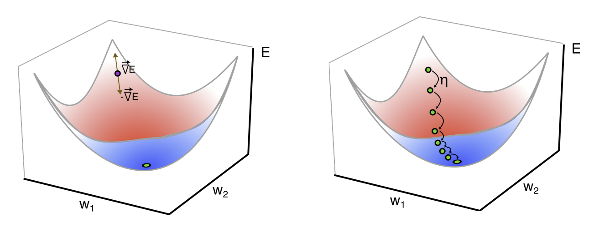
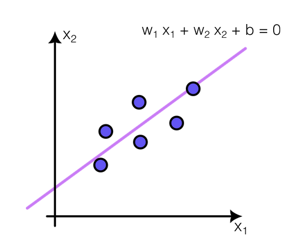
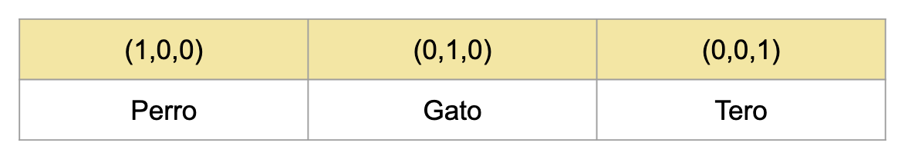
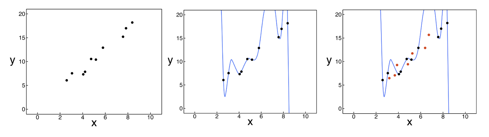
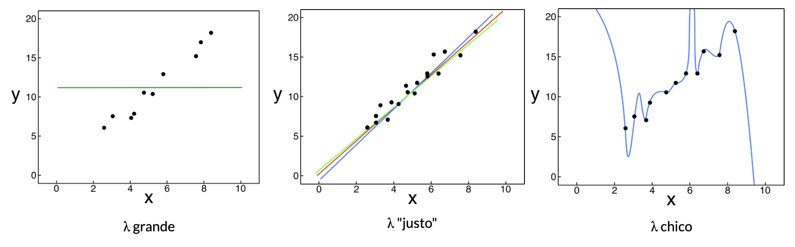

<!-- slide -->
## Diapositiva 1
### Aprendizaje por minimización del error
#### Análisis y procesamiento de Señales
##### Bioingeniería - Facultad de Ingeniería - UNSTA
##### 2026
**Dr. Ing. Facundo Adrián Lucianna**
**Ing. Facundo Roldán**

---

<!-- slide -->
## Diapositiva 2
### Entrenando un perceptrón

{verde}(**Aprendiendo por minimización del error**)

- Exigir un error de exactamente *cero* es un requisito demasiado estricto.
- Aún más problemático si usamos funciones de activación {verde}(**continuas**) (distintas al escalón).

> *Solución:* readaptar la regla para que {amarillo}(**minimice la función de costo**), haciendo pequeños cambios iterativos en los pesos hasta que el error sea "suficientemente" chico.

$$E_{SSE}\!\left(\vec{W}\right) = \frac{1}{2} \sum_{j=1}^{p} \left(d_j - y_j\right)^{2}$$

$$E_{SSE}\!\left(\vec{W}\right) = \frac{1}{2} \sum_{j=1}^{p} \left(d_j - f\!\left(\sum_{i=1}^{n} w_i x_i^{(j)} + b \right)\right)^{2}$$

---

<!-- slide -->
## Diapositiva 3
### Entrenando un perceptrón

{verde}(**Aprendiendo por minimización del error**)

- Con la Regla del Perceptrón original, buscábamos que la salida estuviera simplemente del lado correcto de la frontera.
- Ahora, buscamos que el vector de pesos se mueva para {amarillo}(**reducir continuamente la función de costo**).
- Esto requiere conocer cómo varía el costo a medida que cambian los pesos: el {amarillo}(**gradiente**).

> Si ajustamos los pesos en la dirección **opuesta** al gradiente ({verde}(*descenso por gradiente*)), nos acercamos a un mínimo.

---

<!-- slide -->
## Diapositiva 4
### Entrenando un perceptrón

{verde}(**Aprendiendo por minimización del error**)

- Si analizamos la función de error, vemos que **depende únicamente de los pesos** (las muestras de entrada son fijas).

$$E_{SSE}\!\left(\vec{W}\right) = \frac{1}{2} \sum_{j=1}^{p} \left(d_j - y_j\right)^{2}$$

$$E_{SSE}\!\left(\vec{W}\right) = \frac{1}{2} \sum_{j=1}^{p} \left(d_j - f\!\left(\sum_{i=1}^{n} w_i x_i^{(j)} + b \right)\right)^{2}$$

---

<!-- slide -->
## Diapositiva 5
### Entrenando un perceptrón

{verde}(**Aprendiendo por minimización del error**)

- Gráficamente, el descenso por gradiente busca el {amarillo}(**valle**) o punto más bajo en la superficie de error:



---

<!-- slide -->
## Diapositiva 6
### Entrenando un perceptrón

{verde}(**Aprendiendo por minimización del error**)

- En fórmula, para actualizar los pesos calculamos el gradiente y nos movemos en sentido **opuesto**:

$$\vec{W}(t + 1) = \vec{W}(t) - \eta \cdot \nabla E_{SSE}\!\left(\vec{W}(t)\right)$$

$$\nabla E_{SSE} = \left[\frac{\partial E_{SSE}}{\partial w_{1}},\, \frac{\partial E_{SSE}}{\partial w_{2}},\, \dots,\, \frac{\partial E_{SSE}}{\partial w_{n}} \right]^T$$

---

<!-- slide -->
## Diapositiva 7
### Entrenando un perceptrón

{verde}(**Aprendiendo por minimización del error**)

- Para calcular cómo afecta el peso $w_i$ al error total, aplicamos la {amarillo}(**Regla de la Cadena**):

$$\frac{\partial E_{SSE}}{\partial w_i} = \sum_{j=1}^{p} \underbrace{\frac{\partial E_j}{\partial y_j}}_{-(d_j - y_j)} \cdot \underbrace{\frac{\partial y_j}{\partial z_j}}_{f'(z_j)} \cdot \underbrace{\frac{\partial z_j}{\partial w_i}}_{x_i^{(j)}}$$

- **Salida del perceptrón:** $\dfrac{\partial E_j}{\partial y_j} = -(d_j - y_j)$
- **Derivada de la activación:** $\dfrac{\partial y_j}{\partial z_j} = f'(z_j)$
- **Entrada correspondiente:** $\dfrac{\partial z_j}{\partial w_i} = x_i^{(j)}$

- Reemplazando todo, obtenemos la derivada parcial final:

$$\frac{\partial E_{SSE}}{\partial w_{i}} = -\sum_{j=1}^{p} \left(d_j - y_j\right)\, f'\!\left(z_j\right)\, x_i^{(j)}$$

---

<!-- slide -->
## Diapositiva 8
### Entrenando un perceptrón

{verde}(**Aprendiendo por minimización del error**)

$$\frac{\partial E_{SSE}}{\partial w_{i}} = -\sum_{j=1}^{p} \left(d_j - y_j\right)\, f'\!\left(z_j\right)\, x_i^{(j)}$$

Observaciones al calcular el gradiente:

- Limita el uso a funciones de activación que sean {amarillo}(**derivables**).
- En la práctica se usan funciones con secciones derivables y se {rojo}(**corrigen errores numéricos**) puntuales (como en ReLU en $x=0$).
- El gradiente cambia según la {amarillo}(**función de costo**) elegida.
- Las librerías modernas resuelven esto con {verde}(**diferenciación automática**), abstrayendo este cálculo del usuario.

---

<!-- slide -->
## Diapositiva 9
### Entrenando un perceptrón

{verde}(**Aprendiendo por minimización del error**)

- Esta nueva regla de aprendizaje se conoce como la {amarillo}(**Regla Delta**):

```python
while error > threshold:
    x_train = shuffle(x_train)
    weights = perceptron.obtain_weights()
    for x, d in x_train:
        y = perceptron.output(x)
        for i in range(len(weights)):
            grad_error = gradiente(x, d, y, i)
            weights[i] = weights[i] - eta * grad_error
        perceptron.update_weights(weights)
    error = mse(x_train, perceptron)
```

---

<!-- slide -->
## Diapositiva 10
### Entrenando un perceptrón

{verde}(**Aprendiendo por minimización del error**)

El valor de la **constante de aprendizaje** ({amarillo}(*learning rate*)) es crucial:

- {rojo}(**Muy chico:**) demora demasiado en aprender.
- {rojo}(**Muy grande:**) puede divergir y nunca converger.


---

<!-- slide -->
## Diapositiva 11
### Entrenando un perceptrón

{verde}(**Aprendiendo por minimización del error**)

- Este método {rojo}(**no asegura**) encontrar el mínimo global: el descenso puede quedar atrapado en un {amarillo}(**mínimo local**).

> *Estrategia práctica:* entrenar varias veces inicializando los pesos al azar y quedarse con el mejor resultado.


---

<!-- slide -->
## Diapositiva 12
### Entrenando un perceptrón

{verde}(**Aprendiendo por minimización del error**)

- Esta forma de aprendizaje nos permite ir **más allá** de la clasificación.
- Si usamos una función de activación lineal, la red realiza una {verde}(**regresión**).
- Llega al mismo resultado que **Mínimos Cuadrados**, pero mediante un {amarillo}(**proceso iterativo**), útil cuando hay muchas dimensiones u observaciones.



---

<!-- slide -->
## Diapositiva 13
### Entrenando un perceptrón

{rojo}(**Limitaciones de la Regla Delta pura:**)

- En cada iteración hay que calcular el error usando {rojo}(**todo el dataset**).
- Si el volumen de datos es inmenso (Big Data), cada paso puede demorar muchísimo.

```python
while error > threshold:
    x_train = shuffle(x_train)
    weights = perceptron.obtain_weights()
    for x, d in x_train:
        y = perceptron.output(x)
        for i in range(len(weights)):
            grad_error = gradiente(x, d, y, i)
            weights[i] = weights[i] - eta * grad_error
        perceptron.update_weights(weights)
    error = mse(x_train, perceptron)   # recorre TODO el dataset
```

---

<!-- slide -->
## Diapositiva 14
### Entrenando un perceptrón

{verde}(**Aprendiendo por minimización del error**)

- Una forma de agilizar el entrenamiento es usar {amarillo}(**mini-batches**) (lotes), actualizando los pesos a partir de un subconjunto de datos por iteración:

```python
while error > threshold:
    x_train = shuffle(x_train)

    for batch in split_in_batches(x_train, batch_size):
        weights = perceptron.obtain_weights()
        accum_delta = zeros(len(weights))

        for x, d in batch:
            y = perceptron.output(x)
            for i in range(len(weights)):
                accum_delta[i] += gradiente(x, d, y, i)

        for i in range(len(weights)):
            weights[i] = weights[i] - eta * accum_delta[i] / len(batch)

        perceptron.update_weights(weights)

    error = mse(x_train, perceptron)
```

---

<!-- slide -->
## Diapositiva 15
### La correcta forma de implementar clasificadores

---

<!-- slide -->
## Diapositiva 16
### Implementación de clasificadores

- Hasta ahora vimos {verde}(**clasificadores binarios**) (dos clases, salida $0$ o $1$).
- Para la activación final usábamos **Sigmoide** o **Escalón**.
- ¿Pero qué hacemos si tenemos {amarillo}(**más de dos clases**) (ej. Perro, Gato, Tero)?

> *Opción incorrecta:* asignar un número por clase ($0=$Perro, $1=$Gato, $2=$Tero). Esto asume un orden irreal (variable categórica como ordinal). ¿Qué significaría una salida de $1.35$?

- *Solución:* usar una función de costo más apropiada — la {amarillo}(**Entropía Cruzada Categórica**).

---

<!-- slide -->
## Diapositiva 17
### Implementación de clasificadores

{verde}(**One-Hot Encoding**)

- Para solucionar el problema usamos {amarillo}(**one-hot encoding**).
- Hacemos que la red tenga **tantas neuronas de salida como clases haya** (ej. $3$ neuronas para los animales).



- A esta codificación no le importa si cambiamos el orden de las neuronas.
- Los valores de salida (ej. $0.35,\, 0.5,\, 0.15$) se pueden interpretar directamente como {verde}(**probabilidades**) de pertenencia a cada clase.

---

<!-- slide -->
## Diapositiva 18
### Implementación de clasificadores

{verde}(**Función de activación Softmax**)

- Ninguna de las funciones de activación que vimos sirve para la última capa en este caso:
- Si la salida es **lineal**, puede tomar valores fuera del rango $[0, 1]$ (no es probabilidad).
- Si usamos **sigmoide**, aunque esté en el rango, {rojo}(**no asegura que la suma de todas las salidas sea $1$**).

> *Solución:* usar la función de activación {amarillo}(**Softmax**).

Dada la salida lineal de la red $\vec{O} = \vec{X}\vec{W} + b$, *Softmax* se define como:

$$\vec{Y} = \text{softmax}(\vec{O}), \qquad y_i = \frac{e^{o_i}}{\sum_{j} e^{o_{j}}}$$

---

<!-- slide -->
## Diapositiva 19
### Implementación de clasificadores

{verde}(**Función de activación Softmax**)

- Para definir la clase predicha, simplemente se elige la salida {verde}(**más grande**).

*Ejemplo:*

- Salida lineal: $\vec{O} = [1.25,\, 1.61,\, 0.40]$
- Exponencial: $\exp(\vec{O}) = [3.5,\, 5.0,\, 1.5]$
- Normalizamos: $\text{softmax}(\vec{O}) = [0.35,\, 0.5,\, 0.15]$
- Asignamos $1$ al mayor y $0$ al resto: $\vec{Y} = [0,\, 1,\, 0]$

---

<!-- slide -->
## Diapositiva 20
### Implementación de clasificadores

{verde}(**Optimización de cálculo con Softmax**)

- Como la función exponencial es {verde}(**estrictamente creciente**) — si $a < b$, entonces $e^{a} < e^{b}$ — no necesitamos calcularla si solo queremos predecir la clase.
- Comparando directamente $\vec{O} = [1.25,\, 1.61,\, 0.40]$ ya sabemos que el del medio es el mayor, dando $\vec{Y} = [0,\, 1,\, 0]$.

> Esto {amarillo}(**ahorra cálculo**) durante la inferencia. Por eso, en muchos frameworks, si indicamos que vamos a usar entropía cruzada, la capa final no requiere tener Softmax explícitamente para predecir.

---

<!-- slide -->
## Diapositiva 21
### Implementación de clasificadores

{verde}(**Entropía Cruzada Categórica**)

- ¿Cómo obtenemos la función de costo? La salida de Softmax se puede interpretar como la {amarillo}(**probabilidad condicional**) de cada clase.
- Buscamos los pesos que {verde}(**maximicen esta probabilidad**) para la clase correcta:

$$P(\vec{Y} \mid \vec{X}) = \prod_{i=1}^{n} P\!\left(Y^{[i]} \mid X^{[i]}\right)$$

> Queremos que, para todas las observaciones, la probabilidad asignada a la clase verdadera sea lo más cercana a $1$ posible.

---

<!-- slide -->
## Diapositiva 22
### Implementación de clasificadores

{verde}(**Entropía Cruzada Categórica**)

- Buscamos los pesos que hagan que el producto de estas probabilidades — la {verde}(**verosimilitud**) o *likelihood* — sea lo más grande posible:

$$P(\vec{Y} \mid \vec{X}) = \prod_{i=1}^{n} P\!\left(Y^{[i]} \mid X^{[i]}\right)$$

- Como maximizar productos es {rojo}(**numéricamente inestable**), tomamos el {amarillo}(**logaritmo de la verosimilitud**) (que convierte productos en sumas).
- Y le aplicamos un signo negativo para usar el algoritmo de {amarillo}(**descenso por gradiente**), que **minimiza**:

$$-\log P(\vec{Y} \mid \vec{X}) = -\log \prod_{i=1}^{n} P\!\left(Y^{[i]} \mid X^{[i]}\right) = \sum_{i=1}^{n} -\log P\!\left(Y^{[i]} \mid X^{[i]}\right)$$

$$\sum_{i=1}^{n} -\log P\!\left(Y^{[i]} \mid X^{[i]}\right) = \sum_{i=1}^{n} l\!\left(Y^{[i]}, D^{[i]}\right)$$

---

<!-- slide -->
## Diapositiva 23
### Implementación de clasificadores

{verde}(**Entropía Cruzada Categórica**)

- Así llegamos a nuestra función de costo ideal para problemas multi-clase: la {amarillo}(**Entropía Cruzada Categórica**), definida como:

$$l\!\left(Y^{[i]}, D^{[i]}\right) = -\sum_{j} d_j \log(y_j)$$

> Permite encontrar los pesos sinápticos {verde}(**minimizando**) este error.

---

<!-- slide -->
## Diapositiva 24
### Implementación de clasificadores

{verde}(**Entropía Cruzada Categórica**)

$$l\!\left(Y^{[i]}, D^{[i]}\right) = -\sum_{j} d_j \log(y_j)$$

Analicemos los componentes de la fórmula:

- $d_j$: salida {amarillo}(**real**) (del dataset).
- $y_j$: probabilidad {amarillo}(**predicha**) por el modelo.

---

<!-- slide -->
## Diapositiva 25
### Implementación de clasificadores

{verde}(**Entropía Cruzada Categórica**)

- Como tenemos un vector *one-hot encoding*, la salida esperada tiene **todo ceros** menos el elemento correspondiente a la clase verdadera.
- *Ejemplo:* si la clase real es "Gato", el vector es $\vec{D} = [0,\, 1,\, 0]$.

$$l\!\left(Y^{[i]}, D^{[i]}\right) = -d_{perro} \log(y_{perro}) - d_{gato} \log(y_{gato}) - d_{tero} \log(y_{tero})$$

$$l\!\left(Y^{[i]}, D^{[i]}\right) = -0 \cdot \log(y_{perro}) - 1 \cdot \log(y_{gato}) - 0 \cdot \log(y_{tero})$$

$$l\!\left(Y^{[i]}, D^{[i]}\right) = -\log(y_{gato})$$

---

<!-- slide -->
## Diapositiva 26
### Implementación de clasificadores

{verde}(**Entropía Cruzada Categórica**)

- Y si la salida del modelo luego de Softmax es, por ejemplo, $\vec{Y} = [0.1,\, 0.8,\, 0.1]$:

$$l\!\left(Y^{[i]}, D^{[i]}\right) = -\log(y_{gato})$$

$$l\!\left(Y^{[i]}, D^{[i]}\right) = -\log\!\left(\frac{e^{o_{gato}}}{e^{o_{perro}} + e^{o_{gato}} + e^{o_{tero}}}\right)$$

$$l\!\left(Y^{[i]}, D^{[i]}\right) = -\log\!\left(e^{o_{gato}}\right) + \log\!\left(e^{o_{perro}} + e^{o_{gato}} + e^{o_{tero}}\right)$$

$$l\!\left(Y^{[i]}, D^{[i]}\right) = \log\!\left(e^{o_{perro}} + e^{o_{gato}} + e^{o_{tero}}\right) - o_{gato}$$

---

<!-- slide -->
## Diapositiva 27
### Implementación de clasificadores

{verde}(**El gradiente de Softmax + Entropía Cruzada**)

- Generalizando a cualquier problema:

$$l\!\left(Y^{[i]}, D^{[i]}\right) = \log\!\left(\sum_j e^{o_j}\right) - \sum_j d_j \, o_j$$

- Si calculamos la derivada de la función de costo respecto de la entrada a la capa:

$$\frac{\partial l\!\left(Y^{[i]}, D^{[i]}\right)}{\partial o_{j}} = \frac{e^{o_{j}}}{\sum_k e^{o_{k}}} - d_{j} = \text{softmax}(o_j) - d_{j}$$

> La derivada es, elegantemente, la {amarillo}(**diferencia directa**) entre la probabilidad asignada por el modelo y el valor verdadero (one-hot).

---

<!-- slide -->
## Diapositiva 28
### Decaimiento de pesos y regularización L2

---

<!-- slide -->
## Diapositiva 29
### El problema del sobreajuste

- Cuando entrenamos un modelo, lo que **realmente queremos** es que {verde}(**generalice**): que funcione bien con datos {amarillo}(**nuevos**), no sólo con los del entrenamiento.
- Si el modelo tiene muchos parámetros y poco dato, puede {rojo}(**memorizar**) el dataset de entrenamiento — error de entrenamiento bajísimo, pero error de testeo alto.

> Este fenómeno se llama {rojo}(**sobreajuste**) (*overfitting*): la curva pasa exactamente por todos los puntos del dataset, pero oscila salvajemente entre ellos.



- Un síntoma típico del sobreajuste: los **pesos sinápticos** crecen mucho en valor absoluto.

---

<!-- slide -->
## Diapositiva 30
### La idea: pesos chicos = modelo más simple

- En Machine Learning vale la **navaja de Occam**: entre dos modelos que explican los datos, preferimos el {verde}(**más simple**).
- Pesos chicos en valor absoluto producen funciones más {amarillo}(**suaves**): pequeños cambios en la entrada generan pequeños cambios en la salida.
- Pesos grandes amplifican el ruido y hacen al modelo muy sensible a los datos de entrenamiento.

> *Estrategia:* {verde}(**penalizar**) los pesos grandes directamente en la función de costo, para que el algoritmo prefiera soluciones con pesos chicos.

---

<!-- slide -->
## Diapositiva 31
### Regularización L2

- Agregamos un nuevo término a la función de costo, llamado {amarillo}(**término de regularización**) $s(\vec{W})$:

$$E_{reg}(\vec{W}) = E_{SSE}(\vec{W}) + \lambda \cdot s(\vec{W})$$

- En la **regularización L2**, el término penaliza la {verde}(**norma cuadrática**) del vector de pesos:

$$s(\vec{W}) = \frac{1}{2} \|\vec{W}\|^{2} = \frac{1}{2} \sum_{i=1}^{n} w_i^{2}$$

- Por lo tanto, el costo regularizado queda:

$$E_{reg}(\vec{W}) = \underbrace{\frac{1}{2} \sum_{j=1}^{p} (d_j - y_j)^{2}}_{\text{ajuste a los datos}} + \underbrace{\frac{\lambda}{2} \sum_{i=1}^{n} w_i^{2}}_{\text{penalización a los pesos}}$$

> El entrenamiento ahora busca el {amarillo}(**equilibrio**) entre ajustar bien los datos **y** mantener los pesos chicos.

---

<!-- slide -->
## Diapositiva 32
### Cómo afecta al gradiente

- Calculamos la derivada del nuevo costo respecto a un peso $w_i$:

$$\frac{\partial E_{reg}}{\partial w_i} = \frac{\partial E_{SSE}}{\partial w_i} + \lambda \cdot w_i$$

- Reemplazando en la regla de actualización del descenso por gradiente:

$$w_i(t+1) = w_i(t) - \eta \cdot \frac{\partial E_{SSE}}{\partial w_i} - \eta \lambda \cdot w_i(t)$$

- Reordenando:

$$w_i(t+1) = (1 - \eta \lambda) \cdot w_i(t) - \eta \cdot \frac{\partial E_{SSE}}{\partial w_i}$$

> En cada paso, **antes** de aplicar el gradiente del error, el peso se {verde}(**multiplica por un factor menor que 1**), encogiéndose hacia cero.

---

<!-- slide -->
## Diapositiva 33
### Por qué se llama "decaimiento de pesos"

- El factor $(1 - \eta \lambda)$ es lo que da el nombre {amarillo}(***weight decay***):

$$w_i(t+1) = \underbrace{(1 - \eta \lambda)}_{< 1} \cdot w_i(t) - \eta \cdot \frac{\partial E_{SSE}}{\partial w_i}$$

- Sin importar lo que diga el gradiente del error, hay una {verde}(**fuerza constante**) que tira al peso hacia cero en cada iteración.
- Si el dato no aporta una razón fuerte para que un peso sea grande, el decaimiento gana y el peso {amarillo}(**se achica**).
- Si el dato lo justifica, el gradiente del error compensa el decaimiento y el peso se mantiene.

> Es exactamente el mismo concepto de "presión hacia la simplicidad" que aparece en muchas áreas: si nadie te empuja en otra dirección, decaés hacia el reposo.

---

<!-- slide -->
## Diapositiva 34
### El hiperparámetro λ

El comportamiento del modelo depende fuertemente del valor de $\lambda$:

- $\lambda \to 0$: prácticamente {rojo}(**no hay regularización**). El modelo puede sobreajustar.
- $\lambda$ muy grande: el costo de tener pesos no nulos domina al ajuste, y los pesos se aplastan a cero. El modelo {rojo}(**subajusta**) (*underfitting*).
- $\lambda$ "justo": el modelo encuentra el {verde}(**equilibrio**) entre ajustar los datos y mantenerse simple.

> $\lambda$ es un {amarillo}(**hiperparámetro**): no se aprende durante el entrenamiento, sino que se elige usando un conjunto de **validación**.



> Mantener los pesos chicos es una de las herramientas más simples y efectivas para combatir el sobreajuste, y por eso aparece en {amarillo}(**casi todos los entrenamientos modernos**).


---
