<!-- slide -->
## Diapositiva 1
### Perceptrones multicapa
#### Análisis y procesamiento de Señales
##### Bioingeniería - Facultad de Ingeniería - UNSTA
##### 2026
**Dr. Ing. Facundo Adrián Lucianna**
**Ing. Facundo Roldán**

---

<!-- slide -->
## Diapositiva 2
### Perceptrones multicapa

Hasta ahora vimos una **única neurona**. El siguiente paso natural es extender su funcionamiento agregando **varias neuronas en paralelo** para obtener {amarillo}(salidas vectoriales).

- Permite resolver problemas de **clasificación multiclase**.
- Permite hacer **regresiones de funciones vectoriales**.

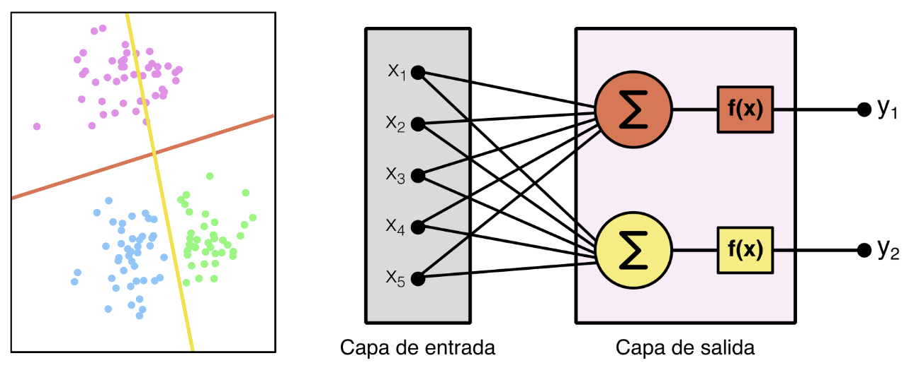

---

<!-- slide -->
## Diapositiva 3
### Perceptrones multicapa

- Sin embargo, todo sigue siendo {rojo}(lineal): las fronteras de decisión son rectas y las regresiones son hiperplanos.
- Para aprovechar las ventajas reales de las redes neuronales, debemos imitar a las redes biológicas: **capas complejas de información**.

> Necesitamos {amarillo}(apilar capas de muchas neuronas), lo que da origen a la primera red neuronal moderna: las **Redes de Perceptrones Multicapa (MLP)** con conexión hacia adelante (*Multilayer Perceptrons*).

- Es la red más básica y la primera en popularizarse en los años 90.

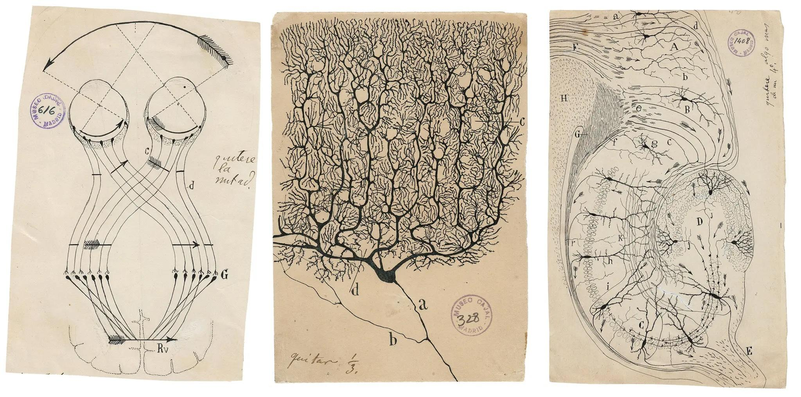

---

<!-- slide -->
## Diapositiva 4
### Perceptrones multicapa

Esta arquitectura agrega **una o más capas ocultas**, donde todas las neuronas de una capa están conectadas con todas las neuronas de la capa siguiente ({amarillo}(fully connected)).

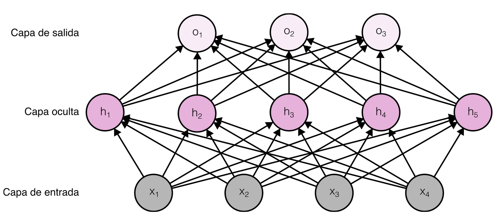

---

<!-- slide -->
## Diapositiva 5
### Perceptrones multicapa

Empecemos por una red donde la **función de activación es lineal** en todas las neuronas. Si tenemos una entrada $\mathbf{X}_{1 \times d}$ (un vector de $d$ features):

$$\mathbf{H} = \mathbf{X}\,\mathbf{W}^{(1)} + \mathbf{b}^{(1)}$$

Donde:

- $\mathbf{H}_{1 \times h}$ es la salida de las neuronas de la capa oculta.
- $\mathbf{W}^{(1)}_{d \times h}$ son los pesos sinápticos para $d$ entradas y $h$ neuronas.
- $\mathbf{b}^{(1)}_{1 \times h}$ es el vector de *bias* de las $h$ neuronas.

---

<!-- slide -->
## Diapositiva 6
### Perceptrones multicapa

La **capa de salida** se calcula de manera análoga:

$$\mathbf{O} = \mathbf{H}\,\mathbf{W}^{(2)} + \mathbf{b}^{(2)}$$

Donde:

- $\mathbf{O}_{1 \times q}$ es la salida final de la red.
- $\mathbf{H}_{1 \times h}$ es la salida de la capa oculta.
- $\mathbf{W}^{(2)}_{h \times q}$ son los pesos para $h$ entradas y $q$ neuronas de salida.
- $\mathbf{b}^{(2)}_{1 \times q}$ es el *bias* de las $q$ neuronas.

---

<!-- slide -->
## Diapositiva 7
### Perceptrones multicapa

Si juntamos las dos ecuaciones y sustituimos $\mathbf{H}$ en la salida:

$$\mathbf{O} = (\mathbf{X}\,\mathbf{W}^{(1)} + \mathbf{b}^{(1)})\,\mathbf{W}^{(2)} + \mathbf{b}^{(2)}$$

$$\mathbf{O} = \mathbf{X}\,\mathbf{W}^{(1)}\mathbf{W}^{(2)} + (\mathbf{b}^{(1)}\mathbf{W}^{(2)} + \mathbf{b}^{(2)})$$

Como las matrices se pueden multiplicar entre sí:

$$\mathbf{O} = \mathbf{X}_{1 \times d}\,\underbrace{\mathbf{W}^{(1)}_{d \times h}\mathbf{W}^{(2)}_{h \times q}}_{\mathbf{W}_{d \times q}} + \underbrace{(\mathbf{b}^{(1)}_{1 \times h}\mathbf{W}^{(2)}_{h \times q} + \mathbf{b}^{(2)}_{1 \times q})}_{\mathbf{b}_{1 \times q}}$$

> {rojo}(La red colapsa a una única capa de neuronas). Por lo tanto, **una MLP NO tiene sentido si no usamos funciones de activación no lineales**.

---

<!-- slide -->
## Diapositiva 8
### Perceptrones multicapa

Para evitar el colapso, basta con introducir una **función de activación no lineal** $\sigma$ en la capa oculta:

$$\mathbf{H} = \sigma(\mathbf{X}\,\mathbf{W}^{(1)} + \mathbf{b}^{(1)})$$

$$\mathbf{O} = \mathbf{H}\,\mathbf{W}^{(2)} + \mathbf{b}^{(2)}$$

- Esta red {verde}(ya no puede colapsar) siempre que $\sigma$ no sea lineal.
- Y por supuesto, podemos **apilar más capas ocultas**:

$$\mathbf{H}^{(1)} = \sigma(\mathbf{X}\,\mathbf{W}^{(1)} + \mathbf{b}^{(1)})$$

$$\mathbf{H}^{(2)} = \sigma(\mathbf{H}^{(1)}\,\mathbf{W}^{(2)} + \mathbf{b}^{(2)})$$

$$\dots$$

---

<!-- slide -->
## Diapositiva 9
### Perceptrones multicapa

Como trabajamos con **productos matriciales**, podemos calcular **mini-batches** de una sola vez. Si la entrada es de $n$ observaciones con $d$ features, $\mathbf{X}_{n \times d}$:

$$\mathbf{H}_{n \times h} = \sigma(\mathbf{X}_{n \times d}\,\mathbf{W}^{(1)}_{d \times h} + \mathbf{b}^{(1)}_{1 \times h})$$

> {amarillo}(Pequeño abuso de notación): el vector $\mathbf{b}$ se **repite $n$ veces** (broadcasting) y la función $\sigma$ se aplica **elemento a elemento** sobre toda la matriz.

---

<!-- slide -->
## Diapositiva 10
### Perceptrones multicapa

En **NumPy** estas operaciones son muy fáciles de implementar y, además, son eficientes porque aprovechan aquello en lo que las CPUs son buenas: **operaciones matriciales sobre regiones contiguas de memoria RAM**.

- Las {verde}(GPUs) son aún mejores haciendo este tipo de cálculos en paralelo masivo.

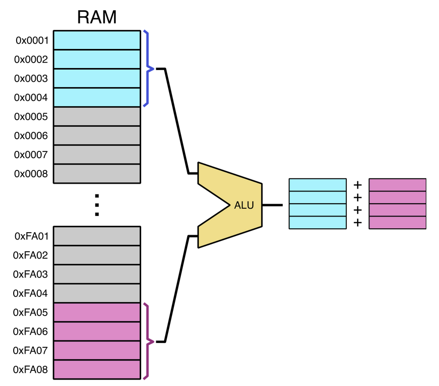

---

<!-- slide -->
## Diapositiva 11
### Perceptrones multicapa

Por esta razón, las librerías de Deep Learning son **librerías de tensores**:

> Un **tensor** es un objeto algebraico que describe una relación multilineal entre conjuntos de objetos algebraicos relacionados con un espacio vectorial.

- Tensor de **rango 0** → escalar.
- Tensor de **rango 1** → vector.
- Tensor de **rango 2** → matriz.
- Tensor de **rango 3 o superior** → estructura multidimensional.

Como las neuronas se describen con operaciones de tensores, y los CPUs/GPUs son rápidos operando tensores, es lógico que las librerías se enfoquen en estas herramientas. De ahí el nombre **TensorFlow** ({rojo}(*flujo de tensores*)).

---

<!-- slide -->
## Diapositiva 12
### Aproximadores universales

---

<!-- slide -->
## Diapositiva 13
### Aproximadores universales

En 1989, **Cybenko** publicó un paper donde demostró matemáticamente lo siguiente:

> Una **red MLP con una sola capa oculta** y funciones de activación sigmoideas puede modelar {verde}(cualquier función matemática), siempre que tenga suficientes neuronas y el conjunto correcto de pesos sinápticos.

- El problema es que obtener esos pesos resulta {rojo}(prácticamente imposible) en la práctica.
- La solución empírica fue **crecer en profundidad** en lugar de hacerlo en ancho: agregar más y más capas. Esta estrategia es la que ha llevado al éxito del **Deep Learning**.

---

<!-- slide -->
## Diapositiva 14
### Funciones de activación de la capa oculta

---

<!-- slide -->
## Diapositiva 15
### Funciones de activación de la capa oculta

**ReLU** (*rectified linear unit*) es la elección más popular hoy en día y la que **inició la revolución del Deep Learning en 2010**.

$$\text{ReLU}(x) = \max(0, x)$$

- Retiene los valores positivos y {rojo}(descarta los negativos).
- Su derivada es **0** para $x < 0$ y **1** para $x > 0$.
- En $x = 0$ la derivada no existe, pero por convención se define como **0**.

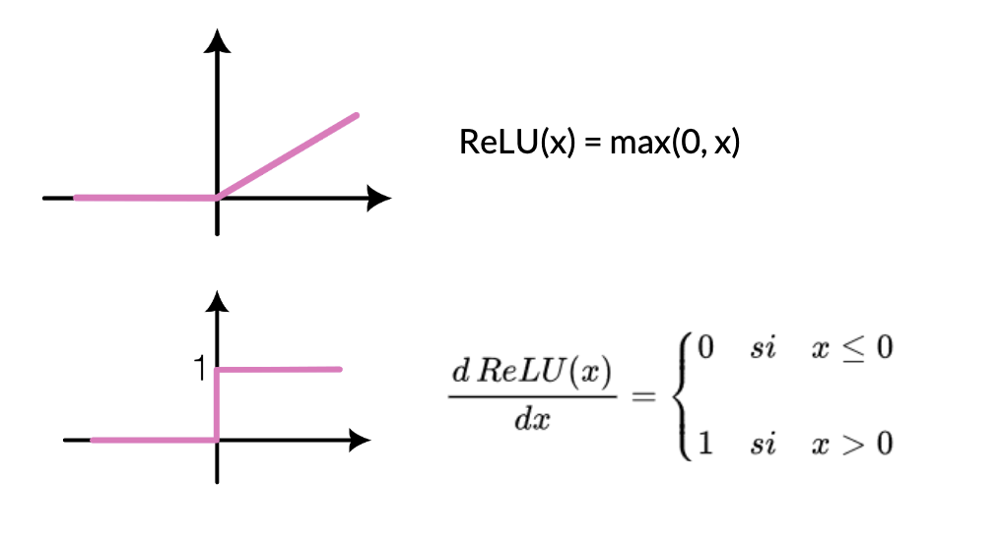 

---

<!-- slide -->
## Diapositiva 16
### Funciones de activación de la capa oculta

ReLU tiene muchas variantes. Una de las más usadas es la **pReLU** (*parametrized rectified linear unit*):

$$\text{pReLU}(x) = \max(0, x) + \alpha \cdot \min(0, x)$$

> Permite que pase {amarillo}(algo de información) cuando el argumento es negativo, controlado por el parámetro $\alpha$.

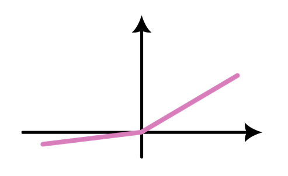

---

<!-- slide -->
## Diapositiva 17
### Funciones de activación de la capa oculta

**Función sigmoidea** (ya la vimos):

$$\sigma(x) = \frac{1}{1 + e^{-x}}$$

- Fue muy popular durante mucho tiempo, hasta que la {naranja}(reemplazó ReLU) en las capas ocultas.
- Problema: el {rojo}(gradiente desaparece) cuando la entrada es muy grande en valor absoluto, y la red **tarda mucho en converger**.

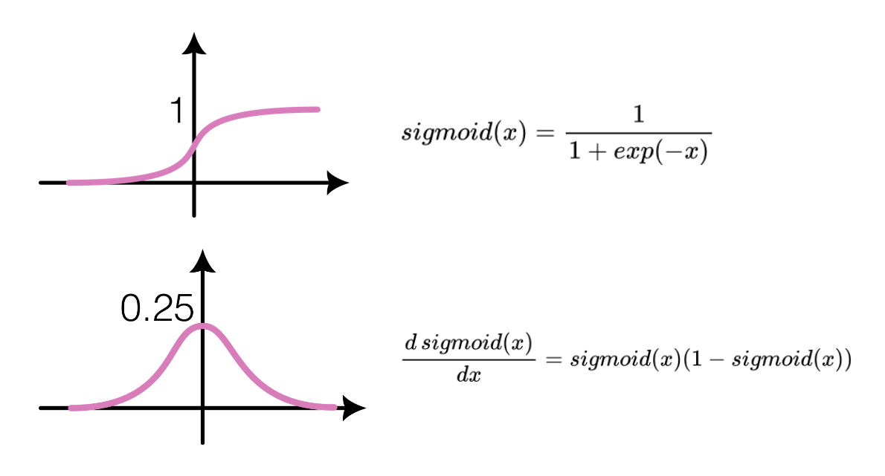

---

<!-- slide -->
## Diapositiva 18
### Funciones de activación de la capa oculta

**Función tangente hiperbólica** (también la vimos):

$$\tanh(x) = \frac{e^{x} - e^{-x}}{e^{x} + e^{-x}}$$

- Comprime los valores entre $-1$ y $1$.
- Cerca de cero tiene un comportamiento {verde}(pseudo-lineal).
- Tiene el {rojo}(mismo problema de gradiente desvaneciente) que la sigmoidea.

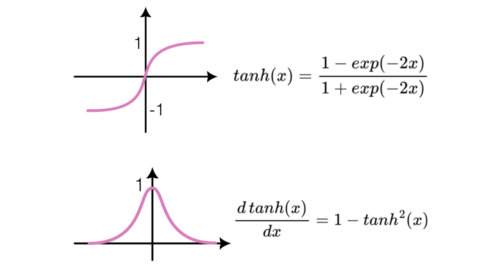

---

<!-- slide -->
## Diapositiva 19
### Propagación hacia adelante y hacia atrás

---

<!-- slide -->
## Diapositiva 20
### Propagación hacia adelante

La **propagación hacia adelante** (*forward propagation*) consiste en avanzar desde la entrada hacia la salida, calculando y almacenando el valor de cada capa hasta obtener la salida final del modelo.

> Veamos un ejemplo simplificado: una red **sin bias** con una entrada $\mathbf{X}_{d}$.

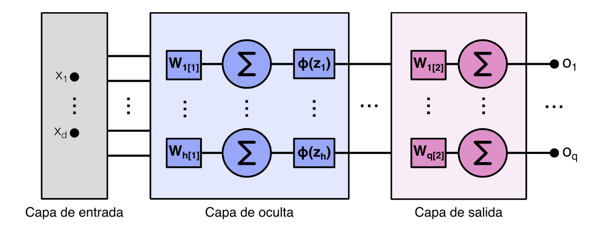

---

<!-- slide -->
## Diapositiva 21
### Propagación hacia adelante

Para la entrada $\mathbf{X}_d$, la salida lineal de la capa oculta es:

$$\mathbf{Z}_h = \mathbf{W}^{(1)}_{h \times d}\,\mathbf{X}_d$$

Luego pasamos $\mathbf{Z}$ por la **función de activación** $\phi$:

$$\mathbf{H} = \phi(\mathbf{Z})$$

Y la salida final de la red es:

$$\mathbf{O} = \mathbf{W}^{(2)}\,\mathbf{H}$$

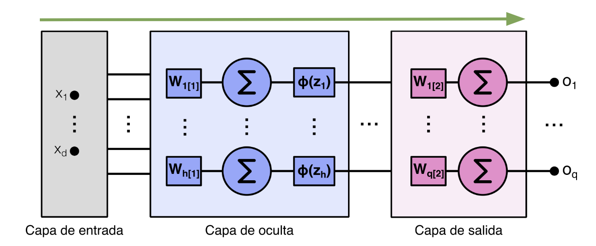

---

<!-- slide -->
## Diapositiva 22
### Propagación hacia adelante

La red tiene una **función de costo** $l$. Para la entrada de ejemplo con salida verdadera $\mathbf{y}$ podemos calcular:

$$L = l(\mathbf{O}, \mathbf{y})$$

Si agregamos una **función de regularización** $s$ (por ejemplo, decaimiento de pesos), 

$$s = \frac{\lambda}{2} \left( \|W^{(1)}\|^2 + \|W^{(2)}\|^2 \right)$$

Donde $\lambda$ es el parámetro de regularización.

La **función de pérdida total** queda:

$$J = L + s$$

> {amarillo}(Esta es la cantidad que queremos minimizar) durante el entrenamiento.

---

<!-- slide -->
## Diapositiva 23
### Propagación hacia atrás

**Backpropagation** se refiere al método para calcular el {verde}(gradiente de los parámetros) de la red. Se arranca desde la salida y se avanza hacia la entrada aplicando la **regla de la cadena**.

- El algoritmo guarda los valores intermedios necesarios para calcular el gradiente.
- Asumamos $\mathbf{Y} = f(\mathbf{X})$ y $\mathbf{Z} = g(\mathbf{Y})$, donde $\mathbf{X}, \mathbf{Y}, \mathbf{Z}$ son tensores. Por la regla de la cadena:

$$\frac{\partial \mathbf{Z}}{\partial \mathbf{X}} = \text{prod}\left(\frac{\partial \mathbf{Z}}{\partial \mathbf{Y}}, \frac{\partial \mathbf{Y}}{\partial \mathbf{X}}\right)$$

> El operador $\text{prod}$ multiplica los argumentos {amarillo}(después) de aplicar las operaciones necesarias (transposiciones, intercambio de posiciones).

---

<!-- slide -->
## Diapositiva 24
### Propagación hacia atrás

Volvamos al ejemplo de la propagación hacia adelante: queremos calcular los gradientes de $J$ respecto a los pesos de cada capa.

$$ \frac{\partial J}{\partial W^{(1)}}, \qquad \frac{\partial J}{\partial W^{(2)}} $$

> Aplicamos la **regla de la cadena**, y el orden de los cálculos se {naranja}(invierte) respecto al de la propagación hacia adelante.

Primer paso: calcular el gradiente de la función objetivo respecto al término de pérdida $L$ y al término de regularización $s$:

$$\frac{\partial J}{\partial L} = 1, \qquad \frac{\partial J}{\partial s} = 1$$

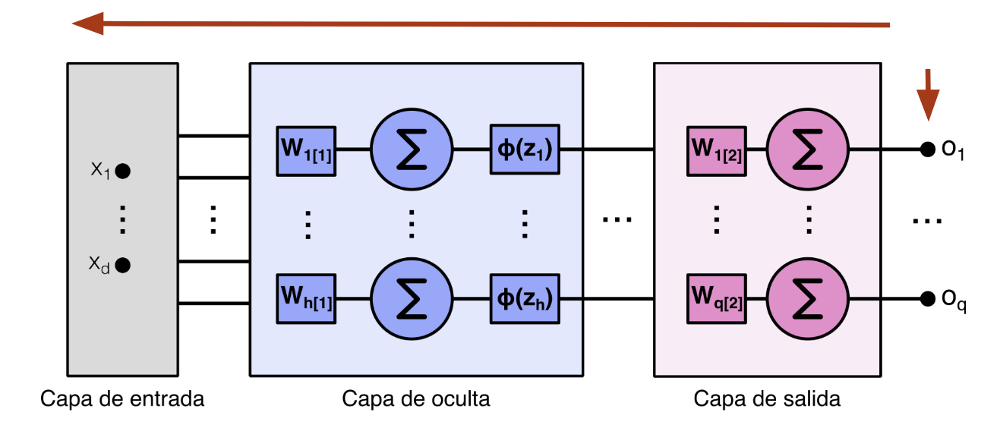

---

<!-- slide -->
## Diapositiva 25
### Propagación hacia atrás

A continuación, calculamos el gradiente de la función objetivo respecto a la **variable de la capa de salida** $\mathbf{O}$ aplicando la regla de la cadena:

$$\frac{\partial J}{\partial \mathbf{O}} = \text{prod}\left(\frac{\partial J}{\partial L}, \frac{\partial L}{\partial \mathbf{O}}\right) = \frac{\partial L}{\partial \mathbf{O}} \in \mathbb{R}^{q}$$

Luego, calculamos el gradiente de los términos de **regularización** respecto a ambos parámetros:

$$\frac{\partial s}{\partial \mathbf{W}^{(1)}} = \lambda \mathbf{W}^{(1)}, \qquad \frac{\partial s}{\partial \mathbf{W}^{(2)}} = \lambda \mathbf{W}^{(2)}$$

---

<!-- slide -->
## Diapositiva 26
### Propagación hacia atrás

Ahora calculamos el gradiente respecto a los **pesos de la capa de salida** $\mathbf{W}^{(2)}$:

$$\frac{\partial J}{\partial \mathbf{W}^{(2)}} = \text{prod}\left(\frac{\partial J}{\partial \mathbf{O}}, \frac{\partial \mathbf{O}}{\partial \mathbf{W}^{(2)}}\right) + \text{prod}\left(\frac{\partial J}{\partial \mathbf{s}}, \frac{\partial \mathbf{s}}{\partial \mathbf{W}^{(2)}}\right) = \frac{\partial J}{\partial \mathbf{O}} \mathbf{H}^T + \lambda \mathbf{W}^{(2)} \in \mathbb{R}^{q \times h}$$

Para llegar a los pesos de la **capa oculta**, necesitamos seguir propagando. El gradiente respecto a la salida de la capa oculta es:

$$\frac{\partial J}{\partial \mathbf{H}} = \text{prod}\left(\frac{\partial J}{\partial \mathbf{O}}, \frac{\partial \mathbf{O}}{\partial \mathbf{H}}\right) \in \mathbb{R}^{h}$$

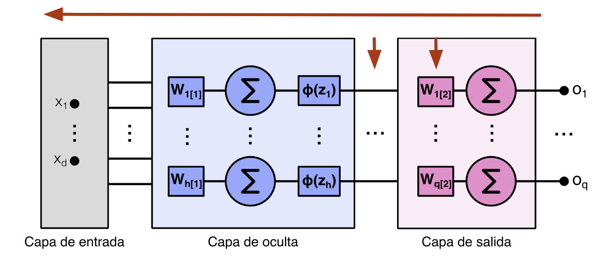

---

<!-- slide -->
## Diapositiva 27
### Propagación hacia atrás

Como la función de activación $\phi$ se aplica {amarillo}(elemento a elemento), calcular el gradiente de la variable intermedia $\mathbf{Z}$ requiere usar el operador de **multiplicación elemento a elemento**, que denotamos con $\odot$:

$$\frac{\partial J}{\partial \mathbf{Z}} = \text{prod}\left(\frac{\partial J}{\partial \mathbf{H}}, \frac{\partial \mathbf{H}}{\partial \mathbf{Z}}\right) = \frac{\partial J}{\partial \mathbf{H}} \odot \phi'(\mathbf{Z}) \in \mathbb{R}^{h}$$

Finalmente, obtenemos el gradiente de los **pesos de la capa oculta** $\mathbf{W}^{(1)}$:

$$\frac{\partial J}{\partial \mathbf{W}^{(1)}} = \text{prod}\left(\frac{\partial J}{\partial \mathbf{Z}}, \frac{\partial \mathbf{Z}}{\partial \mathbf{W}^{(1)}}\right) + \text{prod}\left(\frac{\partial J}{\partial \mathbf{s}}, \frac{\partial \mathbf{s}}{\partial \mathbf{W}^{(1)}}\right) = \frac{\partial J}{\partial \mathbf{Z}} \mathbf{X}^T + \lambda \mathbf{W}^{(1)} \in \mathbb{R}^{h \times d} $$

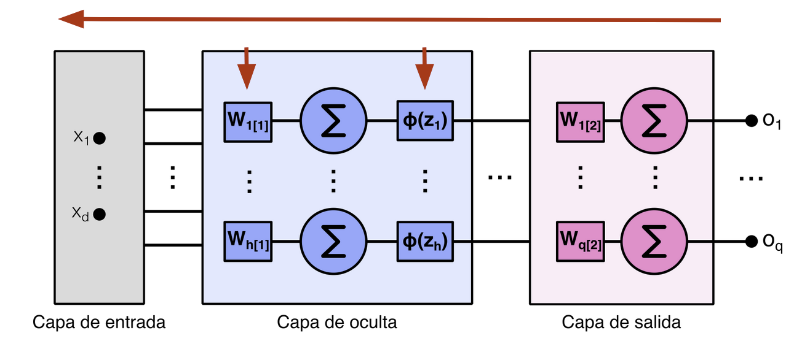

---

<!-- slide -->
## Diapositiva 28
### Propagación hacia atrás

Resumiendo, los gradientes de los pesos quedan:

- $\frac{\partial J}{\partial \mathbf{W}^{(2)}} = \frac{\partial J}{\partial \mathbf{O}} \mathbf{H}^T + \lambda \mathbf{W}^{(2)}$: gradiente de la **capa de salida**.

- $\frac{\partial J}{\partial \mathbf{W}^{(1)}} = \frac{\partial J}{\partial \mathbf{Z}} \mathbf{X}^T + \lambda \mathbf{W}^{(1)} $: gradiente de la **capa oculta**, que reutiliza información ya calculada.

> En este flujo se observa el fenómeno de {verde}(propagación hacia atrás): cada gradiente reutiliza los anteriores, en sentido inverso al *forward*.

- {amarillo}(Recordá): este ejemplo es una simplificación. En redes reales el principio es el mismo, pero con muchas más capas.

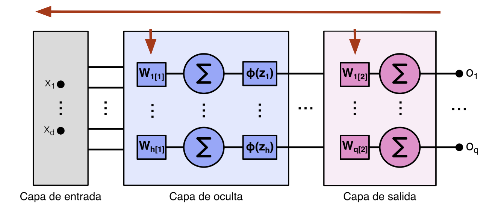

---

<!-- slide -->
## Diapositiva 29
### Estabilidad numérica e inicialización de pesos

---

<!-- slide -->
## Diapositiva 30
### Gradientes que desaparecen

- Cuando se usa la **función sigmoidea**, si las entradas son muy grandes en valor absoluto, los gradientes se vuelven prácticamente {rojo}(cero).
- Dado que la propagación hacia atrás multiplica gradientes capa por capa, en redes profundas es **inevitable** que los gradientes de las primeras capas se desvanezcan.
- Como consecuencia, los pesos de esas capas {rojo}(nunca se actualizan) y el entrenamiento no converge a un buen resultado.

> Por eso **ReLU es más popular**: {verde}(evita este fenómeno) en la región positiva.

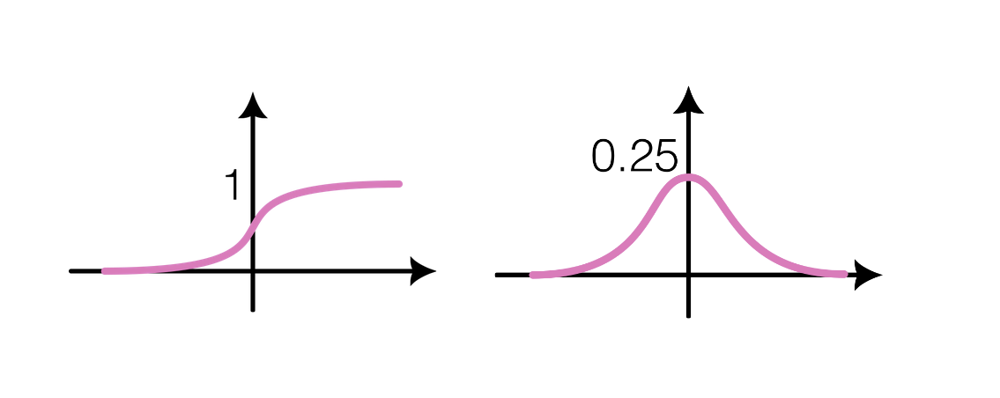

---

<!-- slide -->
## Diapositiva 31
### Gradientes que explotan

El otro extremo es cuando los gradientes {rojo}(explotan) por errores numéricos.

- Ocurre cuando multiplicamos matrices muchas veces y los valores escalan sin control.
- Pueden llegar a {amarillo}(órdenes de $10^{23}$) o más, generando *overflow* numérico.
- El entrenamiento se vuelve inestable y los pesos divergen.

---

<!-- slide -->
## Diapositiva 32
### Simetría

Un punto importante: las redes MLP son inherentemente {morado}(simétricas).

> Si todas las neuronas de una capa se inicializan con el **mismo valor**, al propagar el gradiente hacia atrás cada neurona recibe la **misma actualización**.

- Resultado: todas las neuronas aprenden lo mismo.
- Es como si tuviéramos {rojo}(una sola neurona efectiva) en lugar de varias.

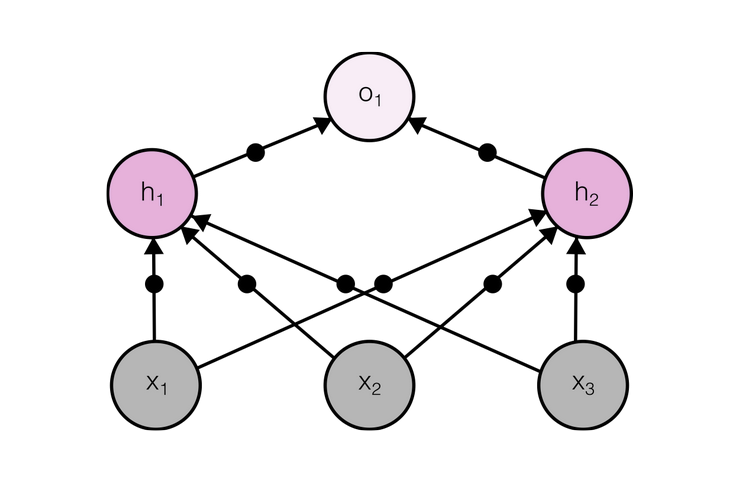

---

<!-- slide -->
## Diapositiva 33
### Inicialización de pesos

La forma de mitigar estos fenómenos es a través de una **correcta inicialización de los pesos**. Otras estrategias complementarias son la **regularización** y los **optimizadores**.

- **Inicialización por defecto**: pesos al azar usando una **distribución normal**. Funciona bien para problemas de tamaño moderado.

---

<!-- slide -->
## Diapositiva 34
### Inicialización de pesos

**Inicialización de Xavier**: permite inicializar los pesos al azar usando cualquier distribución, manteniendo media cero y desvío estándar igual a:

$$\sigma = \sqrt{\frac{2}{n_{\text{in}} + n_{\text{out}}}}$$

> Sirve para evitar el {amarillo}(escalamiento) que aparece tanto en propagación hacia adelante como hacia atrás.

- La varianza de la salida de la capa oculta en el *forward* es proporcional a $n_{\text{in}}\,\sigma^{2}$.
- Con esta elección de $\sigma$, se {verde}(compensa el escalamiento) y se evita que los gradientes exploten o desaparezcan.

---

<!-- slide -->
## Diapositiva 35
### Inicialización de pesos

- **Técnicas más avanzadas**: los frameworks de Deep Learning ofrecen variantes especializadas.
- Existen heurísticas específicas para parámetros {verde}(compartidos), {verde}(superresolución) y {verde}(modelos de secuencia), entre otros casos particulares.

> No las cubriremos en detalle, pero es bueno saber que {amarillo}(existen).

---

<!-- slide -->
## Diapositiva 36
### Dropout

---

<!-- slide -->
## Diapositiva 37
### Dropout

Un **buen modelo** es aquel que {verde}(generaliza), es decir, funciona bien con datos nuevos.

> En Machine Learning, para cerrar la brecha entre el rendimiento de entrenamiento y el de prueba, se suele recomendar apuntar a un **modelo simple**.

- Una forma de simplificar que ya vimos es el **decaimiento de pesos sinápticos** (regularización L2).

---

<!-- slide -->
## Diapositiva 38
### Dropout

Otra propiedad clave de un modelo simple es la {morado}(suavidad): la salida no debe ser sensible a pequeños cambios en la entrada.

Esta idea se traslada a redes neuronales con el concepto de **Dropout**:

- Inyecta {amarillo}(ruido) durante el entrenamiento, en la propagación hacia adelante.
- Consiste en {rojo}(desactivar) algunas neuronas (poner su salida en cero) antes de pasar a la capa siguiente.
- En cada paso de entrenamiento se elige un **subconjunto distinto** de neuronas.

---

<!-- slide -->
## Diapositiva 39
### Dropout

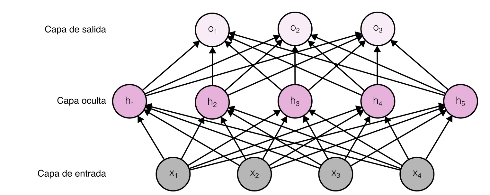

> Durante el {naranja}(entrenamiento) se desactiva un porcentaje de neuronas (poniendo su salida en cero) según una probabilidad umbral. En {verde}(testeo), se habilitan todas las neuronas.

---

<!-- slide -->
## Diapositiva 40
### Dropout

Durante el {naranja}(entrenamiento) se desactiva un porcentaje de neuronas (poniendo su salida en cero) según una probabilidad umbral. En {verde}(testeo), se habilitan todas las neuronas.

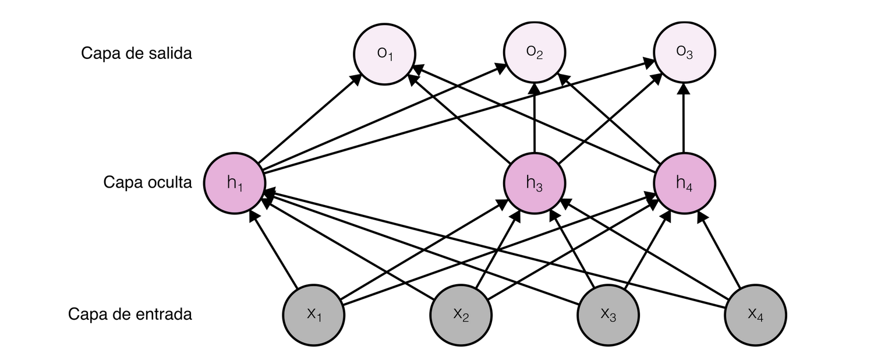

---
