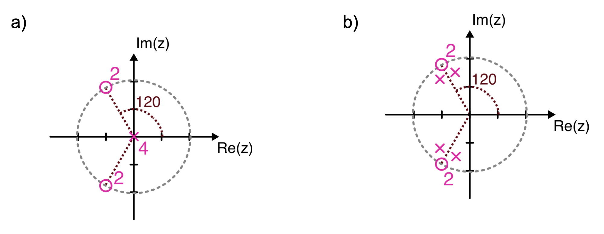

# Trabajo práctico 1 - Filtros digitales

## Análisis y procesamiento de Señales - Bioingeniería - Fac. de Ingeniería - UNSTA

1. Creé una función en Python que, dada una señal $x[n]$ y un nivel de ruido SNR (en dB), le agregue ruido blanco gaussiano a la señal con el nivel de SNR indicado. Usando esta función, genera una señal senoidal de 20 Hz con ruido blanco (SNR = 5 dB). Utiliza un total de 200 muestras y una frecuencia de muestreo de 1000 Hz.

   a) Diseña dos filtros de promedio móvil:
      - i) Usando 3 muestras
      - ii) Usando 10 muestras

   b) Caracterice a los filtros.
      - i) Clasifica el filtro con las clases vistas en clase.
      - ii) Determina el orden del filtro.
      - iii) Grafica el espectro en frecuencia del filtro.
           - 1) ¿Cuál es la frecuencia de corte?
           - 2) ¿Cuál es el ancho de banda de la zona de paso?
           - 3) ¿Qué caída tiene en la zona de transición?
           - 4) ¿Cuál es la mínima atenuación en la zona de bloqueo?
      - iv) Obtén la función de transferencia mediante la transformada Z de cada filtro y grafica el diagrama de polos y ceros.
      - v) Grafica la respuesta al impulso de los filtros.

   c) Filtra la señal.
      - i) Grafica la salida de la señal sin filtrar y las salidas filtradas.
      - ii) Grafica el espectro en frecuencia de la señal sin filtrar y las señales filtradas.

2. Un filtro digital tiene la siguiente función de transferencia:

   $$H(z)= \frac{1 - b z^{-1}}{1 + b z^{-1}}$$

   a) ¿Qué tipo de filtro es si $b \in \{0.8, -0.8, 1, -2, -1/2\}$? Para responder a esto, obtén la respuesta en frecuencia.

   b) Obtén el diagrama de polos y ceros de los 4 filtros.

   c) Si $b = -1/2$, ¿cuál es la ganancia del filtro?

   d) Si $b = 1/2$, ¿cuál es la ecuación de diferencia para obtener $y[n]$?

3. Utilizando el archivo **pcontaminada.csv**, el cual contiene una señal de presión con artefactos debido a la respiración, filtra la respiración del paciente mediante la técnica de eliminación de la tendencia.

4. Encuentra la función de transferencia $H(z)$, la respuesta en frecuencia y la respuesta al impulso de los siguientes filtros. Clasifica qué tipo de filtro son y determina su orden. Además, calcula las frecuencias de corte normalizadas y los valores correspondientes si la frecuencia de muestreo es $f_{s1} = 200\,\text{Hz}$ y $f_{s2} = 1000\,\text{Hz}$. También determina la distorsión máxima en la zona de paso y la distorsión mínima en la zona de bloqueo.

   

   > **Nota**: El número en magenta alrededor de los polos o ceros significa que hay esa cantidad de ceros o polos en esa posición.

5. Implementa un filtro de promedios móviles a la señal **ECG10.csv** ($f_s = 300\,\text{Hz}$) e indica el orden adecuado para que la SNR sea mayor a 15 dB.

   a) Repite el proceso con las señales **ECG20.csv**, **ECG30.csv** y **ECG40.csv**. (Nota: estos registros fueron sobremuestreados a $2f_s$, $4f_s$ y a $8f_s$. Siendo $f_s$ la frecuencia de muestreo de **ECG10.csv**)

   b) Realiza una gráfica del orden del filtro versus la frecuencia de muestreo para una SNR ≈ 15 dB.

6. Dada la señal **ECGnoise.csv**, filtra la señal mediante la técnica de pasar al dominio de la frecuencia, multiplicar y luego volver al dominio del tiempo.
